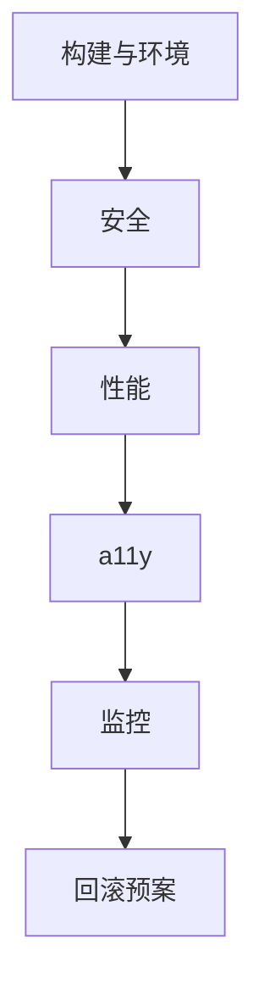

# 生产上线实践要点

React 应用上线前按要点过一遍：**构建、安全、性能、a11y、监控、回滚**，减少「上了才发现」的事故。

---

## 总览

上线 = 构建 + 安全 + 性能 + a11y + 监控 + 回滚的总和，不只 React API。

---

## 构建与环境

| 项 | 说明 |
|-----|------|
| `pnpm build` 无警告/错误 | 构建通过 |
| 环境变量分 dev/staging/prod | 分环境配置 |
| 无 `console.log` 调试残留 | 或构建剔除 |
| Source map 策略 | hidden + 上传 Sentry |
| `react` / `react-dom` 生产模式 | NODE_ENV=production |
| lockfile 提交 | CI 可复现构建 |

---

## 安全

| 项 | 说明 |
|-----|------|
| 无密钥进客户端 bundle | 仅 VITE_* 公开项 |
| CSP 配置 | 限制 script 来源 |
| 富文本消毒 | DOMPurify |
| 依赖 `pnpm audit` | 漏洞扫描 |
| HttpOnly Cookie | 敏感 session |

---

## 性能

| 项 | 说明 |
|-----|------|
| 路由 lazy、首包体积达标 | 代码分割 |
| 图片格式与尺寸 | WebP/AVIF |
| Query staleTime 合理 | 减重复请求 |
| Lighthouse / web-vitals 基线 | 可测量 |
| 大列表虚拟化或分页 | 减 DOM |

---

## 可访问性

| 项 | 说明 |
|-----|------|
| 主流程键盘可达 | Tab 完成主流程 |
| 表单 label | 关联控件 |
| axe 无严重违规 | 自动化扫描 |
| 对比度 AA | 文本 4.5:1 |

---

## 监控与告警

| 项 | 说明 |
|-----|------|
| Sentry（或同类）已接 | JS 错误上报 |
| release 版本标记 | 关联部署 |
| web-vitals 上报 | RUM 采样 |
| 关键 API 错误率告警 | 分环境阈值 |
| Error Boundary 用户友好页 | 局部崩溃不白屏 |

---

## 测试

| 项 | 说明 |
|-----|------|
| CI 单测绿 | PR 阻断 |
| 核心路径 E2E（可选） | 冒烟保障 |
| 冒烟：登录、主流程、支付等 | 上线前手工 |

---

## 部署与回滚

| 项 | 说明 |
|-----|------|
| 静态资源 CDN 缓存（hash 文件名） | 长缓存 |
| HTML 短缓存或 no-cache | 指向最新 chunk |
| 上一版 artifact 可回滚 | 快速恢复 |
| 数据库迁移与前端协调 | 版本对齐 |
| 功能开关（大功能） | 灰度发布 |

---

## 文档与值班

| 项 | 说明 |
|-----|------|
| CHANGELOG / release note | 变更记录 |
| 已知问题登记 | 透明沟通 |
| 值班 runbook | 报错去哪查 |

---

## 小结

上线 = 构建 + 安全 + 性能 + a11y + 监控 + 回滚的总和；按层逐项确认，减少上线事故。

构建：build 绿、分环境变量、source map hidden+上传 Sentry、lockfile 可复现。安全：无密钥进 bundle、CSP、富文本消毒、audit、HttpOnly Cookie。性能：路由 lazy、图片优化、Query staleTime、web-vitals 基线、大列表虚拟化。a11y：键盘可达、label、axe、对比度 AA。监控：Sentry+release+web-vitals+告警+Error Boundary。测试：CI 单测绿、核心 E2E、冒烟。部署：CDN hash 缓存、HTML 短缓存、可回滚、功能开关。文档：CHANGELOG、已知问题、runbook。
