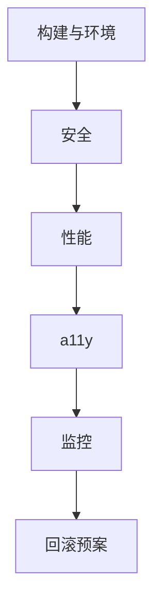

# 生产上线 Checklist

> React 应用上线前按清单过一遍：**构建、安全、性能、a11y、监控、回滚**——减少「上了才发现」的事故。

---

## 一、清单总览

---

## 二、构建与环境

| ☐ | 项 |
|---|-----|
| ☐ | `pnpm build` 无警告/错误 |
| ☐ | 环境变量分 dev/staging/prod |
| ☐ | 无 `console.log` 调试残留（或构建剔除） |
| ☐ | Source map 策略（hidden + 上传 Sentry） |
| ☐ | `react` / `react-dom` 生产模式 |
| ☐ | lockfile 提交，CI 可复现构建 |

---

## 三、安全

| ☐ | 项 |
|---|-----|
| ☐ | 无密钥进客户端 bundle |
| ☐ | CSP 配置 |
| ☐ | 富文本消毒 |
| ☐ | 依赖 `pnpm audit` |
| ☐ | HttpOnly Cookie（如适用） |

见 [16-安全](../16-可访问性-安全-国际化/03-XSS-安全与dangerouslySetInnerHTML.md)。

---

## 四、性能

| ☐ | 项 |
|---|-----|
| ☐ | 路由 lazy、首包体积达标 |
| ☐ | 图片格式与尺寸 |
| ☐ | Query staleTime 合理 |
| ☐ | Lighthouse / web-vitals 基线 |
| ☐ | 大列表虚拟化或分页 |

见 [11-06](../11-性能优化/06-性能优化Checklist.md)。

---

## 五、可访问性

| ☐ | 项 |
|---|-----|
| ☐ | 主流程键盘可达 |
| ☐ | 表单 label |
| ☐ | axe 无严重违规 |
| ☐ | 对比度 AA |

见 [16-05](../16-可访问性-安全-国际化/05-可访问性测试与Review清单.md)。

---

## 六、监控与告警

| ☐ | 项 |
|---|-----|
| ☐ | Sentry（或同类）已接 |
| ☐ | release 版本标记 |
| ☐ | web-vitals 上报 |
| ☐ | 关键 API 错误率告警 |
| ☐ | Error Boundary 用户友好页 |

见 [03-生产监控](./03-生产环境监控与日志.md)。

---

## 七、测试

| ☐ | 项 |
|---|-----|
| ☐ | CI 单测绿 |
| ☐ | 核心路径 E2E（可选） |
| ☐ | 冒烟：登录、主流程、支付等 |

见 [15-测试](../15-测试/)。

---

## 八、部署与回滚

| ☐ | 项 |
|---|-----|
| ☐ | 静态资源 CDN 缓存（hash 文件名） |
| ☐ | HTML 短缓存或 no-cache |
| ☐ | 上一版 artifact 可回滚 |
| ☐ | 数据库迁移与前端协调 |
| ☐ | 功能开关（大功能） |

---

## 九、文档与值班

| ☐ | 项 |
|---|-----|
| ☐ | CHANGELOG / release note |
| ☐ | 已知问题登记 |
| ☐ | 值班 runbook（报错去哪查） |

---

## 十、React 体系学完后的路径

| 目标 | 文档 |
|------|------|
| 日常开发 | [React编码规范](../React编码规范.md) |
| 复习索引 | [00-阅读地图](../00-阅读地图.md) |
| 面试 | 本篇 + [04-面试串联](./04-面试题串联与答题框架.md) |
| 排障 | [01-常见错误](./01-常见运行时错误与修复.md) |

---

## 十一、小结

| 上线 = 工程化总和 | 不只 React API |
|-------------------|----------------|

**上一篇**：[04-面试题串联与答题框架](./04-面试题串联与答题框架.md)

**React 体系正文全部完成** — 从 [00-阅读地图](../00-阅读地图.md) 回顾全链路。
