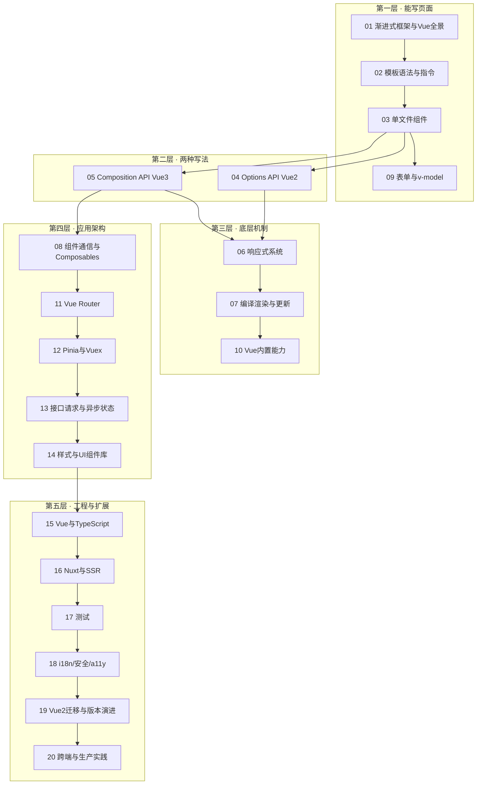

# Vue 体系 · 阅读地图

> 目录按 Vue 2→3 的知识链组织笔记：模板与 SFC、双 API、响应式原理，到 Router、Pinia、Nuxt 与迁移。各章独立成篇，文末 **小结** 收束；正文不依赖跨章跳转。

**前置建议**：HTML/CSS 基础 → JavaScript（原型、闭包、模块）→ TypeScript → 再进入 Vue。

**独立文档**：[Vue 编码规范](./Vue编码规范.md) 为团队工程规范，与原理正文互补，Review 时对照使用。

**学习主线**：Vue 3 新项目走 **02 → 03 → 05 → 11 → 12**；维护 Vue 2 遗留项目走 **04 → 19**；理解底层走 **06 → 07**。

---

## 阅读地图

| 层级 | 模块 | 内容侧重 |
|------|------|----------|
| **L1 能写页面** | 01～03、09 | 模板、SFC、表单 v-model |
| **L2 双 API** | 04～05 | Options API 与 Composition API |
| **L3 底层** | 06～07、10 | 响应式、编译渲染、内置能力 |
| **L4 架构** | 08、11～14 | 通信、路由、状态、请求、样式 |
| **L5 工程** | 15～20 | TS、Nuxt、测试、迁移、跨端 |

写法对齐 [JavaScript 体系](../../前端基础体系/03-JavaScript体系.md)、[TypeScript 体系](../../前端基础体系/04-TypeScript体系.md)：**叙述 + 表格 + 示意图 + 代码**。

---

## 目录总览

---

## 模块索引

### 01 · 渐进式框架与Vue全景

| 文档 | 主题 |
|------|------|
| [01-渐进式框架是什么意思](./01-渐进式框架与Vue全景/01-渐进式框架是什么意思.md) | Vue 自称「渐进式框架」：你可以只拿它的视图层做页面增强，也可以逐步引入路由... |
| [02-Vue2与Vue3版本差异总览](./01-渐进式框架与Vue全景/02-Vue2与Vue3版本差异总览.md) | Vue 3 不是「小改版」：响应式底层、组件写法、全局 API 与模板编译均有... |
| [03-工具链-create-vue-Vite-VueCLI](./01-渐进式框架与Vue全景/03-工具链-create-vue-Vite-VueCLI.md) | 现代 Vue 3 项目以 **create-vue 脚手架 + Vite 构建... |
| [04-官方生态地图](./01-渐进式框架与Vue全景/04-官方生态地图.md) | Vue 核心只负责视图层；**路由、状态、SSR、DevTools** 等由官... |

### 02 · 模板语法与指令

| 文档 | 主题 |
|------|------|
| [01-插值与模板表达式](./02-模板语法与指令/01-插值与模板表达式.md) | Vue 模板用 **Mustache 插值 `{{ }}`** 把数据渲染成文... |
| [02-绑定与事件指令](./02-模板语法与指令/02-绑定与事件指令.md) | **`v-bind`（`: `）** 把数据绑到 DOM 属性与组件 prop... |
| [03-条件与列表渲染](./02-模板语法与指令/03-条件与列表渲染.md) | **`v-if` / `v-else-if` / `v-else`** 按条件... |
| [04-v-model与双向绑定](./02-模板语法与指令/04-v-model与双向绑定.md) | **`v-model`** 在表单元素上是 `:value` + 事件监听的语... |
| [05-渲染函数与JSX](./02-模板语法与指令/05-渲染函数与JSX.md) | 模板覆盖多数 UI 场景；当需要 **完全程序化 vnode**、复杂分支或 ... |

### 03 · 单文件组件

| 文档 | 主题 |
|------|------|
| [01-SFC结构与script标签](./03-单文件组件/01-SFC结构与script标签.md) | **单文件组件（.vue）** 把 template、script、style... |
| [02-Props定义与校验](./03-单文件组件/02-Props定义与校验.md) | **Props** 是父组件向子组件输入数据的唯一正式通道；在 Vue 3 中... |
| [03-事件emit与组件v-model](./03-单文件组件/03-事件emit与组件v-model.md) | 子组件通过 **`defineEmits`** 向父组件发送事件；**组件 v... |
| [04-插槽体系](./03-单文件组件/04-插槽体系.md) | **插槽（slot）** 让父组件向子组件模板注入 markup 与结构；扩展... |
| [05-动态组件与异步组件](./03-单文件组件/05-动态组件与异步组件.md) | **`<component :is="...">`** 在同一挂载点切换不同组... |

### 04 · Options-API

| 文档 | 主题 |
|------|------|
| [01-data与methods](./04-Options-API/01-data与methods.md) | Options API 用 **`data`** 定义响应式状态，用 **`m... |
| [02-computed与watch](./04-Options-API/02-computed与watch.md) | **computed** 基于依赖缓存衍生状态；**watch** 在数据变化... |
| [03-生命周期钩子](./04-Options-API/03-生命周期钩子.md) | Options API 通过 **beforeCreate → unmount... |
| [04-组件选项-混入与extends](./04-Options-API/04-组件选项-混入与extends.md) | Options API 通过 **mixins、extends、compone... |
| [05-过滤器与Vue2语法遗留](./04-Options-API/05-过滤器与Vue2语法遗留.md) | **filters**、**$listeners**、**`.sync`**、... |

### 05 · Composition-API与script-setup

| 文档 | 主题 |
|------|------|
| [01-setup与响应式入口](./05-Composition-API与script-setup/01-setup与响应式入口.md) | **setup** 是 Composition API 的入口：在组件创建早期... |
| [02-ref-reactive与toRefs](./05-Composition-API与script-setup/02-ref-reactive与toRefs.md) | **`ref`** 包装任意值为响应式引用；**`reactive`** 将对... |
| [03-computed-watch-watchEffect](./05-Composition-API与script-setup/03-computed-watch-watchEffect.md) | Composition API 用 **`computed`** 缓存衍生状态... |
| [04-script-setup宏](./05-Composition-API与script-setup/04-script-setup宏.md) | **`<script setup>`** 中的 **编译宏**（defineP... |
| [05-组合式函数Composables](./05-Composition-API与script-setup/05-组合式函数Composables.md) | **Composable**（习惯命名 `useXxx`）把可复用的响应式逻辑... |
| [06-生命周期组合式对照](./05-Composition-API与script-setup/06-生命周期组合式对照.md) | Composition API 用 **`onMounted`、`onUpda... |

### 06 · 响应式系统

| 文档 | 主题 |
|------|------|
| [01-依赖收集与触发更新](./06-响应式系统/01-依赖收集与触发更新.md) | **响应式核心**：当响应式数据被读取时**收集依赖**（track），当数据... |
| [02-Vue2-DefineProperty实现](./06-响应式系统/02-Vue2-DefineProperty实现.md) | Vue 2 用 **`Object.defineProperty`** 拦截对... |
| [03-Vue3-Proxy与ref实现](./06-响应式系统/03-Vue3-Proxy与ref实现.md) | Vue 3 以 **`Proxy`** 代理对象、`ref` 包装基本类型，统... |
| [04-shallowRef-markRaw等工具](./06-响应式系统/04-shallowRef-markRaw等工具.md) | 并非所有数据都需要深层响应式。**shallowRef**、**shallow... |
| [05-响应式丢失场景与修复](./06-响应式系统/05-响应式丢失场景与修复.md) | 数据「明明改了」界面却不更新，多数是**响应式链接断裂**：解构丢 ref、普... |

### 07 · 编译渲染与更新机制

| 文档 | 主题 |
|------|------|
| [01-模板编译流程](./07-编译渲染与更新机制/01-模板编译流程.md) | Vue 单文件组件的 `<template>` 在构建期（或运行时）被编译为 ... |
| [02-虚拟DOM与Patch](./07-编译渲染与更新机制/02-虚拟DOM与Patch.md) | Vue 3 用**虚拟 DOM（VNode）**描述 UI 树，更新时对新旧 ... |
| [03-组件渲染与更新队列](./07-编译渲染与更新机制/03-组件渲染与更新队列.md) | 组件从 **mount** 到 **update** 由 render eff... |
| [04-nextTick与异步更新](./07-编译渲染与更新机制/04-nextTick与异步更新.md) | Vue 在数据变更后**异步** flush DOM 更新。要在「视图已反映最... |
| [05-编译优化与Vapor-Mode前瞻](./07-编译渲染与更新机制/05-编译优化与Vapor-Mode前瞻.md) | Vue 3 编译器通过 **静态提升、PatchFlags、Block Tre... |

### 08 · 组件通信与Composables

| 文档 | 主题 |
|------|------|
| [01-props-emit与v-model通信](./08-组件通信与Composables/01-props-emit与v-model通信.md) | 父子组件通信的**正交三件套**：**props 向下**传数据、**emit... |
| [02-provide-inject](./08-组件通信与Composables/02-provide-inject.md) | **provide / inject** 在组件树中**跨层级**传递依赖，适... |
| [03-事件总线与mitt](./08-组件通信与Composables/03-事件总线与mitt.md) | Vue 3 移除了实例 API **`$on` / `$off` / `$on... |
| [04-mixins迁移到Composables](./08-组件通信与Composables/04-mixins迁移到Composables.md) | Vue 2 **mixins** 将选项分散合并，带来命名冲突与来源不清。Vu... |
| [05-模块划分与特性目录](./08-组件通信与Composables/05-模块划分与特性目录.md) | 中大型 Vue 3 项目宜按**业务域（feature）**组织，而非按文件类... |

### 09 · 表单与v-model

| 文档 | 主题 |
|------|------|
| [01-原生表单控件绑定](./09-表单与v-model/01-原生表单控件绑定.md) | **`v-model`** 在原生 `<input>`、`<textarea>... |
| [02-自定义表单组件协议](./09-表单与v-model/02-自定义表单组件协议.md) | 自定义输入组件参与 **v-model** 需实现约定：**prop `mod... |
| [03-修饰符-lazy-number-trim](./09-表单与v-model/03-修饰符-lazy-number-trim.md) | **v-model 修饰符**调整绑定时机与值变换。**lazy** 改事件时... |
| [04-表单校验](./09-表单与v-model/04-表单校验.md) | 生产表单除 **v-model** 外需**校验、错误展示、提交门禁**。**... |
| [05-复杂表单与第三方编辑器](./09-表单与v-model/05-复杂表单与第三方编辑器.md) | 多步骤向导、动态字段、**富文本**、**文件上传**、嵌套对象等复杂表单，需... |

### 10 · Vue内置能力

| 文档 | 主题 |
|------|------|
| [01-Transition与TransitionGroup](./10-Vue内置能力/01-Transition与TransitionGroup.md) | **`<Transition>`** 为单元素/组件进出场加动画；**`<Tr... |
| [02-KeepAlive](./10-Vue内置能力/02-KeepAlive.md) | **`<KeepAlive>`** 缓存动态组件或路由组件实例，切换时**保留... |
| [03-Teleport](./10-Vue内置能力/03-Teleport.md) | **`<Teleport>`** 将模板片段**渲染到 DOM 其他位置**（... |
| [04-Suspense](./10-Vue内置能力/04-Suspense.md) | **`<Suspense>`** 协调**异步依赖**（async setup... |
| [05-自定义指令](./10-Vue内置能力/05-自定义指令.md) | **自定义指令**用于对普通 DOM 元素施加**底层行为**（聚焦、权限、懒... |
| [06-插件与app.use](./10-Vue内置能力/06-插件与app.use.md) | **插件**是接收 **app 实例**并扩展 Vue 应用能力的函数：注册全... |

### 11 · Vue-Router

| 文档 | 主题 |
|------|------|
| [01-路由基础与Router3-4差异](./11-Vue-Router/01-路由基础与Router3-4差异.md) | **摘要**：Vue Router 是 Vue 官方路由库，负责 URL 与组... |
| [02-嵌套路由与命名视图](./11-Vue-Router/02-嵌套路由与命名视图.md) | **摘要**：复杂后台常有多层布局：顶栏固定、侧栏随模块变化、内容区再嵌套详情... |
| [03-导航守卫](./11-Vue-Router/03-导航守卫.md) | **摘要**：导航守卫（Navigation Guards）在路由跳转的各个阶... |
| [04-动态路由与路由表生成](./11-Vue-Router/04-动态路由与路由表生成.md) | **摘要**：动态路由指路径中含 **params**（如 `/users/:... |
| [05-懒加载与滚动行为](./11-Vue-Router/05-懒加载与滚动行为.md) | **摘要**：路由级代码分割通过 **动态 import** 将每个页面打成独... |

### 12 · Pinia与Vuex

| 文档 | 主题 |
|------|------|
| [01-何时需要全局状态](./12-Pinia与Vuex/01-何时需要全局状态.md) | **摘要**：并非所有数据都应放进 Pinia/Vuex。**本地 UI 状态... |
| [02-Pinia-store与组合式写法](./12-Pinia与Vuex/02-Pinia-store与组合式写法.md) | **摘要**：Pinia 是 Vue 3 官方推荐的状态库，每个 store ... |
| [03-Vuex核心与Modules](./12-Pinia与Vuex/03-Vuex核心与Modules.md) | **摘要**：Vuex 是 Vue 2 时代的主流全局状态方案，核心约束是 *... |
| [04-Vuex迁移Pinia](./12-Pinia与Vuex/04-Vuex迁移Pinia.md) | **摘要**：从 Vuex 迁到 Pinia 的在于 **去掉 mutati... |
| [05-持久化与插件](./12-Pinia与Vuex/05-持久化与插件.md) | **摘要**：Pinia 插件可在 store 创建、action 前后、st... |

### 13 · 接口请求与异步状态

| 文档 | 主题 |
|------|------|
| [01-axios封装与拦截器](./13-接口请求与异步状态/01-axios封装与拦截器.md) | **摘要**：axios 是 Vue 生态最常用的 HTTP 客户端。生产项目... |
| [02-Pinia-action中的请求](./13-接口请求与异步状态/02-Pinia-action中的请求.md) | **摘要**：在 Pinia **action** 中发起 HTTP 请求是 ... |
| [03-vue-query缓存策略](./13-接口请求与异步状态/03-vue-query缓存策略.md) | **摘要**：**TanStack Query**（Vue 版 `@tanst... |
| [04-分页-轮询-乐观更新](./13-接口请求与异步状态/04-分页-轮询-乐观更新.md) | **摘要**：列表分页、定时轮询、提交后立刻更新 UI（乐观更新）是后台高频异... |
| [05-取消请求与重试](./13-接口请求与异步状态/05-取消请求与重试.md) | **摘要**：组件卸载、路由离开、搜索词连击时，进行中的 HTTP 请求应**... |

### 14 · 样式与UI组件库

| 文档 | 主题 |
|------|------|
| [01-Scoped与CSS-Modules](./14-样式与UI组件库/01-Scoped与CSS-Modules.md) | **摘要**：Vue SFC 的 `<style>` 支持 **scoped*... |
| [02-CSS变量与主题切换](./14-样式与UI组件库/02-CSS变量与主题切换.md) | **摘要**：现代主题系统基于 **CSS Custom Properties... |
| [03-Element-Plus-Ant-Design-Vue](./14-样式与UI组件库/03-Element-Plus-Ant-Design-Vue.md) | **摘要**：**Element Plus**（Element UI 的 Vu... |
| [04-图标与原子化CSS](./14-样式与UI组件库/04-图标与原子化CSS.md) | **摘要**：图标可用组件库内置、**Iconify + unplugin-i... |
| [05-组件库二次封装](./14-样式与UI组件库/05-组件库二次封装.md) | **摘要**：直接在页面堆砌 `ElTable`、`AForm` 会导致 pr... |

### 15 · Vue与TypeScript

| 文档 | 主题 |
|------|------|
| [01-vue-tsc与项目配置](./15-Vue与TypeScript/01-vue-tsc与项目配置.md) | **摘要**：Vue 3 + TypeScript 项目用 **vue-tsc... |
| [02-defineProps与defineEmits类型](./15-Vue与TypeScript/02-defineProps与defineEmits类型.md) | **摘要**：`<script setup>` 中 **defineProps... |
| [03-模板ref与组件实例类型](./15-Vue与TypeScript/03-模板ref与组件实例类型.md) | **摘要**：模板 **ref** 绑定 DOM 或子组件实例时，TypeSc... |
| [04-泛型组件与库导出](./15-Vue与TypeScript/04-泛型组件与库导出.md) | **摘要**：Vue 3.3+ 的 **generic** SFC 块让组件像... |
| [05-Vue2-TS边界](./15-Vue与TypeScript/05-Vue2-TS边界.md) | **摘要**：Vue 2 时代的 TypeScript 支持弱于 Vue 3：... |

### 16 · Nuxt与SSR

| 文档 | 主题 |
|------|------|
| [01-CSR-SSR-SSG概念](./16-Nuxt与SSR/01-CSR-SSR-SSG概念.md) | **摘要**：Vue 应用可以在浏览器（CSR）、服务器（SSR）或构建时（S... |
| [02-createSSRApp与hydration](./16-Nuxt与SSR/02-createSSRApp与hydration.md) | **摘要**：Vue 3 的 SSR 以 `createSSRApp` 替代 ... |
| [03-Nuxt3目录与路由](./16-Nuxt与SSR/03-Nuxt3目录与路由.md) | **摘要**：Nuxt 3 基于**约定式目录**自动注册路由、布局、中间件与... |
| [04-useFetch与Server-Routes](./16-Nuxt与SSR/04-useFetch与Server-Routes.md) | **摘要**：Nuxt 3 的 `useFetch` / `$fetch` 在... |
| [05-预渲染与部署](./16-Nuxt与SSR/05-预渲染与部署.md) | **摘要**：Nuxt 3 基于 **Nitro** 统一 SSR、预渲染（S... |

### 17 · 测试

| 文档 | 主题 |
|------|------|
| [01-Vitest与测试分层](./17-测试/01-Vitest与测试分层.md) | **摘要**：Vue 3 生态推荐 **Vitest** 作为单元与组件测试运... |
| [02-Vue-Test-Utils](./17-测试/02-Vue-Test-Utils.md) | **摘要**：**@vue/test-utils** 是 Vue 官方组件测试... |
| [03-Router-Pinia-mock](./17-测试/03-Router-Pinia-mock.md) | **摘要**：组件测试需隔离 **Vue Router** 与 **Pinia... |
| [04-Composables单测](./17-测试/04-Composables单测.md) | **摘要**：组合式函数（Composables）是 Vue 3 逻辑复用的核... |
| [05-Playwright-E2E](./17-测试/05-Playwright-E2E.md) | **摘要**：**Playwright** 在真实浏览器中驱动端到端测试，验证... |

### 18 · 国际化-安全与可访问性

| 文档 | 主题 |
|------|------|
| [01-vue-i18n组合式用法](./18-国际化-安全与可访问性/01-vue-i18n组合式用法.md) | **摘要**：**vue-i18n v9+** 为 Vue 3 提供组合式 A... |
| [02-v-html与XSS防护](./18-国际化-安全与可访问性/02-v-html与XSS防护.md) | **摘要**：Vue 默认转义插值，但 **`v-html`** 会将字符串当... |
| [03-可访问性基础](./18-国际化-安全与可访问性/03-可访问性基础.md) | **摘要**：可访问性（a11y）让视障、运动障碍等用户能借助屏幕阅读器、键盘... |
| [04-焦点管理与弹层](./18-国际化-安全与可访问性/04-焦点管理与弹层.md) | **摘要**：模态框、抽屉、下拉菜单打开时需 **转移焦点**、限制 Tab ... |
| [05-Review清单](./18-国际化-安全与可访问性/05-Review清单.md) | **摘要**：本篇汇总 Vue 项目在 **PR Review** 时应检查的... |

### 19 · Vue2迁移与版本演进

| 文档 | 主题 |
|------|------|
| [01-Vue2遗留项目现状](./19-Vue2迁移与版本演进/01-Vue2遗留项目现状.md) | **摘要**：截至 2024 年底，Vue 2 已 **EOL（终止官方维护）... |
| [02-破坏性变更清单](./19-Vue2迁移与版本演进/02-破坏性变更清单.md) | **摘要**：Vue 2 → 3 是一次 **有意为之的破坏性升级**，涉及全... |
| [03-vue-compat渐进迁移](./19-Vue2迁移与版本演进/03-vue-compat渐进迁移.md) | **摘要**：**@vue/compat**（迁移构建）在 Vue 3 运行时... |
| [04-Vue3.4-3.5新特性](./19-Vue2迁移与版本演进/04-Vue3.4-3.5新特性.md) | **摘要**：Vue 3.4、3.5 在 **编译器、响应式、SSR、DX**... |
| [05-升级Checklist](./19-Vue2迁移与版本演进/05-升级Checklist.md) | **摘要**：Vue 2 → 3 升级（或 Vue 3 大版本依赖跃迁）需要 ... |

### 20 · 跨端与生产实践

| 文档 | 主题 |
|------|------|
| [01-uni-app与小程序](./20-跨端与生产实践/01-uni-app与小程序.md) | **摘要**：**uni-app** 基于 Vue 语法一套代码编译到微信/支... |
| [02-微前端与模块联邦](./20-跨端与生产实践/02-微前端与模块联邦.md) | **摘要**：大型前端按 **子应用** 拆分可独立部署、技术栈渐进升级。Vu... |
| [03-性能调优](./20-跨端与生产实践/03-性能调优.md) | **摘要**：Vue 3 默认性能已较好，生产瓶颈多在 **不必要渲染、大包体... |
| [04-监控与排障](./20-跨端与生产实践/04-监控与排障.md) | **摘要**：生产环境 Vue 应用需 **错误监控、性能 RUM、日志关联*... |
| [05-上线Checklist](./20-跨端与生产实践/05-上线Checklist.md) | **摘要**：Vue 应用上线前需核对 **构建产物、环境变量、路由回退、监控... |
---

## 推荐学习路径

| 目标 | 路径 |
|------|------|
| **Vue 3 新手上岗** | 01 → 02 → 03 → 05 → 09 → 11 → 12 → 编码规范 |
| **读懂 Vue 源码向** | 06 → 07 → 10 |
| **维护 Vue 2 项目** | 01 → 02 → 03 → 04 → 12(03) → 19 |
| **Vue 2 升 Vue 3** | 05 → 06 → 19 |
| **全栈 / Nuxt** | 05 → 13 → 16 → 17 |
| **面试原理** | 06 + 07 + 12 + 20-04 |

---

## 与仓库其他文档的衔接

| 本篇主题 | 延伸阅读 |
|----------|----------|
| 事件、异步 | [JavaScript 体系 · 事件与异步](../../前端基础体系/03-JavaScript体系.md) |
| 组件类型 | [TypeScript 体系 · 泛型与类型运算](../../前端基础体系/04-TypeScript体系.md) |
| ESLint、测试 CI | [代码规范与质量保障](../../前端工程化体系/04-代码规范与质量保障.md) |
| 构建、Vite | [模块化与构建层](../../前端工程化体系/02-模块化与构建层.md) |
| 性能指标 | [性能优化与监控](../../前端工程化体系/06-性能优化与监控.md) |

---

## 写作进度

| 批次 | 范围 | 状态 |
|------|------|------|
| **骨架** | 00 阅读地图、Vue 原生目录 | ✅ 已完成 |
| **入门线** | 01～03、09 | ✅ 已完成 |
| **双 API** | 04 Options、05 Composition | ✅ 已完成 |
| **原理线** | 06 响应式、07 编译渲染、10 内置能力 | ✅ 已完成 |
| **应用线** | 08、11～14 | ✅ 已完成 |
| **工程线** | 15～20 | ✅ 已完成 |
| **全文** | 01～20 共 101 篇 + 编码规范 | ✅ **体系完成** |

---

## 外部参考

[Vue 官方文档](https://cn.vuejs.org/) · [Vue GitHub](https://github.com/vuejs/core) · [Vue RFC](https://github.com/vuejs/rfcs) · [Pinia](https://pinia.vuejs.org/zh/) · [Vue Router](https://router.vuejs.org/zh/) · [Nuxt](https://nuxt.com/)
