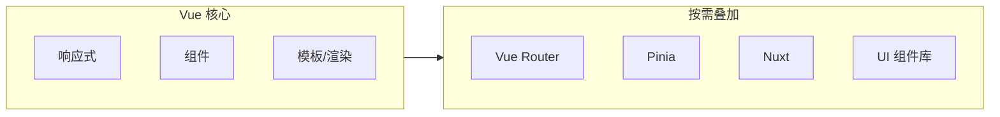
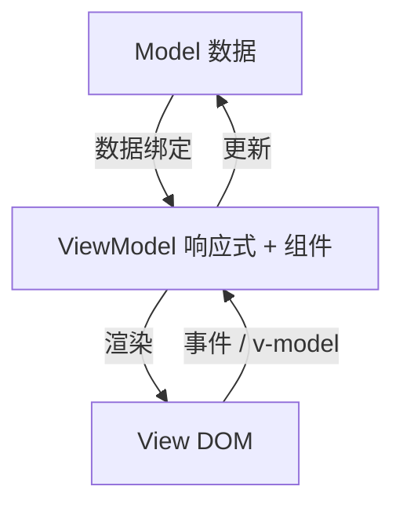

# 渐进式框架是什么意思

Vue 不必第一天就上全家桶，CDN 局部增强、Vite 组件化、Router + Pinia 全栈 SPA 都是同一条演进路径。按当前阶段选能力，缺什么再叠什么，这就是「渐进式」在工程里的含义。

---

## 库与框架：边界在哪里

日常讨论里「库（Library）」和「框架（Framework）」常被混用。粗略区分：

| 维度 | 库 | 框架 |
|------|-----|------|
| **控制权** | 业务代码调用库 | 框架在生命周期里调用业务代码 |
| **典型例子** | lodash、axios | Vue、Angular |
| **集成方式** | 按需 import 某个函数 | 按约定组织组件、路由、状态 |
| **换成本** | 换掉某个工具函数影响面小 | 换掉框架通常等于重写应用骨架 |

Vue 官方把它定位为**用于构建用户界面的渐进式框架**：核心只解决「如何把数据映射到 DOM、如何在数据变化时更新视图」，其余能力（路由、状态、SSR）以**官方生态包**或**社区方案**形式按需叠加。



---

## 「渐进式」在工程里长什么样

**阶段一：CDN 引入，改一块静态页**

在已有后台模板里，只对「订单筛选区」挂一个 Vue 实例，其余仍由服务端模板输出：

```html
<div id="filter">
  <input v-model="keyword" placeholder="搜索订单号" />
  <ul>
    <li v-for="item in filtered" :key="item.id">{{ item.no }}</li>
  </ul>
</div>
<script src="https://unpkg.com/vue@3/dist/vue.global.js"></script>
<script>
  const { createApp } = Vue
  createApp({
    data() {
      return { keyword: '', orders: [] }
    },
    computed: {
      filtered() {
        return this.orders.filter(o => o.no.includes(this.keyword))
      }
    }
  }).mount('#filter')
</script>
```

**阶段二：Vite + SFC，组件化整页**，同一业务域拆成 `.vue` 文件，用 `<script setup>` 组织逻辑。

**阶段三：Router + Pinia + 工程规范**，多页面 SPA、全局状态、代码规范与 CI，这时才用到「全家桶」形态，但每一步都建立在上一层的 Vue 核心之上，而不是 Day 1 就必须全部到位。

| 场景 | 渐进式（Vue） | 约定更重的框架 |
|------|----------------|----------------|
| 遗留系统加交互 | 易：mount 一个根节点 | 往往需要整页接管 |
| 小工具页 | 核心 + 少量组件即可 | 可能显得「杀鸡用牛刀」 |
| 大型 SPA | 官方生态补齐路由/状态 | 开箱目录结构更固定 |

「渐进式」指默认不强迫一次 adopt 全部约定。

---

## MVVM 与 Vue 的对应关系

Vue 文档常用 **MVVM（Model–View–ViewModel）** 描述其数据流，和经典 MVC 略有不同：

| 层 | 在 Vue 里 roughly 对应 | 职责 |
|----|------------------------|------|
| **Model** | `data` / `ref` / Pinia state | 业务数据 |
| **View** | 模板渲染出的 DOM | 用户所见 |
| **ViewModel** | 组件实例 + 响应式系统 | 连接 Model 与 View，驱动更新 |



用户点击按钮 → 事件处理改 state → 响应式触发重新渲染 → DOM 更新。开发者主要写**声明式模板**和**状态变更逻辑**，不必手写每一步 DOM 操作。

> **Vue 2 差异**：Options API 下 `data` 返回普通对象，由 `Object.defineProperty` 劫持；Vue 3 默认用 `Proxy`，Composition API 下常用 `ref` / `reactive`。

---

## Vue 核心解决的三件事

**声明式渲染**，用模板描述「数据为 X 时界面应长什么样」：

```vue
<template>
  <p v-if="loading">加载中…</p>
  <ul v-else>
    <li v-for="user in users" :key="user.id">{{ user.name }}</li>
  </ul>
</template>
```

**组件化**，UI 拆成可复用、可组合的 `.vue` 或对象组件，通过 props 输入、emit 输出，形成树状结构。

**响应式**，状态变更自动触发依赖该状态的视图更新；衍生状态用 `computed`，副作用用 `watch` / `watchEffect`。

| 能力 | 不采用 Vue 时 | 采用 Vue 后 |
|------|----------------|-------------|
| 列表与详情联动 | 手动 querySelector + 改 innerHTML | 改数组，列表自动重绘 |
| 表单双向绑定 | 监听 input 再写回变量 | `v-model` 一行 |
| 跨组件共享 | 自定义事件总线或 DOM 耦合 | props / emit / provide / Pinia |

---

## 何时「只用到核心」、何时上生态

| 项目特征 | 建议采纳 |
|----------|----------|
| 单页、无 URL 路由需求 | 仅 `createApp` + 组件 |
| 多视图、浏览器前进后退 | + Vue Router |
| 多模块共享登录态、购物车 | + Pinia |
| SEO、首屏、同构 | + Nuxt 或自建 SSR |
| 设计体系统一 | + Element Plus 等 UI 库 |

渐进式的含义是：**没有「不用 Router 就不算 Vue 项目」这种门槛**；但团队规范可以规定「新项目必须 Vue 3 + Vite + Pinia」，那是在渐进能力之上的**工程约束**，与框架本身的渐进性不矛盾。

---

## 和「微框架」说法的关系

社区有时把只含核心的用法叫「把 Vue 当库用」。官方仍称 Vue 为框架，因为一旦 `createApp().mount()`，就由 Vue 调度组件更新、生命周期与渲染管线，**反转控制**已经成立。渐进式说的是可选模块的厚度，框架属性照样成立。

---

## 小结

渐进式指响应式、组件、模板始终不变，路由、状态、SSR 按需叠加，没有「不全栈就不算 Vue」的门槛。`createApp().mount()` 后由 Vue 调度更新与生命周期，反转控制已经成立；可选模块可以慢慢加，框架属性不会因此变弱。

- 库 vs 框架：库由业务代码调用，框架在生命周期里调用业务代码。
- MVVM 落地：写 Model（`ref` / Pinia）和声明式 View；ViewModel（组件 + 响应式）负责双向同步。
- 演进路径：CDN 局部增强 → Vite SFC → Router + Pinia 全家桶，层层叠加。
- 选型：单页无路由用核心即可；多视图加 Router；跨模块共享态加 Pinia；SEO/首屏加 Nuxt。

**易混点**：
- 「渐进式」≠ 功能少，而是不强迫 Day 1  adopt 全部约定。
- 团队工程约束（必须 Pinia）与框架渐进性不矛盾。
- 「把 Vue 当库用」仍属框架范畴，因 mount 后调度权在 Vue。

核对：当前项目真的需要 Router/Pinia 吗？遗留页能否只 mount 一个根节点？核心三角（响应式、组件、模板）是否已理解？
