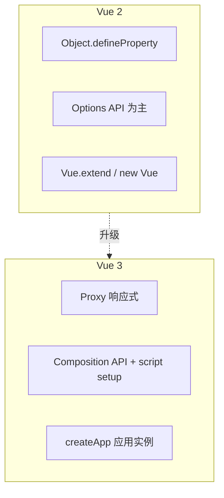

# Vue2 与 Vue3 版本差异总览

Vue 3 改动了响应式底层、全局 API 与 v-model 协议，新项目默认 Vue 3；维护 2.x 或升级时，按破坏性变更表逐项对照。2.7 只是桥，不等于 Vue 3。

---

## 版本线与维护状态

| 版本 | 首发 | 状态（2025 前后） | 典型项目 |
|------|------|-------------------|----------|
| Vue 2.6 / 2.7 | 2019 / 2022 | 2.x 已 EOL，2.7 含部分 3.x API 回填 | 老后台、未升级 SPA |
| Vue 3.4+ | 2023 起持续 minor | **官方主推**，长期维护 | 新项目、Nuxt 3 |

Vue 2.7 是过渡版：可在 Options API 项目里使用 `setup()`、`ref`、`computed` 等，但**底层仍是 Vue 2 响应式**，与 Vue 3 不完全等价。



---

## 架构级差异一览

| 领域 | Vue 2 | Vue 3 |
|------|-------|-------|
| **响应式** | `defineProperty`，无法检测属性增删、数组索引 | `Proxy`，支持 Map/Set，动态属性 |
| **API 风格** | Options API；2.7 可选 `setup` | Composition API、`script setup` 为一等公民 |
| **根实例** | `new Vue({ el: '#app' })` | `createApp(App).mount('#app')` |
| **全局 API** | `Vue.use`、`Vue.component` 污染全局 | `app.use`、`app.component` 挂载在应用实例 |
| **Fragment** | 单根节点（2.x 模板限制） | 支持多根节点 |
| **v-model** | 组件默认 `value` + `input` | 默认 `modelValue` + `update:modelValue` |
| **事件 API** | `$on` / `$off` / `$once` | 已移除，用 mitt / props |
| **过滤器 filters** | 支持 | **已移除**，用方法或 computed |
| **$listeners** | 透传非原生事件 | 合并进 `$attrs` |
| **Teleport / Suspense** | 无 | 内置 |
| **Tree-shaking** | 较弱 | 按 API 导入，包体更易减小 |

---

## 写法对照：同一计数器

Vue 2 Options API：

```javascript
export default {
  data() {
    return { count: 0 }
  },
  methods: {
    increment() {
      this.count++
    }
  },
  template: `<button @click="increment">{{ count }}</button>`
}
```

Vue 3 script setup：

```vue
<script setup>
import { ref } from 'vue'
const count = ref(0)
function increment() {
  count.value++
}
</script>

<template>
  <button @click="increment">{{ count }}</button>
</template>
```

| 对比点 | Vue 2 | Vue 3 |
|--------|-------|-------|
| 状态 | `data` 返回对象 | `ref` / `reactive` |
| 模板里访问 | `count` | `ref` 自动解包为 `count` |
| 脚本里改值 | `this.count` | `count.value` |

---

## 破坏性变更（升级必查）

**全局 API**：

```javascript
// Vue 2
import Vue from 'vue'
Vue.use(Router)
Vue.component('MyComp', MyComp)
new Vue({ router, render: h => h(App) }).$mount('#app')

// Vue 3
import { createApp } from 'vue'
const app = createApp(App)
app.use(router)
app.component('MyComp', MyComp)
app.mount('#app')
```

**组件 v-model**：

```vue
<!-- 子组件 Vue 2 -->
<script>
export default {
  props: ['value'],
  emits: ['input']
}
</script>

<!-- 子组件 Vue 3 -->
<script setup>
defineProps(['modelValue'])
defineEmits(['update:modelValue'])
</script>
```

Vue 3 还支持**多个 v-model**：`v-model:title`、`v-model:visible`。

**已移除或替换的能力**：

| 能力 | Vue 2 | Vue 3 替代 |
|------|-------|------------|
| `$set` / `$delete` | 解决响应式限制 | 一般不再需要 |
| `filters` | `\| currency` | `computed` 或函数 |
| `$children` | 访问子实例 | `ref` + `expose` |
| 函数式组件 | `functional: true` | 普通函数 + `defineComponent` 或纯函数 |
| `keyCode` 修饰符 | `@keyup.13` | 用 `@keyup.enter` 等 |

---

## 性能与编译

Vue 3 编译器会做**静态提升、PatchFlags、block tree** 等优化，更新时跳过静态子树 diff。运行时包可 tree-shake：只打包用到的 `ref`、`computed` 等。

| 指标 | 说明 |
|------|------|
| 初次渲染 | 3.x 在大列表场景通常更快 |
| 更新 | Proxy + 编译优化，依赖追踪更精确 |
| 包体积 | 全量仍可比 2.x 小；按功能导入更小 |

---

## 生态版本配对

| 能力 | Vue 2 常见组合 | Vue 3 常见组合 |
|------|----------------|----------------|
| 路由 | Vue Router 3.x | Vue Router 4.x |
| 状态 | Vuex 3.x | Pinia（推荐）或 Vuex 4 |
| 构建 | Vue CLI + Webpack | Vite + create-vue |
| SSR 框架 | Nuxt 2 | Nuxt 3 |
| UI | Element UI | Element Plus |
| TS | vue-class-component | `vue-tsc` + script setup 类型 |

**不要**把 Vue Router 4 配 Vue 2，或 Element UI 直接当 Vue 3 组件库用，查官方兼容表再定依赖大版本。

---

## 选型建议

| 情况 | 建议 |
|------|------|
| 2024 起新项目 | **Vue 3 + Vite + Pinia + Vue Router 4** |
| 维护 Vue 2 且短期不升 | 锁依赖版本，了解 EOL 风险；可评估 2.7 局部 composables |
| 计划升级 | 用 `@vue/compat` 兼容构建分步改 |
| 团队只会 Options API | Vue 3 仍支持 Options API，但新代码建议 script setup |

**学习路径**：只学 Vue 3 优先 Composition API，Options API 作读旧代码用；维护 Vue 2 以 Options 为主；原理面试重点在响应式 2 vs 3 实现与编译 diff。

---

## 小结

要点：Vue 3 用 Proxy 替代 defineProperty，Composition API + script setup 为一等公民；全局 API、v-model 协议、事件系统均有破坏性变更。2.7 可局部用 `setup()`，底层仍是 Vue 2 响应式，不能当作「已是 Vue 3」。


- 底层：动态增删属性、数组索引、Map/Set 均可追踪。
- 写法：`createApp` 替代 `new Vue`；v-model 改为 `modelValue` / `update:modelValue`。
- 生态：Vue 3 → Router 4 + Pinia + Vite + Nuxt 3 + Element Plus。
- 性能：静态提升、PatchFlags、tree-shaking 带来更新与体积收益。

**易混点**：
- 2.7 有 `ref`/`computed` API，但响应式实现仍是 Vue 2。
- Vue 3 仍支持 Options API，不等于必须立刻全量改写法。
- Router/UI 库大版本必须与 Vue 大版本配对，不能混装。

核对：项目锁的是哪个 Vue 大版本？v-model 协议是 value/input 还是 modelValue？生态依赖版本是否配对？
