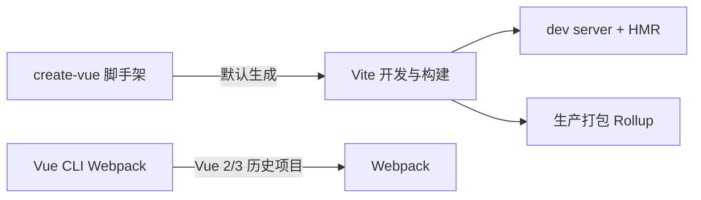
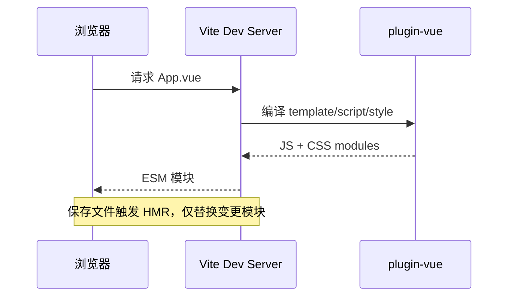

# 工具链：create-vue、Vite 与 Vue CLI

Vue 3 新项目走 `npm create vue@latest` → Vite；Vue CLI（Webpack）多见于 Vue 2 遗留仓。知道二者分工，新建与维护都不踩坑。

---

## 工具链全景



| 工具 | 角色 | 适用 |
|------|------|------|
| **create-vue** | 官方项目模板生成器 | Vue 3 新项目 |
| **Vite** | 开发服务器 + 生产构建 | Vue 3 默认、也可配 React 等 |
| **Vue CLI** | 基于 Webpack 的 `@vue/cli-service` | Vue 2/早期 Vue 3 |
| **@vitejs/plugin-vue** | 解析 SFC、HMR | Vite 项目必备插件 |

---

## create-vue：创建项目

```bash
npm create vue@latest
# 或
pnpm create vue
yarn create vue
```

交互式选项通常包括：

| 选项 | 建议 |
|------|------|
| TypeScript | 中大型项目建议开启 |
| JSX | 需要渲染函数/JSX 时开 |
| Vue Router | 多页面 SPA 开 |
| Pinia | 需要全局状态开 |
| Vitest | 单元测试 |
| ESLint / Prettier | 团队规范 |
| Vue DevTools | 开发调试插件 |

生成后：

```bash
cd my-project
npm install
npm run dev
```

典型目录结构：

```
my-project/
├── index.html          # Vite 入口 HTML
├── vite.config.ts
├── src/
│   ├── main.ts         # createApp(App).mount
│   ├── App.vue
│   ├── assets/
│   ├── components/
│   ├── router/         # 若选了 Router
│   └── stores/         # 若选了 Pinia
├── public/
└── env.d.ts
```

与 Vue CLI 的 `public/index.html` + `src/main.js` 概念对应，但 **Vite 根目录即 `index.html` 所在处**，不是嵌在 public 里。

---

## Vite 为何成为默认

| 特性 | 说明 |
|------|------|
| **原生 ESM** | 开发时不打包整应用，按请求编译当前模块 |
| **HMR** | 改 SFC 时热替换，状态尽量保留 |
| **冷启动快** | 依赖预构建（esbuild），大项目明显 |
| **配置简洁** | `vite.config.ts` 通常短于 Webpack 等价配置 |

最小 vite.config 示例：

```typescript
import { defineConfig } from 'vite'
import vue from '@vitejs/plugin-vue'
import { fileURLToPath, URL } from 'node:url'

export default defineConfig({
  plugins: [vue()],
  resolve: {
    alias: {
      '@': fileURLToPath(new URL('./src', import.meta.url))
    }
  },
  server: {
    port: 5173,
    proxy: {
      '/api': { target: 'http://localhost:3000', changeOrigin: true }
    }
  }
})
```

**环境变量**：

```bash
# .env.development
VITE_API_BASE=/api

# .env.production
VITE_API_BASE=https://api.example.com
```

代码中通过 `import.meta.env.VITE_API_BASE` 读取；**只有 `VITE_` 前缀**会暴露给客户端。

> Vue CLI 使用 `VUE_APP_` 前缀与 `process.env`，迁移时需全局替换。

---

## Vue CLI 与 Webpack 路径

```bash
# 历史方式（Vue 3 仍可用，非首选）
vue create my-legacy-app
npm run serve    # 开发
npm run build    # 生产
```

`vue.config.js` 扩展 Webpack：

```javascript
module.exports = {
  devServer: { port: 8080 },
  configureWebpack: {
    resolve: { alias: { '@': path.resolve(__dirname, 'src') } }
  }
}
```

| 维度 | Vite | Vue CLI (Webpack) |
|------|------|-------------------|
| 开发启动 | 快 | 随项目增大变慢 |
| 配置生态 | rollup-plugin 系 | loader/plugin 丰富、成熟 |
| 官方推荐 | Vue 3 默认 | 维护模式，Vue 2 遗留多 |
| 环境变量 | `import.meta.env` | `process.env` |

旧项目不必为「追新」强行迁 Vite；**新 fork 或重大重构**时再评估迁移成本。

---

## 脚本与构建产物

```json
{
  "scripts": {
    "dev": "vite",
    "build": "vue-tsc --noEmit && vite build",
    "preview": "vite preview",
    "test:unit": "vitest"
  }
}
```

| 命令 | 作用 |
|------|------|
| `dev` | 本地开发 + HMR |
| `build` | 输出到 `dist/`，默认静态资源 |
| `preview` | 本地预览生产构建 |
| `vue-tsc` | TS 类型检查（不 emit JS） |

构建结果在 `dist/`，可部署到任意静态托管（Nginx、OSS、Netlify）。若使用 History 路由，服务器需 **fallback 到 index.html**。

---

## 常用插件与集成

| 需求 | Vite 生态 |
|------|-----------|
| 自动导入 API | `unplugin-auto-import` |
| 组件按需注册 | `unplugin-vue-components` |
| 图标 | `unplugin-icons` |
| 压缩、legacy 浏览器 | `@vitejs/plugin-legacy` |
| 分析包体积 | `rollup-plugin-visualizer` |

Vue CLI 侧对应 `chainWebpack` 或 `configureWebpack` 配同样能力，但配置量通常更大。

---

## 从 Vue CLI 迁到 Vite 的要点

| 步骤 | 说明 |
|------|------|
| 依赖 | 移除 `@vue/cli-service`，加 `vite`、`@vitejs/plugin-vue` |
| 入口 | 根目录 `index.html`，`<script type="module" src="/src/main.ts">` |
| 别名 | `vite.config` 的 `resolve.alias` |
| 环境变量 | `VUE_APP_` → `VITE_`，`process.env` → `import.meta.env` |
| 静态资源 | `require()` 改 `import` 或 URL |
| 测试 | Jest 可换 Vitest |

---

## HMR 与 SFC 编译链

改 `.vue` 文件时：



`@vitejs/plugin-vue` 负责把 SFC 拆成 JS 与 CSS；`<style scoped>` 会注入 data 属性选择器。

---

## 小结

要点：create-vue 生成模板，Vite 负责开发与构建（开发走 ESM + HMR，生产走 Rollup）；Vue CLI 是 Webpack 路线，维护旧仓可用，非 Vue 3 默认选型。

工程化通识对照见 [14-框架工程化实践](../../../前端工程化体系/14-框架工程化实践.md)。


- 新项目：`npm create vue@latest` → 按需 Router / Pinia / TS → `npm run dev`。
- 环境变量：Vite 用 `VITE_` 前缀 + `import.meta.env`；CLI 用 `VUE_APP_` + `process.env`。
- 迁移：根目录 `index.html`、别名改 `vite.config`、`VUE_APP_` → `VITE_`、静态资源改 `import`。
- HMR：`plugin-vue` 编译 SFC，保存后仅替换变更模块。

**易混点**：
- Vite 入口 HTML 在根目录，不在 `public/` 里。
- 只有 `VITE_` 前缀的环境变量会暴露给客户端。
- 旧仓不必强行迁 Vite，重大重构时再评估。

核对：环境变量前缀是 `VITE_` 还是 `VUE_APP_`？`index.html` 是否在项目根目录？History 路由部署是否配了 fallback？
