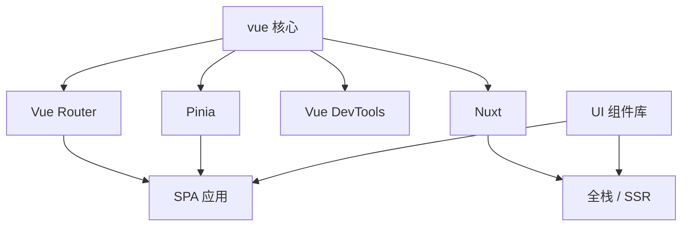

# 官方生态地图

Vue 核心只管视图层；**Router 导航 + Pinia 状态 + Vite 工程** 覆盖多数 SPA，Nuxt / UI 库 / i18n 按业务选配。

---

## 生态分层



| 层级 | 包/项目 | 职责 |
|------|---------|------|
| 核心 | `vue` | 响应式、组件、编译运行时 |
| 路由 | `vue-router` | URL ↔ 视图映射、导航守卫 |
| 状态 | `pinia` | 跨组件共享状态（推荐） |
| 状态（旧） | `vuex` | Vue 2/3 均可，新项少用 |
| 元框架 | `nuxt` | 目录约定、SSR/SSG、Server Routes |
| 工具 | `@vitejs/plugin-vue`、`create-vue` | 工程脚手架 |
| 调试 | Vue DevTools 浏览器扩展 | 组件树、Pinia、路由、性能 |

---

## Vue Router

| Vue | Vue Router |
|-----|------------|
| 2.x | 3.x |
| 3.x | 4.x |

最小示例（Vue 3）：

```typescript
// router/index.ts
import { createRouter, createWebHistory } from 'vue-router'
import Home from '@/views/HomeView.vue'

const router = createRouter({
  history: createWebHistory(import.meta.env.BASE_URL),
  routes: [
    { path: '/', name: 'home', component: Home },
    {
      path: '/user/:id',
      name: 'user',
      component: () => import('@/views/UserView.vue')
    }
  ]
})

export default router
```

```typescript
// main.ts
import { createApp } from 'vue'
import App from './App.vue'
import router from './router'

createApp(App).use(router).mount('#app')
```

| 能力 | 说明 |
|------|------|
| 嵌套路由 | `children` + 子 `router-view` |
| 命名视图 | 同一 URL 多个 `router-view` |
| 导航守卫 | `beforeEach`、组件内 `onBeforeRouteLeave` |
| 懒加载 | 路由 `component: () => import(...)` |

---

## Pinia 与 Vuex

| 对比 | Vuex | Pinia |
|------|------|-------|
| TS 推断 | 需额外类型包装 | 开箱友好 |
| Mutations | 必须 | 无，直接改 state 或 actions |
| 模块 | modules 嵌套 | 多 store 文件 |
| 体积 | 相对大 | 更轻 |
| Vue 3 官方态度 | 维护 | **推荐** |

Pinia 示例：

```typescript
// stores/counter.ts
import { defineStore } from 'pinia'
import { ref, computed } from 'vue'

export const useCounterStore = defineStore('counter', () => {
  const count = ref(0)
  const double = computed(() => count.value * 2)
  function increment() {
    count.value++
  }
  return { count, double, increment }
})
```

```vue
<script setup>
import { useCounterStore } from '@/stores/counter'
const counter = useCounterStore()
</script>

<template>
  <button @click="counter.increment">{{ counter.count }}</button>
</template>
```

Vue 2 遗留项目常见 Vuex 3；升级时可逐步迁到 Pinia。

---

## Vue DevTools

浏览器扩展（Chrome / Firefox / Edge）提供：

| 面板 | 用途 |
|------|------|
| Components | 组件树、props、state、事件 |
| Pinia | store 状态与时间旅行 |
| Router | 当前路由、记录 |
| Timeline | 性能、自定义事件 |
| Assets | 静态资源概览 |

开发环境自动连接；生产需避免暴露敏感数据。Vue 3.4+ 可选 `__VUE_PROD_DEVTOOLS__` 控制生产是否启用（默认关）。

---

## Nuxt

**Nuxt 3** 基于 Vue 3 + Vite + Nitro 服务器引擎：

| 特性 | 说明 |
|------|------|
| 文件路由 | `pages/` 自动生成路由 |
| 布局 | `layouts/`、`app.vue` |
| 数据获取 | `useFetch`、`useAsyncData` |
| SSR / SSG | 服务端渲染、静态生成 |
| Server Routes | `server/api/` BFF 层 |

适合：SEO 敏感站点、同构首屏、希望约定大于配置的全栈团队。纯后台 SPA 可不用 Nuxt。

---

## UI 组件库（社区主流）

官方不捆绑 UI 库，常见选型：

| 库 | Vue 版本 | 特点 |
|----|----------|------|
| Element Plus | 3 | 中后台表单表格丰富 |
| Ant Design Vue | 3 | 设计规范统一 |
| Naive UI | 3 | TS 友好、主题可调 |
| Vuetify | 3 | Material Design |
| Element UI | 2 | 仅 Vue 2 |

集成方式：全量引入、按需自动导入（`unplugin-vue-components` + resolver）。

---

## 测试与质量

| 工具 | 角色 |
|------|------|
| **Vitest** | 单元测试，与 Vite 配置共享 |
| **@vue/test-utils** | 挂载组件、触发事件 |
| **Playwright / Cypress** | E2E |
| **vue-tsc** | 模板与 script 类型检查 |
| **ESLint** | `eslint-plugin-vue` 规则集 |

create-vue 可一键生成 Vitest + ESLint 模板。

---

## 国际化与安全周边

| 包 | 用途 |
|----|------|
| **vue-i18n** | 多语言、`useI18n` 组合式 API |
| **@vueuse/core** | 常用 composables（非官方但事实标准） |
| **vee-validate / zod** | 表单校验 |

XSS、CSP、a11y 不属单一包，需在工程规范层面落实。

---

## 新项目依赖清单参考

```json
{
  "dependencies": {
    "vue": "^3.5.0",
    "vue-router": "^4.4.0",
    "pinia": "^2.2.0"
  },
  "devDependencies": {
    "vite": "^5.0.0",
    "@vitejs/plugin-vue": "^5.0.0",
    "typescript": "^5.0.0",
    "vue-tsc": "^2.0.0",
    "vitest": "^2.0.0",
    "@vue/test-utils": "^2.4.0"
  }
}
```

按是否需要 Nuxt、UI 库、i18n 再追加；避免重复引入 Vuex + Pinia 除非迁移过渡期。

---

## 文档与 RFC

| 资源 | 地址 |
|------|------|
| 中文文档 | https://cn.vuejs.org/ |
| Router | https://router.vuejs.org/zh/ |
| Pinia | https://pinia.vuejs.org/zh/ |
| Nuxt | https://nuxt.com/ |
| RFC | https://github.com/vuejs/rfcs |

重大特性（如 script setup 标准化）先 RFC 再进正式版，读 RFC 可理解设计动机。

---

## 小结

要点：Vue 核心只管视图层；Router 管 URL↔视图，Pinia 管跨组件状态，Vite 管工程化，三者构成 SPA 核心三角。Nuxt、UI 库、i18n 按业务选配。


- Pinia vs Vuex：无 mutations、TS 友好、多 store 文件，Vue 3 新项目默认 Pinia。
- 版本配对：Router 4 配 Vue 3，Element Plus 配 Vue 3。
- 质量标配：Vue DevTools + vue-tsc + Vitest。
- Nuxt：SEO / 首屏 / 全栈约定场景再上；纯后台 SPA 不必强上。

**易混点**：
- 迁移期避免 Vuex + Pinia 双栈并存。
- Element UI（Vue 2）≠ Element Plus（Vue 3）。
- @vueuse/core 非官方包，但是事实标准 composable 库。

核对：Router/Pinia 大版本是否与 Vue 大版本配对？是否重复引入 Vuex + Pinia？UI 库是否匹配 Vue 版本？
