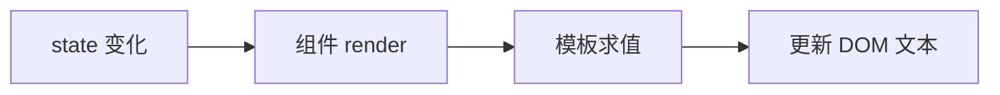

# 插值与模板表达式

`{{ }}` 把响应式数据渲染成文本（自动转义）；`v-html` 可渲染 HTML 但需防 XSS。复杂逻辑放 computed，模板只写表达式。

---

## 文本插值 {{ }}

最常用写法：将数据绑定到文本节点。

```vue
<template>
  <p>用户名：{{ username }}</p>
  <p>注册于 {{ registeredAt }}</p>
</template>

<script setup>
const username = 'lin'
const registeredAt = '2024-03-01'
</script>
```

| 特性 | 说明 |
|------|------|
| 更新时机 | 依赖的响应式数据变化后，重新求值并更新 DOM |
| 内容类型 | **纯文本**；HTML 标签会被转义显示 |
| 空白 | 插值内首尾空白可被压缩（编译器行为） |

```vue
<!-- 若 message 为 '<script>alert(1)</script>' -->
<p>{{ message }}</p>
<!-- 页面显示字面量，不会执行脚本 -->
```

---

## v-text 与插值的等价关系

```vue
<span v-text="username"></span>
<!-- 等价于 -->
<span>{{ username }}</span>
```

| 指令 | 使用场景 |
|------|----------|
| `{{ }}` | 混合静态文本与动态片段 |
| `v-text` | 整个元素内容都是动态文本 |

`v-text` 会**覆盖**元素原有子节点；需要保留子 HTML 结构时用插值或拆分元素。

---

## v-html：渲染 HTML 字符串

```vue
<template>
  <article v-html="richContent"></article>
</template>

<script setup>
const richContent = '<p>支持 <strong>富文本</strong></p>'
</script>
```

| 注意点 | 说明 |
|--------|------|
| XSS 风险 | **勿**对不可信用户输入直接用 `v-html` |
| 样式隔离 | 插入的 HTML 不受 SFC `scoped` 约束 |
| 与插值对比 | `{{ }}` 转义；`v-html` 按 HTML 解析 |

消毒示例（生产常见做法）：

```vue
<script setup>
import DOMPurify from 'dompurify'
import { computed } from 'vue'

const raw = ''
const safeHtml = computed(() => DOMPurify.sanitize(raw))
</script>

<template>
  <div v-html="safeHtml"></div>
</template>
```

---

## 模板表达式：能写什么

插值与指令参数里可写 **单个 JavaScript 表达式**（有返回值）：

```vue
<template>
  <p>{{ count + 1 }}</p>
  <p>{{ ok ? '是' : '否' }}</p>
  <p>{{ message.split('').reverse().join('') }}</p>
  <p>{{ formatPrice(price) }}</p>
</template>

<script setup>
import { ref } from 'vue'

const count = ref(0)
const ok = ref(true)
const message = ref('hello')
const price = ref(1999)

function formatPrice(n) {
  return `¥${(n / 100).toFixed(2)}`
}
</script>
```

**允许 vs 禁止**：

| 允许 | 禁止 |
|------|------|
| 三元、算术、逻辑运算 | `if` / `for` / `while` 语句 |
| 方法调用 `fn()` | 变量声明 `const x = 1` |
| 可选链 `obj?.a` | `import` 语句 |
| 简单数组/对象字面量 | 副作用：`count++`（应用 computed / methods） |

复杂逻辑应放到 **`computed`** 或 **函数**，模板保持可读：

```vue
<template>
  <p>{{ displayLabel }}</p>
</template>

<script setup>
import { computed, ref } from 'vue'
const firstName = ref('张')
const lastName = ref('三')
const displayLabel = computed(() => `${lastName.value}${firstName.value}`)
</script>
```

---

## 表达式中的全局与组件上下文

模板表达式可访问：

| 来源 | 示例 |
|------|------|
| script setup 顶层绑定 | `count`、`formatPrice` |
| props | `title`、`user.id` |
| 注入 | `inject('theme')` |
| 全局属性 | `$route`（若注册）、`$t`（i18n） |

**不可**直接访问组件实例上未暴露的属性（Vue 3 移除了大量实例 mystery API）。

> **Vue 2**：模板里常用 `this.xxx` 对应 Options API 的 `data` / `computed` / `methods`；Vue 3 script setup 无 `this`，直接用标识符。

---

## 过滤器 filters（Vue 2 遗留）

Vue 2 支持管道式过滤器：

```vue
<!-- Vue 2 仅 -->
<p>{{ price | currency('CNY') }}</p>
```

**Vue 3 已移除 filters**。改用函数或 computed：

```vue
<p>{{ currency(price, 'CNY') }}</p>
```

读旧代码时见到 `|` 语法，按等价函数理解即可。

---

## 多插值与性能直觉

同一元素内多个 `{{ }}` 会生成多个文本节点，无功能问题。频繁更新的 heavy 表达式应缓存到 `computed`，避免每次渲染重复计算：

```vue
<!-- 不推荐：模板里大数组 reduce -->
<p>{{ items.filter(i => i.active).map(i => i.name).join(', ') }}</p>

<!-- 推荐 -->
<p>{{ activeNames }}</p>
```

响应式触发更新链路（简化）：



---

## 与 JavaScript 模板字符串的区别

| | Vue 模板 `{{ }}` | JS 模板字符串 |
|，|------------------|---------------|
| 运行环境 | 编译进 render 函数 | 运行时 JS |
| 响应式 | 自动追踪依赖 | 无 |
| 语法 | 单表达式 | 任意 `${}` |

在 `.vue` 的 `<template>` 里写 `` `hello ${name}` `` **不会**自动绑定响应式；应使用 `{{ name }}` 或 `:title="`hello ${name}`"`（属性绑定里可用 JS 字符串）。

---

## 常见坑

| 坑 | 原因 | 处理 |
|----|------|------|
| 显示 `[object Object]` | 直接插值对象 | 取字段或 `JSON.stringify`（调试） |
| 数字不更新 | 非响应式普通变量 | 用 `ref` / `reactive` |
| v-html 样式错乱 | 全局 CSS 影响 | 消毒 + 限定容器 class |
| undefined 报错 | 深层属性未初始化 | 可选链 `user?.profile?.name` |

---

## 小结

要点：`{{ }}` 是编译期文本插值，自动追踪响应式依赖并转义 HTML；模板只允许单个表达式，语句和声明应放 script。


- `{{ }}` 默认文本插值，HTML 自动转义；显示对象会得到 `[object Object]`，应取字段。
- `v-text` 整节点替换；`v-html` 渲染 HTML，必须消毒防 XSS。
- 表达式边界：模板只允许表达式，语句/声明放 computed / 函数；Vue 3 无 filters。
- 深层访问：用可选链 `user?.profile?.name` 避免 undefined 报错。

**易混点**：
- `{{ }}` 与 JS 模板字符串不同，前者有响应式追踪。
- `v-html` 插入的内容不受 scoped 样式约束。
- Vue 2 的 `| filter` 语法在 Vue 3 已移除。

核对：模板里有没有写 `if/for` 语句？有没有对不可信输入用 `v-html`？复杂表达式是否已抽到 computed？
