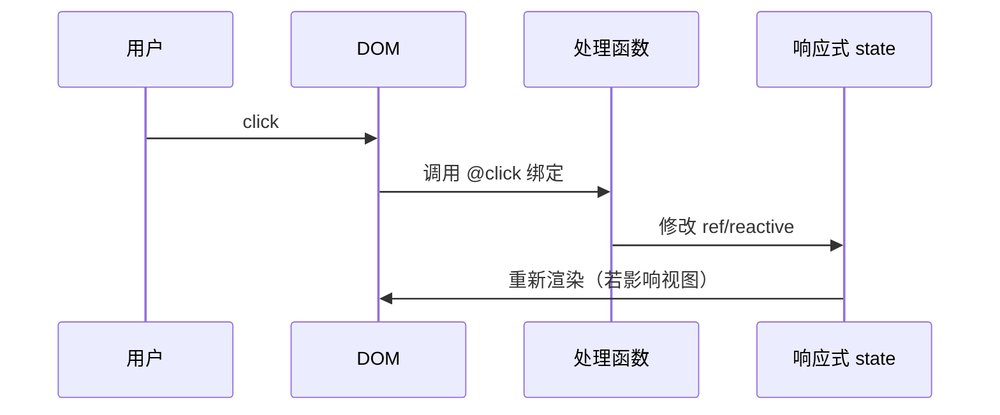

# 绑定与事件指令

`:attr`（v-bind）输出属性/props，`@event`（v-on）接收用户输入，修饰符处理冒泡、默认行为、按键等横切逻辑。

---

## v-bind 基础

```vue
<template>
  
  <button :disabled="loading">提交</button>
  <a :href="link">详情</a>
</template>

<script setup>
const avatarUrl = '/avatars/1.png'
const username = 'lin'
const loading = false
const link = 'https://example.com'
</script>
```

`:attr` 是 `v-bind:attr` 的缩写。绑定值为 `null` 或 `undefined` 时，该属性会从 DOM 上**移除**（布尔属性尤其常用）。

**绑定对象与数组**：

```vue
<!-- 对象：批量 class / style -->
<div
  :class="{ active: isActive, 'text-danger': hasError }"
  :style="{ fontSize: size + 'px', color: themeColor }"
></div>

<!-- 数组 class -->
<div :class="[baseClass, isActive && 'active']"></div>

<!-- 绑定整个 props 对象到子组件 -->
<MyInput v-bind="inputProps" />
```

```javascript
const inputProps = { placeholder: '搜索', maxlength: 20, disabled: false }
```

---

## v-on 与事件处理

```vue
<template>
  <button @click="handleClick">点击</button>
  <button @click="count++">内联表达式</button>
  <button @click="handleSubmit(id, $event)">传参</button>
</template>

<script setup>
import { ref } from 'vue'
const count = ref(0)
const id = 'order-1'

function handleClick() {
  console.log('clicked')
}

function handleSubmit(orderId, e) {
  e.preventDefault()
  console.log(orderId)
}
</script>
```

| 写法 | 说明 |
|------|------|
| `@click="fn"` | 无额外参数，事件对象自动传入（需要时在 fn 声明 `(e)`） |
| `@click="fn(a, $event)"` | `$event` 为原生 DOM 事件 |
| `@click="count++"` | 简单副作用可用内联表达式 |

复杂逻辑放 **script setup 函数**；内联只适合一两行，否则难测难读。

---

## 事件修饰符

用 `.` 后缀处理常见 DOM 行为：

```vue
<form @submit.prevent="onSubmit">
  <button @click.stop="onBtn">不冒泡</button>
</form>

<div @click.self="onWrapper">仅自身触发</div>
<a @click.prevent="navigate">阻止默认跳转</a>

<input @keyup.enter="onEnter" />
<input @keyup.esc="onEsc" />
```

| 修饰符 | 作用 |
|--------|------|
| `.stop` | `event.stopPropagation()` |
| `.prevent` | `event.preventDefault()` |
| `.capture` | 捕获阶段监听 |
| `.self` | 仅当 event.target 是绑定元素自身 |
| `.once` | 最多触发一次 |
| `.passive` | `{ passive: true }`，滚动性能相关 |

**按键修饰符**：

```vue
<input @keyup.enter="submit" />
<input @keydown.ctrl.s.prevent="save" />
```

Vue 3 提供常用键别名：`enter`、`tab`、`delete`、`esc`、`space`、`up`、`down` 等。

> **Vue 2**：曾支持 `.keyCode`（如 `.13`）；Vue 3 已移除，统一用键名别名。

鼠标修饰符：`.left`、`.right`、`.middle` 限定触发按键。

---

## v-bind 修饰符

**.prop**，强制绑定为 DOM property 而非 attribute（少数场景，如 `value` on `<progress>`）。

**.camel**，将 `kebab-case` 属性名转为 camelCase 传给组件（SVG 或 in-DOM 模板有时需要）。

**.sync（Vue 2 遗留）**，Vue 2 的 `:title.sync="title"` 等价于 `:title` + `@update:title`。Vue 3 用 **`v-model:title`** 替代。

---

## 组件上的 v-bind 与 v-on

**向子组件传 props**：

```vue
<!-- 父 -->
<UserCard :user="currentUser" :highlight="true" @select="onSelect" />

<!-- 子 UserCard.vue -->
<script setup>
defineProps({
  user: { type: Object, required: true },
  highlight: Boolean
})
const emit = defineEmits(['select'])
</script>
```

**透传 attrs**，未在 `props` 声明的属性落入 **`$attrs`**，默认挂到根元素：

```vue
<!-- MyButton 根为 button 时，class/id 会合并到 button -->
<button><slot /></button>
```

`inheritAttrs: false` + `v-bind="$attrs"` 可手动指定落点。

> **Vue 2**：非 prop 的 listener 在 `$listeners`；Vue 3 合并进 `$attrs`，包含 `onXxx` 形式事件。

---

## 动态参数

属性和事件名也可动态：

```vue
<a :[attributeName]="value">...</a>
<button @[eventName]="handler">...</button>
```

`attributeName` / `eventName` 需为合法标识符字符串；常用于抽象包装组件。

---

## 与原生属性的区别

| 类型 | 示例 | 绑定方式 |
|------|------|----------|
| HTML attribute | `id`、`class` | `:id`、`:class` |
| DOM property | `value`、`checked` | 通常 `:value` 仍走 property |
| 布尔 attribute | `disabled` | `:disabled="true"` 出现即生效 |

表单 **`v-model`** 是对 `:value` + `@input`/`@change` 的语法糖；`:value` 与 `@input` 可手写实现双向效果。

---

## 事件流示意



---

## 实践建议

| 建议 | 原因 |
|------|------|
| 表单 submit 用 `.prevent` | 避免整页刷新 |
| 委托列表项用数据驱动 `:key` + `@click` | 避免每项绑不同闭包（性能） |
| 包装原生组件时显式 `emit` 转发 | 父组件 API 清晰 |
| 避免在模板 `@click="async () => {...大量逻辑}"` | 可测试性差 |

---

## 小结

要点：`:attr` 动态绑定 DOM 属性或组件 props，`@event` 绑定事件处理函数；修饰符在编译期改写绑定代码，处理冒泡、默认行为等横切逻辑。


- `:attr` 绑定 `null`/`undefined` 会移除属性。
- 修饰符：`.stop` / `.prevent` / `.once` 处理冒泡与默认行为；按键用 `.enter` 等具名修饰符。
- 组件通信：`v-bind` 传 props，`v-on` 收 emit；Vue 3 将 listeners 合并进 `$attrs`。
- 动态参数：`:[name]`、`@[name]` 适合元数据驱动的属性/事件名。

**易混点**：
- Vue 2 的 `.sync` → Vue 3 的 `v-model:propName`。
- Vue 2 的 `$listeners` → Vue 3 合并进 `$attrs`。
- Vue 2 的 `.keyCode` 修饰符已移除。

核对：表单 submit 是否加了 `.prevent`？组件透传是否需 `inheritAttrs: false`？事件处理逻辑是否过长？
