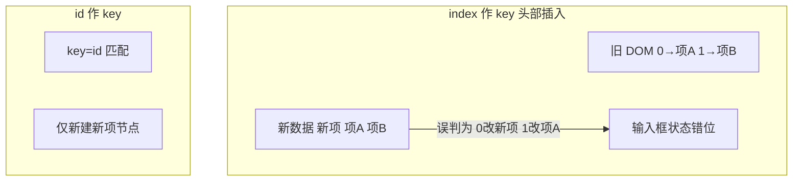

# 条件与列表渲染

`v-if` 挂载/销毁 DOM，`v-show` 只切 display；`v-for` 遍历列表必须配**稳定 key**，三者决定更新行为与性能。

---

## v-if 与 v-show

```vue
<template>
  <p v-if="role === 'admin'">管理员面板</p>
  <p v-else-if="role === 'editor'">编辑者视图</p>
  <p v-else>访客视图</p>
</template>

<script setup>
import { ref } from 'vue'
const role = ref('guest')
</script>
```

| 特性 | v-if | v-show |
|------|------|--------|
| DOM | 不满足时**不渲染**（无节点） | 始终渲染，CSS `display: none` |
| 切换成本 | 销毁/重建子树 | 仅改样式 |
| 初始为 false | 无开销 | 仍创建 DOM |
| 与 `<template>` | 可包一组元素 | 不能用在 `<template>` |

```vue
<template v-if="loggedIn">
  <h1>欢迎</h1>
  <UserMenu />
</template>
```

**何时用哪个**：

| 场景 | 选择 |
|------|------|
| 很少切换的块（权限、步骤） | `v-if` |
| 频繁切换（Tab、折叠） | `v-show` |
| 内含重型子组件且常隐藏 | `v-if` 避免无效挂载 |
| 需要 SEO crawler 见内容 | 两者都是客户端行为；SSR 另论 |

---

## v-for 列表渲染

```vue
<template>
  <ul>
    <li v-for="item in items" :key="item.id">
      {{ item.name }} — ¥{{ item.price }}
    </li>
  </ul>

  <ul>
    <li v-for="(item, index) in items" :key="item.id">
      {{ index + 1 }}. {{ item.name }}
    </li>
  </ul>

  <dl>
    <template v-for="user in users" :key="user.id">
      <dt>{{ user.name }}</dt>
      <dd>{{ user.email }}</dd>
    </template>
  </dl>
</template>

<script setup>
const items = [
  { id: 1, name: '键盘', price: 299 },
  { id: 2, name: '鼠标', price: 99 }
]
const users = [{ id: 'u1', name: 'Lin', email: 'a@b.com' }]
</script>
```

**遍历对象与数字**：

```vue
<!-- 对象：值、键、索引 -->
<li v-for="(value, key, index) in userProfile" :key="key">
  {{ key }}: {{ value }}
</li>

<!-- 1 到 n -->
<span v-for="n in 10" :key="n">{{ n }}</span>
```

---

## key 的作用

`key` 给 Vue 的 diff 算法提供**稳定身份**，列表重排、插入、删除时复用正确 DOM 与组件状态。

```vue
<!-- 错误：用 index 作 key，在头部插入时会错乱 -->
<li v-for="(todo, index) in todos" :key="index">{{ todo.text }}</li>

<!-- 正确：业务唯一 id -->
<li v-for="todo in todos" :key="todo.id">{{ todo.text }}</li>
```



| 规则 | 说明 |
|------|------|
| 必须唯一 | 同一列表内 sibling 间不重复 |
| 稳定 | 不要用随机数每次 render 变 |
| 不用 index | 列表会 reorder / 头部增删时 |

---

## v-if 与 v-for 的优先级

**Vue 3**：`v-if` 优先级 **高于** `v-for`。

```vue
<!-- 不推荐：同一元素上同时写 -->
<li v-for="user in users" v-if="user.active" :key="user.id">
```

应改为：

```vue
<template v-for="user in users" :key="user.id">
  <li v-if="user.active">{{ user.name }}</li>
</template>

<!-- 或 computed 先过滤 -->
<li v-for="user in activeUsers" :key="user.id">{{ user.name }}</li>
```

```javascript
import { computed } from 'vue'
const activeUsers = computed(() => users.value.filter(u => u.active))
```

> **Vue 2**：`v-for` 优先级高于 `v-if`，迁移时留意旧模板语义变化。

---

## 列表中的组件与状态

```vue
<TodoItem
  v-for="todo in todos"
  :key="todo.id"
  :todo="todo"
  @toggle="toggle(todo.id)"
/>
```

每个 `TodoItem` 实例有独立内部 state（如编辑中）。**错误 key** 会导致「删 A 却保留 A 的编辑态到 B」。

---

## 空列表与加载态

```vue
<template>
  <p v-if="loading">加载中…</p>
  <p v-else-if="items.length === 0">暂无数据</p>
  <ul v-else>
    <li v-for="item in items" :key="item.id">{{ item.title }}</li>
  </ul>
</template>
```

互斥分支用 `v-if` 链，避免空 `ul` 与「暂无数据」同时出现。

---

## 性能与长列表

| 手段 | 说明 |
|------|------|
| 虚拟滚动 | 只渲染视口内项（vue-virtual-scroller 等） |
| `v-memo`（Vue 3.2+） | 依赖不变则跳过子树更新 |
| 稳定子树 | 列表项内重型组件配合 `key` + `v-if` 延迟挂载 |
| 避免 v-for 内重计算 | 用 computed 预处理列表 |

```vue
<div v-for="item in list" :key="item.id" v-memo="[item.selected]">
  <!-- 仅 item.selected 变时才更新此块 -->
  <HeavyChart :data="item.chart" />
</div>
```

---

## Fragment 与 v-for

Vue 3 允许多根节点；`v-for` 在 `<template>` 上可输出多个同级节点：

```vue
<template v-for="row in rows" :key="row.id">
  <dt>{{ row.label }}</dt>
  <dd>{{ row.value }}</dd>
</template>
```

Vue 2 单根限制下常包一层 `<div>`；升级后可去掉无意义 wrapper。

---

## 常见错误

| 现象 | 可能原因 |
|------|----------|
| 列表不更新 | 直接改数组索引（Vue 2）；Vue 3 用 splice 或新数组 |
| 重复 key 警告 | id 重复或未设 key |
| 过滤后顺序乱 | index key + 排序/过滤 |
| v-show 无效 | 绑在 `<template>` 上 |

Vue 2 数组变更需用变更方法（`push`、`splice` 等）或 `Vue.set`；Vue 3 Proxy 下直接索引赋值通常可追踪，但仍推荐 immutable 风格更新便于推理。

---

## 小结

要点：`v-if` 控制 DOM 是否存在，`v-show` 控制 CSS 显隐，`v-for` + `key` 决定列表 diff 时节点复用策略，三者共同决定更新行为与性能。


- `v-if`：真条件挂载/销毁，适合低频切换；`v-show`：只切 display，适合高频显隐。
- `v-for`：遍历数组/对象/数字；**key 用稳定 id**，勿用 index（排序/过滤会乱序）。
- 优先级：Vue 3 上 v-if 优先于 v-for；同元素混写用 `<template>` 包裹或 computed 过滤。
- 长列表：考虑虚拟滚动、`v-memo`。

**易混点**：
- Vue 2 与 Vue 3 的 v-if/v-for 优先级相反。
- `v-show` 不能用在 `<template>` 上。
- index 作 key 在头部插入/删除时会错位组件内部状态。

核对：key 是否用业务 id 而非 index？v-if 与 v-for 有没有同元素冲突？长列表是否考虑虚拟化？
