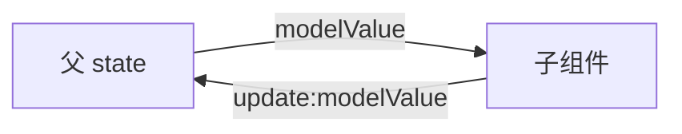

# v-model 与双向绑定

原生元素上 v-model 是 `:value` + 输入事件的语法糖；组件上是 `modelValue` + `update:modelValue`，Vue 3 支持多个命名 v-model。

---

## 原生元素上的 v-model

**文本与多行**：

```vue
<template>
  <input v-model="username" />
  <textarea v-model="bio"></textarea>
</template>

<script setup>
import { ref } from 'vue'
const username = ref('')
const bio = ref('')
</script>
```

等价展开（简化）：

```vue
<input :value="username" @input="username = $event.target.value" />
```

**复选框与单选**：

```vue
<!-- 单个 checkbox → boolean -->
<input type="checkbox" v-model="agreed" />

<!-- 多个 checkbox → 数组 -->
<input type="checkbox" value="sport" v-model="hobbies" />
<input type="checkbox" value="music" v-model="hobbies" />

<!-- radio -->
<input type="radio" value="a" v-model="picked" />
<input type="radio" value="b" v-model="picked" />
```

**select**：

```vue
<select v-model="city">
  <option disabled value="">请选择</option>
  <option value="sh">上海</option>
  <option value="bj">北京</option>
</select>

<!-- 多选 -->
<select v-model="tags" multiple>
  <option v-for="t in tagOptions" :key="t" :value="t">{{ t }}</option>
</select>
```

| 控件 | v-model 绑定类型 |
|------|------------------|
| text / textarea | string |
| checkbox（单个） | boolean |
| checkbox（多个） | array |
| radio | string / number / boolean |
| select | string / number / array（multiple） |

---

## 修饰符

```vue
<input v-model.lazy="msg" />
<input v-model.number="age" type="number" />
<input v-model.trim="keyword" />
```

| 修饰符 | 行为 |
|--------|------|
| `.lazy` | 用 `change` 而非 `input` 同步 |
| `.number` | 输入转为数字 |
| `.trim` | 去除首尾空白 |

修饰符在编译阶段改写绑定代码，对组件 v-model 也可自定义对应 prop/事件。

---

## 组件 v-model（Vue 3）

**默认 model**：

```vue
<!-- 父 -->
<CustomInput v-model="search" />

<!-- 子 CustomInput.vue -->
<script setup>
const props = defineProps(['modelValue'])
const emit = defineEmits(['update:modelValue'])

function onInput(e) {
  emit('update:modelValue', e.target.value)
}
</script>

<template>
  <input :value="modelValue" @input="onInput" />
</template>
```

父组件编译等价于：

```vue
<CustomInput
  :modelValue="search"
  @update:modelValue="search = $event"
/>
```

> **Vue 2 组件**：默认 `value` + `input`；Vue 3 改为 **`modelValue` + `update:modelValue`**，升级必改。

**多个 v-model**：

```vue
<UserForm
  v-model:name="form.name"
  v-model:email="form.email"
/>
```

```vue
<!-- UserForm.vue -->
<script setup>
defineProps(['name', 'email'])
defineEmits(['update:name', 'update:email'])
</script>

<template>
  <input :value="name" @input="$emit('update:name', $event.target.value)" />
  <input :value="email" @input="$emit('update:email', $event.target.value)" />
</template>
```

Vue 2 用 **`.sync`** 修饰符实现类似 `:title.sync="x"` → Vue 3 统一为 `v-model:title`。

---

## 自定义组件修饰符

子组件通过 `modelModifiers` 接收：

```vue
<!-- 父 -->
<MyInput v-model.capitalize="text" />

<!-- 子 -->
<script setup>
const props = defineProps({
  modelValue: String,
  modelModifiers: { default: () => ({}) }
})
const emit = defineEmits(['update:modelValue'])

function emitValue(val) {
  if (props.modelModifiers.capitalize) {
    val = val.charAt(0).toUpperCase() + val.slice(1)
  }
  emit('update:modelValue', val)
}
</script>
```

命名 v-model 的修饰符在 prop 上为 `nameModifiers` 等形式。

---

## v-model 与单向数据流

「双向绑定」不等于子组件随意改 prop：

```vue
<!-- 反模式：子组件直接改 prop -->
<script setup>
const props = defineProps(['modelValue'])
// props.modelValue = 'x'  // 不应这样做
</script>
```

正确路径：**emit 通知父更新**，父的 state 才是 source of truth。



复杂表单可在子组件内用 **computed 带 getter/setter** 包装：

```vue
<script setup>
import { computed } from 'vue'
const props = defineProps(['modelValue'])
const emit = defineEmits(['update:modelValue'])

const proxy = computed({
  get: () => props.modelValue,
  set: (v) => emit('update:modelValue', v)
})
</script>

<template>
  <input v-model="proxy" />
</template>
```

---

## 非字符串 v-model

组件可绑定对象/数组：

```vue
<RangePicker v-model="range" />

<script setup>
const range = ref({ start: null, end: null })
</script>
```

子组件 `emit('update:modelValue', { start, end })` 即可。深层对象仍需注意不可变更新习惯（或整体替换对象）。

---

## 与 :value + @input 手写对比

| 方式 | 适用 |
|------|------|
| `v-model` | 标准表单、封装输入组件 |
| 拆分绑定 | 需要中间转换、仅读展示 |
| `v-model` + computed | 格式化显示与存储分离 |

只读展示不要用 v-model，用 `:value` 或普通插值。

---

## Vue 2 对照速查

| 能力 | Vue 2 | Vue 3 |
|------|-------|-------|
| 组件默认 prop/event | `value` / `input` | `modelValue` / `update:modelValue` |
| 多个绑定 | `.sync` | `v-model:xxx` |
| `.native` 修饰符 | 监听组件根原生事件 | 已移除；未声明 emit 的 event 落 attrs |
| v-model on component | 一个 | 多个命名 |

---

## 常见坑

| 坑 | 处理 |
|----|------|
| 数字变字符串 | `v-model.number` 或子组件 parse |
| 中文输入法组合态 | 依赖 `input` 事件，一般无问题；特殊场景监听 `compositionend` |
| checkbox 初始 undefined | 给 `ref(false)` 或 `[]` 明确初值 |
| 父 v-model 未更新 | 子未 emit 或 event 名拼错 |

---

## 小结

要点：v-model 是 prop + emit 的语法糖，数据流仍单向，子 emit → 父改 state → props 下发。原生元素上是值绑定 + 输入事件；组件上是 modelValue + update:modelValue。


- 原生 v-model = 值绑定 + 输入事件；`.lazy` / `.number` / `.trim` 修饰输入时机与类型。
- 组件 Vue 3：`modelValue` + `update:modelValue`；多字段用 `v-model:fieldName`。
- 子组件勿直接改 prop；用 emit 或 computed getter/setter 包装。
- Vue 2 的 value/input → Vue 3 的 modelValue/update:modelValue；`.sync` → `v-model:xxx`。

**易混点**：
- 「双向绑定」≠ 子组件可改 prop，仍是 props down、events up。
- 数字输入忘 `.number` 会得到字符串。
- Vue 2 组件库的 v-model 协议与 Vue 3 不同，升级必改。

核对：子组件 emit 名是否拼对？数字输入是否加了 `.number`？升级时 value/input 是否已改为 modelValue？
