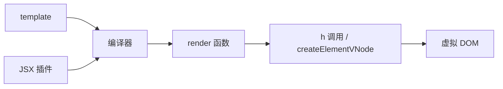

# 渲染函数与 JSX

模板覆盖多数 UI；需要程序化 vnode、复杂分支或 TSX 集成时用 **`h()` 渲染函数** 或 **JSX**，与 SFC 模板走同一套 render 管线。

---

## 为何需要渲染函数

| 场景 | 模板 | 渲染函数 / JSX |
|------|------|----------------|
| 静态结构为主 | ✅ 可读性高 | 冗长 |
| 动态 tag / 多层嵌套由数据驱动 | 可用 component :is | ✅ 更直接 |
| 重度依赖 TS 类型推断的组件库 | 一般 | JSX 常见 |
| 复用渲染逻辑块 | slot / 组件 | ✅ 抽函数返回 vnode |

Vue 3 推荐默认 **SFC + template**；渲染函数是补充工具，不是默认风格。

---

## h() 基础

从 `vue` 导入 `h`（hyperscript）：

```javascript
import { h, ref } from 'vue'

export default {
  setup() {
    const count = ref(0)
    return () =>
      h('button', { onClick: () => count.value++ }, count.value)
  }
}
```

签名：`h(type, props?, children?)`

| 参数 | 说明 |
|------|------|
| `type` | 标签名字符串、组件对象、异步组件 |
| `props` | class、style、onClick、自定义 prop |
| `children` | 字符串、数组 of vnode、单 vnode |

```javascript
h('div', { class: 'box', id: 'app' }, [
  h('h1', null, '标题'),
  h('p', null, '段落')
])
```

事件在 props 里用 **`on` + 大驼峰**：`onClick`、`onUpdate:modelValue`。

---

## 在 setup 中返回渲染函数

```javascript
import { h, ref, computed } from 'vue'
import MyIcon from './MyIcon.vue'

export default {
  props: ['items'],
  setup(props) {
    const filter = ref('')
    const visible = computed(() =>
      props.items.filter(i => i.name.includes(filter.value))
    )

    return () =>
      h('div', { class: 'list' }, [
        h('input', {
          value: filter.value,
          onInput: (e) => { filter.value = e.target.value }
        }),
        ...visible.value.map(item =>
          h('div', { key: item.id, class: 'row' }, [
            h(MyIcon, { name: item.icon }),
            item.name
          ])
        )
      ])
  }
}
```

等价模板大致是 `v-model` + `v-for`；渲染函数把结构收成 JavaScript 表达式。

---

## 函数式组件与 defineComponent

```javascript
import { defineComponent, h } from 'vue'

export default defineComponent({
  props: { level: { type: Number, default: 1 } },
  setup(props, { slots }) {
    return () => h(`h${props.level}`, slots.default?.())
  }
})
```

Vue 3 移除了 Vue 2 的 `functional: true` 选项；无 state 的组件直接 `setup` return 渲染函数即可。

---

## JSX / TSX

Vite 项目安装并配置 `@vitejs/plugin-vue-jsx`：

```typescript
// vite.config.ts
import vueJsx from '@vitejs/plugin-vue-jsx'

export default defineConfig({
  plugins: [vue(), vueJsx()]
})
```

示例：

```tsx
import { defineComponent, ref } from 'vue'

export default defineComponent({
  setup() {
    const count = ref(0)
    return () => (
      <button class="btn" onClick={() => count.value++}>
        {count.value}
      </button>
    )
  }
})
```

| JSX | 模板 |
|-----|------|
| `class="a"` 或 `class={{ active: ok }}` | `:class` |
| `onClick={fn}` | `@click` |
| `{list.map(...)}` | `v-for` |
| `{ok ? <A/> : <B/>}` | `v-if` |

**v-model 在 JSX 中**：

```tsx
<input
  value={text.value}
  onInput={(e) => { text.value = e.target.value }}
/>
```

组件：

```tsx
<MyInput
  modelValue={search.value}
  onUpdate:modelValue={(v) => { search.value = v }}
/>
```

---

## slots 在渲染函数里

```javascript
export default {
  setup(props, { slots }) {
    return () =>
      h('div', { class: 'card' }, [
        slots.header?.(),
        slots.default?.(),
        slots.footer?.()
      ])
  }
}
```

具名 + 作用域插槽：

```javascript
// 子组件提供作用域数据
return () =>
  h('div', null, slots.item?.({ row: currentRow }))

// 父组件在 JSX 中
<Table v-slots={{
  item: ({ row }) => <span>{row.name}</span>
}} />
```

Vue 3.3+ 有 **`defineSlots`** 辅助 TS；模板侧仍推荐 `<template #item>` 可读性更好。

---

## 编译关系



SFC 的 `<template>` 最终也变成 `render()` 内的 `h()` 序列；手写渲染函数跳过 template 编译步骤，**运行时规则一致**（props、key、patchFlags 等）。

---

## 何时不必用渲染函数

- 业务页面、表单、列表：**template 足够**。
- 设计系统文档示例：优先 SFC 便于 copy。
- 仅因「习惯 JSX」而全项目 TSX：团队需统一 lint 与 IDE 支持，维护成本更高。

适合渲染函数的典型库代码：**Table 动态列**、**Schema 驱动表单**、**Markdown → 组件映射**。

```javascript
function renderField(schema) {
  switch (schema.type) {
    case 'input':
      return h('input', { type: 'text', ...schema.attrs })
    case 'select':
      return h('select', null,
        schema.options.map(opt => h('option', { value: opt.value }, opt.label))
      )
    default:
      return h('span', null, '未知类型')
  }
}
```

---

## Vue 2 render 差异提示

| 点 | Vue 2 | Vue 3 |
|----|-------|-------|
| h 导入 | `Vue.h` 或 `render(h)` 参数注入 | 直接 `import { h } from 'vue'` |
| VNode 数据结构 | 不同内部 shape | 新 vnode 模型 + PatchFlags |
| JSX | `vue-jsx` 生态 | `@vitejs/plugin-vue-jsx` |

读旧库源码时注意 h 的第二个参数在 Vue 3 合并了 data、props、on 等于一体对象。

---

## 小结

要点：template 与 h()/JSX 最终都走同一套 render 管线，产出虚拟 DOM；SFC template 由编译器转成 h() 序列，手写渲染函数跳过 template 编译但运行时规则一致。


- `h(type, props, children)` 创建 vnode；`setup` 返回函数即渲染函数组件。
- JSX 需 `@vitejs/plugin-vue-jsx`；事件 `onClick`，组件 v-model 用 `modelValue` + `onUpdate:modelValue`。
- slots：渲染函数中通过 `slots.default?.()` 传递。
- 选型：默认用 template；动态结构、组件库开发、TSX 生态集成再用 h/JSX。

**易混点**：
- 渲染函数事件用 `onClick` 而非 `@click`。
- Vue 2 的 `functional: true` 在 Vue 3 已移除。
- 全项目 TSX 维护成本高于 SFC + template。

核对：是否真的需要程序化 vnode？JSX 插件是否已配置？事件 prop 是否用大驼峰 `onXxx`？
