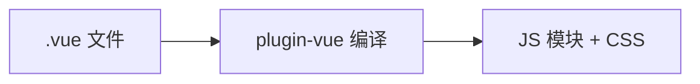

# SFC 结构与 script 标签

`.vue` 文件把 template、script、style 收在一起，三块各干什么、script setup 和标准 script 怎么选、scoped 为什么有时选不中子组件，搞清这些，改样式和读报错会省很多力气。

---

## 一个 .vue 文件里有什么

通常三块：

```vue
<template><!-- 结构 --></template>
<script setup lang="ts"><!-- 逻辑 --></script>
<style scoped><!-- 样式 --></style>
```

Vite 的 `@vitejs/plugin-vue` 会把它编译成 **ES 模块**；浏览器跑的是编译后的 JS/CSS，不是 `.vue` 原文。至少要有 template 或 script 之一；纯 render 函数组件可以只有 script。



把结构、逻辑、样式收在一个文件里，改一个组件不用跳三个目录；编译期还能做 scoped、`defineProps` 这些优化。单文件堆到上千行宜拆 composable 和子组件，而不是继续往里塞。

---

## script setup：Vue 3 的默认写法

**标准 script** 要 `export default`，setup 里还得 `return` 暴露给模板。**script setup** 里顶层变量、函数**自动**给 template 用，配合 `defineProps`、`defineEmits` 等宏，样板少一截。

```vue
<script setup lang="ts">
import { ref } from 'vue'
const count = ref(0)
</script>

<template>
  <button @click="count++">{{ count }}</button>
</template>
```

Options API（`data`、`methods`）在 **Vue 2 遗留代码**里仍会出现；Vue 3 新代码默认 script setup + TS。

只有几种情况需要**第二个普通 script 块**（或 `defineOptions`）：要固定 **组件 name**（DevTools 里好看），或 **`inheritAttrs: false`** 配合 `v-bind="$attrs"` 手动分配属性。

```vue
<script lang="ts">
export default { name: 'UserProfile', inheritAttrs: false }
</script>
<script setup lang="ts">
// ...
</script>
```

`defineProps` 返回的 props **只读**，在 setup 里改 `props.id` 是错的，和 React props 只读同理。

---

## template：Vue 3 可以多根了

template 里是增强的 HTML：指令、`{{ }}`、组件标签。Vue 3 允许多个根节点，不用再包一层无意义的 `<div>`；Vue 2 旧编译器要求单根，老项目里常见外包 wrapper。

复杂表达式宜放 script，template 保持可读。`v-if` 和 `v-for` 写同一元素时，Vue 3 里 **v-if 优先级更高**，列表+条件容易踩坑，习惯用 `template v-for` 包一层，或 computed 先过滤数组。

---

## scoped 锁样式，:deep 改子组件内部

默认 `<style>` 是**全局**的，`.title { color: red }` 可能误伤全站。**scoped** 给选择器加 `[data-v-xxx]`，只作用于当前组件模板渲染出的 DOM。

改 Element Plus 这类库的内部 class，scoped 里直接写 `.el-input__inner` **选不中**，要用 `:deep()` 穿透：

```vue
<style scoped>
.card { padding: 16px; }
.wrapper :deep(.el-input__inner) {
  border-radius: 8px;
}
</style>
```

Vue 2 老代码可能用 `>>>` / `/deep/`，迁移时宜统一到 `:deep()`。另外 scoped 管的是本组件模板出来的 DOM；**Teleport** 到 body 的节点有时套不上 scoped 规则，要单独写样式或走全局层。

---

## 资源 import 和报错栈

script 里 `import logo from './logo.png'`，template 里 `:src="logo"`，构建会处理成 URL。`?raw`、`?worker` 是 Vite 约定，没配构建链别乱用后缀。

script setup 编译后大致是带 `setup()` 的组件 + `render` 函数。DevTools、栈里出现 `setup`、`_ctx.xxx` 时，先查 template 里用到的名字是否在 script setup **顶层**定义，typo 或漏 import 最常见。

---

## Vue 2 和 Vue 3 写 SFC 时的差别

| 点 | Vue 2 常见写法 | Vue 3 推荐 |
|----|----------------|------------|
| 根节点 | 单根 | 可多根 |
| 深度选择器 | `>>>` / `/deep/` | `:deep()` |
| script setup | 2.7 实验性 | 默认 |
| CSS 绑 JS | 无 | `v-bind(color)` in style |

---

## 小结

要点：SFC 把 template、script、style 合成一个 `.vue`，由 Vite + `plugin-vue` 编译成 ES 模块；浏览器执行编译产物，不是源文件本身。


- 三块分工：template 写结构；script 写逻辑；style 写样式。giant 单文件应拆 composable 与子组件。
- script setup 是 Vue 3 默认：顶层绑定自动暴露，配合 defineProps/defineEmits 等宏。
- template：Vue 3 支持多根；v-if 与 v-for 同元素时 v-if 优先。
- 样式：scoped 隔离；改 UI 库内部用 `:deep()`；Teleport 节点 scoped 可能管不到。

**易混点**：
- scoped 里裸写 `.el-xxx` 选不中组件库内部 DOM，须 `:deep()`。
- props 只读，不能在 setup 里改 `props.id`。
- Vue 2 单根、旧深度选择器 `>>>` / `/deep/` 迁移时须改。

核对：props 有没有被改写？v-if/v-for 有没有同元素冲突？scoped 改 UI 库要不要 deep？template 里变量名是否都在 script setup 顶层？
