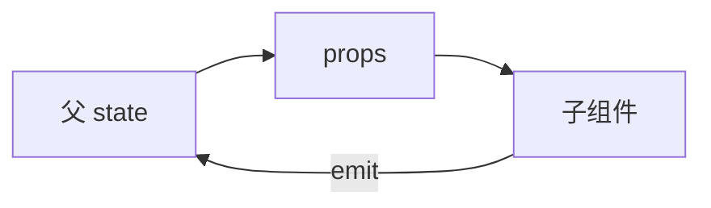

# Props 定义与校验

Props 是父→子的正式数据通道；`defineProps` 声明类型与默认值，**单向数据流**，子组件不直接改 prop，用 emit 通知父更新。

---

## 基本用法

```vue
<!-- 父 Parent.vue -->
<template>
  <UserBadge :name="userName" :level="3" show-icon />
</template>

<script setup>
import UserBadge from './UserBadge.vue'
const userName = 'Lin'
</script>
```

```vue
<!-- 子 UserBadge.vue -->
<script setup>
const props = defineProps({
  name: { type: String, required: true },
  level: { type: Number, default: 1 },
  showIcon: { type: Boolean, default: false }
})
</script>

<template>
  <span class="badge">
    <Icon v-if="showIcon" />
    {{ name }} Lv.{{ level }}
  </span>
</template>
```

模板中 prop 直接当变量用；script 里通过 **`props.xxx`** 访问（解构见 toRefs / defineProps 解构）。

---

## 运行时声明 vs TypeScript

**运行时对象声明**：

```javascript
defineProps({
  id: [String, Number],
  payload: Object,
  onDone: Function, // 回调型 prop，更推荐 emit
  tags: {
    type: Array,
    default: () => []
  }
})
```

| 字段 | 说明 |
|------|------|
| `type` | String / Number / Boolean / Array / Object / Date / Function / Symbol |
| `required` | 缺失时 dev 警告 |
| `default` | 对象/数组必须用工厂函数 `() => ({})` |
| `validator` | `(value) => boolean` 自定义校验 |

**类型声明（TS）**：

```vue
<script setup lang="ts">
interface User {
  id: string
  name: string
}

const props = defineProps<{
  user: User
  optional?: boolean
}>()
</script>
```

带默认值需 **withDefaults**：

```typescript
const props = withDefaults(
  defineProps<{ size?: 'sm' | 'md' | 'lg' }>(),
  { size: 'md' }
)
```

Vue 3.4+ 支持在类型 props 上更简洁的默认值写法；团队统一一种风格即可。

---

## 单向数据流

```vue
<script setup>
const props = defineProps(['count'])

// ❌ 不要：props.count++
// ❌ 不要：props.user.name = 'x'（对象 prop 改内部字段也违反约定）

const emit = defineEmits(['update:count'])
function inc() {
  emit('update:count', props.count + 1)
}
</script>
```



需要「子改父数据」时：**emit 事件** 或 **v-model**（本质是 prop + emit 语法糖）。

---

## Boolean 与属性透传

**Boolean 转换**：

```vue
<!-- 仅写 prop 名等价于 :show-icon="true" -->
<UserBadge show-icon />
```

无值 attribute 在 prop 类型为 Boolean 时转为 `true`；`""` 也常为 true。

**非 prop 的 attribute（$attrs）**：

```vue
<!-- 父 -->
<MyInput class="field" data-testid="email" aria-label="邮箱" />

<!-- 子未声明 class / data-testid 时进入 $attrs -->
<script setup>
defineOptions({ inheritAttrs: false })
</script>

<template>
  <label>
    <input v-bind="$attrs" />
  </label>
</template>
```

Vue 3 中 **class、style、未监听的事件** 也在 attrs 体系内；与 Vue 2 的 `$listeners` 合并。

---

## prop 校验与开发体验

开发模式下类型不匹配会 console 警告：

```javascript
defineProps({
  age: {
    type: Number,
    validator: (v) => v >= 0 && v <= 150
  }
})
```

生产构建默认 strip 掉校验逻辑以减小体积；**不要依赖 validator 做安全边界**，仅辅助开发。

---

## 大小写与 DOM 模板

| 定义（script） | 模板（父） |
|----------------|------------|
| `showIcon` | `show-icon` 或 `:showIcon` |
| `userId` | `user-id` |

SFC 模板编译器会解析 kebab-case；**in-DOM 模板**（直接写 HTML 文件）仅 kebab-case 可靠。

---

## Options API 中的 props（读旧代码）

```javascript
export default {
  props: {
    title: String,
    items: {
      type: Array,
      default: () => []
    }
  }
}
```

Vue 2 / Vue 3 Options API 写法相同；新代码优先 script setup + `defineProps`。

---

## 设计原则

| 原则 | 说明 |
|------|------|
| props 宜少而稳 | 频繁变动的内部状态放子组件 state |
| 对象 prop 视 immutable | 父换引用触发更新，少改深层字段 |
| 回调 prop vs emit | 对外通知用 **emit**，跨层用 provide/inject |
| 文档化 | 组件库用 JSDoc / Storybook 描述 props |

```vue
<!-- 反模式：prop 过多且全 optional -->
<Widget a b c d e f g />

<!-- 更好：分组对象或 variant -->
<Widget variant="compact" :options="widgetOptions" />
```

---

## 常见坑

| 坑 | 处理 |
|----|------|
| 数组 default 写 `default: []` | 改 `default: () => []` |
| 解构 prop 失响应 | `toRefs(props)` 或 `props.xxx` |
| TS 联合类型不窄化 | 用 `as const` 或运行时分支 |
| 传 undefined 覆盖 default | default 仅在「未传」时生效 |

---

## 小结

要点：Props 是父→子的单向数据通道，子组件只读不改；需要回传父级用 emit 或 v-model。未声明的 attribute 落入 $attrs 透传。


- `defineProps`：运行时对象或 TS 泛型；对象/数组默认值用工厂函数 `() => ({})`。
- 单向数据流：子不直接改 prop；本地副本用 computed getter/setter 或 emit。
- `$attrs`：未声明 prop 的 attribute 自动透传；`inheritAttrs: false` 需手动 `v-bind="$attrs"`。
- 命名：JS 用 camelCase，DOM 模板用 kebab-case。

**易混点**：
- 对象/数组 default 不能写 `default: []`，必须 `default: () => []`。
- 解构 props 会丢响应式，需 toRefs 或 Vue 3.4+ 编译期解构。
- Boolean prop 无值 attribute 等价于 `true`。

核对：有没有在子组件里直接改 prop？default 是否用了工厂函数？透传 attrs 是否需 inheritAttrs: false？
