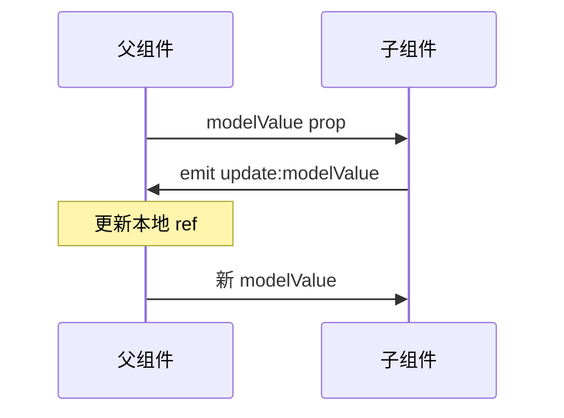

# 事件 emit 与组件 v-model

子组件用 **`defineEmits`** 向父发事件；组件 v-model = **`modelValue` + `update:modelValue`**，多字段用 `v-model:xxx`，本地编辑 prop 用 computed 或 `defineModel`。

---

## defineEmits 基础

```vue
<!-- 子 SearchBar.vue -->
<script setup>
const emit = defineEmits(['search', 'clear'])

function onSubmit(keyword) {
  emit('search', keyword)
}

function onClear() {
  emit('clear')
}
</script>

<template>
  <form @submit.prevent="onSubmit(input)">
    <input v-model="input" />
    <button type="submit">搜索</button>
    <button type="button" @click="onClear">清空</button>
  </form>
</template>
```

```vue
<!-- 父 -->
<SearchBar @search="handleSearch" @clear="handleClear" />
```

| 要点 | 说明 |
|------|------|
| 事件名 | 推荐 kebab-case：`update:modelValue` |
| 载荷 | `emit('search', keyword, meta)` 多参数 |
| 校验 | `defineEmits({ search: (q) => q.length > 0 })` |

---

## TypeScript 类型

```vue
<script setup lang="ts">
const emit = defineEmits<{
  search: [query: string]
  select: [id: number, item: { name: string }]
}>()

emit('search', 'vue') // OK
// emit('search', 1)   // 类型错误
</script>
```

Vue 3.3+ 元组形式 `[payload]` 表达参数列表；与运行时 validator 二选一或并存。

---

## 组件 v-model 完整示例

```vue
<!-- 父 -->
<CustomSwitch v-model="enabled" />

<!-- CustomSwitch.vue -->
<script setup>
const props = defineProps({
  modelValue: { type: Boolean, default: false }
})
const emit = defineEmits(['update:modelValue'])

function toggle() {
  emit('update:modelValue', !props.modelValue)
}
</script>

<template>
  <button
    role="switch"
    :aria-checked="modelValue"
    @click="toggle"
  >
    {{ modelValue ? '开' : '关' }}
  </button>
</template>
```

编译器展开：

```vue
<CustomSwitch
  :modelValue="enabled"
  @update:modelValue="enabled = $event"
/>
```

---

## 多个 v-model

```vue
<!-- 父 -->
<DateRangePicker
  v-model:start="range.start"
  v-model:end="range.end"
/>

<!-- DateRangePicker.vue -->
<script setup>
defineProps(['start', 'end'])
defineEmits(['update:start', 'update:end'])
</script>

<template>
  <input
    type="date"
    :value="start"
    @input="$emit('update:start', $event.target.value)"
  />
  <input
    type="date"
    :value="end"
    @input="$emit('update:end', $event.target.value)"
  />
</template>
```

| Vue 2 | Vue 3 |
|-------|-------|
| `:start.sync="range.start"` | `v-model:start="range.start"` |

---

## computed 包装 v-model

子组件内需要本地编辑再同步父级时：

```vue
<script setup>
import { computed } from 'vue'

const props = defineProps(['modelValue'])
const emit = defineEmits(['update:modelValue'])

const text = computed({
  get: () => props.modelValue,
  set: (v) => emit('update:modelValue', v)
})
</script>

<template>
  <textarea v-model="text" />
</template>
```

避免直接 `ref` 拷贝 prop 初值导致与父不同步（除非刻意「非受控」草稿态并 `@blur` 再提交）。

---

## emit 与原生事件

**声明的事件不会进 attrs**：

```vue
<script setup>
defineEmits(['click']) // 组件自定义 click
</script>
```

父组件 `@click` 监听的是 **emit 的 click**，不会自动等价于原生 DOM click，除非在子模板里 `@click="$emit('click')"`。

**未声明的 listener**，Vue 3：未在 `emits` 选项声明的事件名，在部分场景会作为 **`onClick` 形式 attrs** 落到根元素。最佳实践：显式 `defineEmits` 列出对外 API。

> **Vue 2**：`.native` 修饰符监听根原生事件；Vue 3 已移除。

---

## v-model 修饰符在组件上

父：

```vue
<MyInput v-model.trim.capitalize="name" />
```

子接收 `modelModifiers`：

```vue
<script setup>
const props = defineProps({
  modelValue: String,
  modelModifiers: { default: () => ({}) }
})
const emit = defineEmits(['update:modelValue'])

function onInput(e) {
  let v = e.target.value
  if (props.modelModifiers.trim) v = v.trim()
  if (props.modelModifiers.capitalize) {
    v = v.charAt(0).toUpperCase() + v.slice(1)
  }
  emit('update:modelValue', v)
}
</script>
```

命名 v-model 对应 `startModifiers` 等。

---

## 事件流示意



自定义业务事件同理：`emit('save', payload)` → 父 `@save="onSave"`。

---

## Options API 对照

```javascript
export default {
  props: ['modelValue'],
  emits: ['update:modelValue', 'change'],
  methods: {
    onInput(e) {
      this.$emit('update:modelValue', e.target.value)
    }
  }
}
```

Vue 2 组件 `model` 选项可改 prop/event 名：

```javascript
// Vue 2
model: { prop: 'checked', event: 'change' }
```

Vue 3 改用 **`defineModel`（3.4+）** 或显式 props/emit。

---

## 实践建议

| 做法 | 原因 |
|------|------|
| 输入类组件支持 v-model | 与原生表单心智一致 |
| 操作类用动词 emit：`submit`、`delete` | 语义清晰 |
| 不在 emit 里改 prop | 保持单向流 |
| 文档写清事件载荷 shape | 方便 TS 与联调 |

---

## 小结

要点：子→父通信靠 emit，v-model 是 modelValue prop + update:modelValue emit 的语法糖；数据流仍单向，父 state 是 source of truth。


- `defineEmits`：声明子→父事件；TS 用泛型，运行时用数组或对象 validator。
- `v-model`：`modelValue` + `update:modelValue`；多字段 `v-model:fieldName`；Vue 3.4+ 可用 **defineModel** 简化。
- 本地编辑 prop：computed getter/setter 或 defineModel，勿直接改 prop。
- 修饰符：父传 `v-model.trim` → 子读 `modelModifiers.trim`。

**易混点**：
- 父 `@click` 监听的是 emit 的 click，不等于原生 DOM click。
- 用 `ref` 拷贝 prop 初值会导致与父不同步。
- Vue 2 的 `.sync` → Vue 3 的 `v-model:xxx`。

核对：emit 事件名是否拼对？输入组件是否支持 v-model？有没有直接改 prop？
