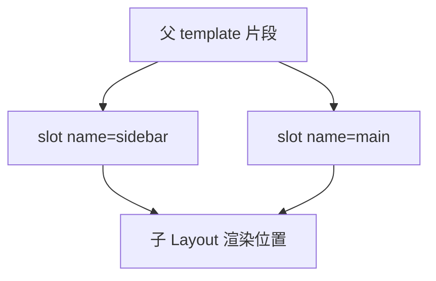

# 插槽体系

插槽让父向子模板注入 markup，**默认 / 具名 / 作用域** 三级覆盖布局与表格列定制；父用 `#name="{ data }"` 接收子暴露的数据。

---

## 默认插槽

```vue
<!-- 子 Card.vue -->
<template>
  <div class="card">
    <header v-if="$slots.header"><slot name="header" /></header>
    <main><slot /></main>
    <footer v-if="$slots.footer"><slot name="footer" /></footer>
  </div>
</template>
```

```vue
<!-- 父 -->
<Card>
  <p>正文内容</p>
</Card>

<!-- 等价于 -->
<Card>
  <template #default>
    <p>正文内容</p>
  </template>
</Card>
```

| API | 说明 |
|-----|------|
| `<slot />` | 默认插槽出口 |
| `$slots.default` | 是否传入默认内容（v-if 判断） |
| fallback | `<slot>暂无内容</slot>` 无传入时显示 |

---

## 具名插槽

```vue
<!-- Layout.vue -->
<template>
  <div class="layout">
    <aside><slot name="sidebar" /></aside>
    <section><slot name="main" /></section>
  </div>
</template>
```

```vue
<!-- 父：v-slot 或 # 缩写 -->
<Layout>
  <template #sidebar>
    <NavMenu />
  </template>
  <template #main>
    <RouterView />
  </template>
</Layout>
```



---

## 作用域插槽

子组件向插槽**提供数据**，父决定如何渲染：

```vue
<!-- 子 DataList.vue -->
<template>
  <ul>
    <li v-for="item in items" :key="item.id">
      <slot name="item" :row="item" :index="index" />
    </li>
  </ul>
</template>

<script setup>
defineProps(['items'])
</script>
```

```vue
<!-- 父 -->
<DataList :items="users">
  <template #item="{ row, index }">
    <strong>{{ index + 1 }}. {{ row.name }}</strong>
    <span>{{ row.email }}</span>
  </template>
</DataList>
```

| 概念 | 说明 |
|------|------|
| 子 `slot` 上的 props | 作用域数据 |
| 父 `#item="{ row }"` | 解构使用 |
| 旧语法 | `slot-scope`（Vue 2）→ `v-slot`（Vue 2.6+ / Vue 3） |

---

## script setup 与 useSlots

```vue
<script setup>
import { useSlots, computed } from 'vue'

const slots = useSlots()
const hasActions = computed(() => !!slots.actions)
</script>

<template>
  <div class="toolbar">
    <slot name="title" />
    <div v-if="hasActions" class="actions">
      <slot name="actions" />
    </div>
  </div>
</template>
```

`defineSlots`（Vue 3.3+）为 TS 标注插槽类型：

```typescript
defineSlots<{
  default?: (props: { item: Item }) => any
  header?: () => any
}>()
```

---

## 典型模式

**布局组件**：

```vue
<PageShell>
  <template #header><Breadcrumb /></template>
  <template #default><Form /></template>
  <template #footer><SubmitBar /></template>
</PageShell>
```

**表格列定制**：

```vue
<BaseTable :columns="columns" :data="rows">
  <template #cell-status="{ value, row }">
    <StatusTag :status="value" :id="row.id" />
  </template>
</BaseTable>
```

**复合组件（无样式逻辑）**，Headless 组件只提供状态与 slot API，样式完全由父决定。

---

## 插槽 vs props 传 VNode

| 方式 | 适用 |
|------|------|
| slot | 父写 template，结构可变、可嵌套指令 |
| prop 传组件 / h() | 配置驱动、程序化 |

大多数 UI 库对外用 **slot**；内部动态列可能用函数 prop。

---

## 动态插槽名

```vue
<template v-for="name in slotNames" #[name]>
  <component :is="blocks[name]" />
</template>
```

`#[name]` 为动态具名插槽；需 Vue 3 动态参数支持。

---

## Vue 2 迁移注意

| Vue 2 | Vue 3 |
|-------|-------|
| `slot="header"` on template | `#header` 或 `v-slot:header` |
| `slot-scope="props"` | `#default="props"` |
| `$scopedSlots` | 合并入 `$slots`，均为函数 |

读旧 Element UI 文档时常见 `slot="footer"`，在 Vue 3 + Element Plus 中改为 `#footer`。

---

## 性能与坑

| 点 | 说明 |
|----|------|
| 插槽内容作用域 | 父插槽表达式访问**父** setup 变量 |
| 多次 slot 渲染 | 同一 slot 出口只渲染一次父提供片段 |
| v-if 包 slot | 父 `#header` 不传则 `$slots.header` 为 undefined |
| 默认 slot + 具名 | 注意 whitespace 文本节点（少见） |

```vue
<!-- 父插槽内可用父级 state -->
<Child>
  <template #default>
    {{ parentMessage }} <!-- 来自父 setup -->
  </template>
</Child>
```

---

## 小结

要点：插槽是父向子注入 template 片段的机制，子定义出口 `<slot>`，父通过 `#name` 填充；作用域插槽让子向父传递渲染数据。


- 三级插槽：默认（内容区）、具名（header/footer）、作用域（子传数据给父）。
- 作用域插槽：子 `<slot :row="row">` → 父 `#default="{ row }"` 定制渲染。
- script setup：`useSlots()` 条件渲染；Vue 3.3+ **defineSlots** 补类型。
- 选型：结构/markup 注入用插槽；纯数据传 props。

**易混点**：
- 插槽内容访问的是**父** setup 变量，不是子组件变量。
- Vue 2 的 `slot-scope` → Vue 3 的 `#default="{ ... }"`。
- `$scopedSlots` 在 Vue 3 合并入 `$slots`。

核对：布局组件是否用了具名插槽？表格列定制是否用作用域插槽？`$slots.xxx` 判断是否传了内容？
