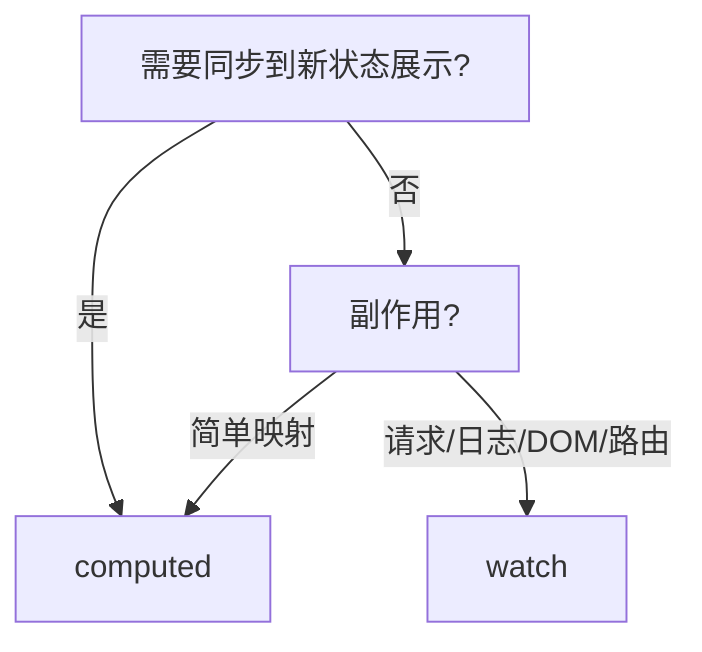

# computed 与 watch

**computed** 缓存衍生值，**watch** 跑副作用，展示用 computed，异步/日志/路由跳转用 watch；读 Vue 2 代码的核心选项。

---

## computed 基础

```javascript
export default {
  data() {
    return {
      items: [
        { name: '苹果', price: 3, qty: 2 },
        { name: '梨', price: 2, qty: 1 }
      ],
      discount: 0.9
    }
  },
  computed: {
    total() {
      const sum = this.items.reduce((s, i) => s + i.price * i.qty, 0)
      return sum * this.discount
    },
    itemCount() {
      return this.items.reduce((s, i) => s + i.qty, 0)
    }
  }
}
```

```vue
<template>
  <p>共 {{ itemCount }} 件，合计 ¥{{ total.toFixed(2) }}</p>
</template>
```

| 特性 | computed | methods |
|------|----------|---------|
| 缓存 | 依赖不变不重算 | 每次调用都执行 |
| 用途 | 衍生展示数据 | 事件、任意操作 |
| 返回值 | 应有 return | 任意 |

---

## computed getter / setter

```javascript
computed: {
  fullName: {
    get() {
      return `${this.lastName}${this.firstName}`
    },
    set(val) {
      const [last, first] = val.split('-')
      this.lastName = last
      this.firstName = first
    }
  }
}
```

```vue
<input v-model="fullName" />
```

可写 computed 适合 **v-model 包装多个 data 字段**；复杂表单仍推荐显式 emit。

---

## watch 基础

```javascript
export default {
  data() {
    return { query: '', results: [] }
  },
  watch: {
    query(newVal, oldVal) {
      this.fetchResults(newVal)
    }
  },
  methods: {
    async fetchResults(q) {
      this.results = await api.search(q)
    }
  }
}
```

| 参数 | 说明 |
|------|------|
| `newVal` / `oldVal` | 变化前后值（对象引用变化时 old 可能同引用） |
| 深度监听 | `deep: true` |
| 立即执行 | `immediate: true` |

---

## watch 选项详解

```javascript
watch: {
  'user.id': {
    handler(id) {
      this.loadProfile(id)
    },
    immediate: true
  },
  form: {
    handler(val) {
      this.saveDraft(val)
    },
    deep: true
  },
  selectedIds: {
    handler(ids) { /* ... */ },
    flush: 'post' // 组件更新后触发
  }
}
```

| 选项 | 作用 |
|------|------|
| `deep` | 递归遍历对象属性 |
| `immediate` | 创建时先跑一次 handler |
| `flush: 'pre' \| 'post' \| 'sync'` | 回调触发时机（默认 pre） |

---

## 何时 computed vs watch



| 场景 | 选择 |
|------|------|
| 过滤列表展示 | computed |
| 搜索词 → 调 API | watch 或 composable |
| 两个字段拼字符串 | computed |
| id 变 → 拉详情 | watch + immediate |
| 同一数据多处派生 | 多个 computed |

**反模式**：watch 里改 data 再触发另一个 watch 链式震荡，合并逻辑或 computed。

---

## watch 多个来源

```javascript
watch: {
  'a.b'(v) {},
}
```

在 **setup** 中可侦听多个源：

```javascript
watch([() => props.id, () => props.type], ([id, type]) => {
  load(id, type)
})
```

---

## Vue 2 与 Vue 3 差异

| 点 | Vue 2 | Vue 3 |
|----|-------|-------|
| computed 实现 | 同概念 | 同概念，与 ref 集成 |
| watch 数组 | 需 `watch: { '$route': ... }` | Options 相同 |
| `$watch` API | `this.$watch('x', fn)` | 仍可用 |
| 清理副作用 | watch 返回 unwatch | setup 中 onUnmounted 配合 |

Vue 3 **watchEffect** 无显式源，自动收集依赖（Composition API）。

---

## 性能注意

```javascript
watch: {
  bigObj: {
    handler() { /* heavy */ },
    deep: true // 大对象 deep 昂贵，改 watch 具体 key
  }
}
```

| 建议 | 说明 |
|------|------|
| 大列表过滤 | computed + 稳定引用 |
| 避免 deep 滥用 | watch `'user.id'` 而非整个 user |
| debounce 搜索 | watch 内 lodash debounce 或 composable |

---

## 与模板配合

- `visibleLines`、`total` → **computed**
- `lineSubtotal(line)` 若依赖 item 字段且列表大可 computed 预处理整表

---

## 小结

要点：computed 基于依赖缓存衍生值，适合展示；watch 在数据变化时跑副作用（请求、日志、DOM 操作），二者分工明确。


- computed：依赖不变则返回缓存；可有 getter/setter 实现 v-model 式写入。
- watch：数据变化时跑副作用；`deep`/`immediate`/`flush` 按需配置。
- 选型：展示/衍生值 → computed；异步请求、日志、路由 → watch。
- 性能：避免 deep watch 大对象；模板展示用 computed 而非重复调 methods。

**易混点**：
- methods 无缓存，模板里每次渲染都执行；computed 有缓存。
- watch 链式改 data 可能导致震荡，应合并逻辑。
- deep watch 大对象性能昂贵。

核对：模板展示是否用了 computed 而非 methods？watch 有没有 deep 滥用？搜索请求是否该 debounce？
