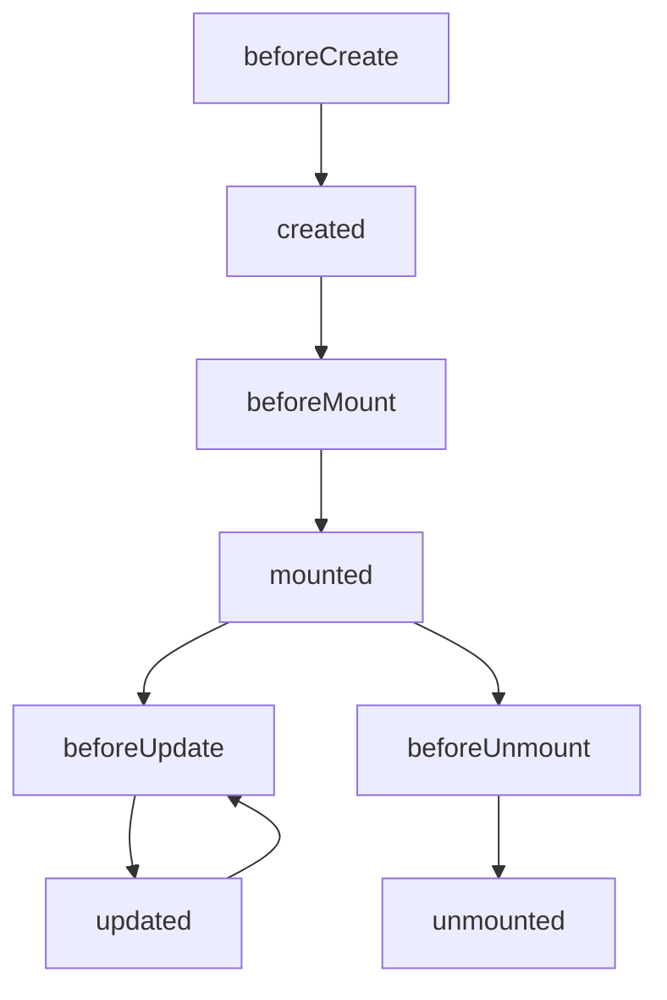
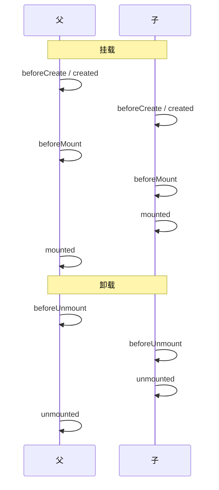

# 生命周期钩子

Options API 生命周期从 **beforeCreate → unmounted**，请求放 mounted、清理放 beforeUnmount；KeepAlive 用 activated/deactivated。

---

## 完整钩子列表（Vue 3）



| 钩子 | 典型用途 |
|------|----------|
| **beforeCreate** | 极少用；实例初始化前 |
| **created** | 读 props/data，调 API（无 DOM） |
| **beforeMount** | 渲染前最后配置 |
| **mounted** | 访问 DOM、第三方库 init、订阅 |
| **beforeUpdate** | DOM 更新前 |
| **updated** | DOM 已更新（避免此处改 state 死循环） |
| **beforeUnmount** | 清理定时器、解绑事件 |
| **unmounted** | 销毁后 |

> **Vue 2** 对应名为 **beforeDestroy / destroyed**；Vue 3 重命名为 **beforeUnmount / unmounted**。

---

## 示例：请求与清理

```javascript
export default {
  data() {
    return { list: [], timer: null }
  },
  created() {
    this.fetchList()
  },
  mounted() {
    this.timer = setInterval(this.poll, 60_000)
    window.addEventListener('resize', this.onResize)
  },
  beforeUnmount() {
    clearInterval(this.timer)
    window.removeEventListener('resize', this.onResize)
  },
  methods: {
    async fetchList() {
      this.list = await api.getList()
    },
    poll() { /* ... */ },
    onResize() { /* ... */ }
  }
}
```

| 原则 | 说明 |
|------|------|
| DOM 相关放 **mounted** | created 时 `$el` 不可用 |
| 配对清理 | 在 beforeUnmount 撤 mounted 里副作用 |
| SSR | mounted / unmounted 不在服务端执行 |

---

## KeepAlive 专属钩子

被 `<KeepAlive>` 包裹的组件额外有：

| 钩子 | 时机 |
|------|------|
| **activated** | 从缓存插入 DOM |
| **deactivated** | 从 DOM 移除进入缓存 |

```javascript
export default {
  activated() {
    this.refreshIfStale()
  },
  deactivated() {
    this.pauseVideo()
  }
}
```

与 mounted 区别：Tab 切换时可能 **deactivated 而非 unmounted**。

---

## 更新阶段注意

```javascript
export default {
  data() { return { count: 0 } },
  updated() {
    // ❌ 危险：可能无限循环
    // if (this.$refs.box) this.count++
  },
  methods: {
    scrollToBottom() {
      this.$nextTick(() => {
        const el = this.$refs.list
        el.scrollTop = el.scrollHeight
      })
    }
  }
}
```

| 场景 | 做法 |
|------|------|
| 改 DOM 后读布局 | **updated** 或 `watch` + **nextTick** |
| 因 data 变自动再改 data | 放 **watch** 并加条件，慎在 updated |

---

## 父子组件执行顺序



父 **mounted 晚于** 子 mounted；卸载时 **子先 unmounted**。

---

## 与路由、异步组件

```javascript
export default {
  async mounted() {
    await this.initMap() // 组件已挂载
  },
  watch: {
    '$route.params.id': {
      immediate: true,
      handler(id) {
        this.loadDetail(id)
      }
    }
  }
}
```

Vue Router 还提供 **beforeRouteEnter / update / leave**（组件内导航守卫），与实例生命周期正交。

---

## Vue 2 → Vue 3 更名对照

| Vue 2 | Vue 3 |
|-------|-------|
| beforeDestroy | beforeUnmount |
| destroyed | unmounted |
| 其余 | 名称基本一致 |

`this.$destroy()` 移除；用条件渲染或路由卸载组件。

---

## 常见误用

| 误用 | 更好 |
|------|------|
| created 里操作 DOM | mounted |
| mounted 不设清理 | beforeUnmount |
| 所有逻辑堆 mounted | 按阶段拆分 + composables |
| updated 里 fetch | watch 源数据 |

---

## 与 Composition API 对照

Options 钩子对应 **onMounted**、**onUnmounted** 等。同一组件勿重复挂载相同副作用（Options mounted + setup onMounted 各写一遍）。

```javascript
import { onMounted, onUnmounted } from 'vue'
export default {
  setup() {
    onMounted(() => { /* ... */ })
    onUnmounted(() => { /* ... */ })
  },
  mounted() {
    // 与 setup 并存时两者都会执行
  }
}
```

---

## 小结

要点：生命周期钩子标记组件从创建到销毁各阶段的时机；DOM 操作放 mounted，副作用清理放 beforeUnmount，KeepAlive 场景用 activated/deactivated。


- 创建：created（无 DOM）→ mounted（可操作 DOM）；销毁：beforeUnmount 清理订阅/定时器。
- KeepAlive：activated/deactivated 替代 mount/unmount 的部分场景。
- 顺序：父 created → 子 created → 子 mounted → 父 mounted；销毁相反。
- Vue 3 更名：beforeDestroy/destroyed → beforeUnmount/unmounted；读 DOM 用 nextTick。

**易混点**：
- created 时 `$el` 不可用，DOM 操作须等 mounted。
- updated 里改 state 可能死循环。
- Options mounted 与 setup onMounted 并存时两者都执行。

核对：mounted 里的订阅是否在 beforeUnmount 清理？有没有在 created 里操作 DOM？KeepAlive 组件是否用了 activated？
