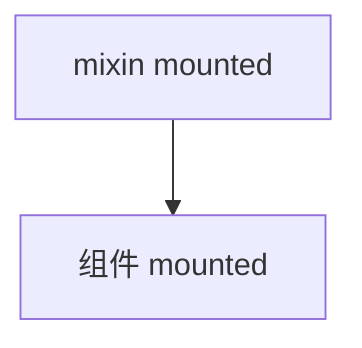

# 组件选项、混入与 extends

mixins/extends 可复用 Options API 逻辑，但来源不透明、易冲突，**新代码用 Composables 替代**；读遗留代码时留意合并策略。

---

## 常用组件选项概览

```javascript
export default {
  name: 'UserCard',
  components: { Avatar, Badge },
  props: { user: Object },
  emits: ['select'],
  inheritAttrs: false,
  data() { return { expanded: false } },
  computed: { /* ... */ },
  watch: { /* ... */ },
  methods: { /* ... */ },
  mounted() { /* ... */ }
}
```

| 选项 | 作用 |
|------|------|
| **name** | DevTools、KeepAlive include、递归组件 |
| **components** | 局部注册子组件 |
| **emits** | 声明发出事件（Vue 3 推荐） |
| **inheritAttrs** | 是否自动继承 attrs 到根 |
| **expose**（Vue 3） | 限制 setup 暴露给 ref 的内容 |

---

## mixins

```javascript
// mixins/pagination.js
export default {
  data() {
    return {
      page: 1,
      pageSize: 20,
      total: 0
    }
  },
  methods: {
    onPageChange(p) {
      this.page = p
      this.loadData()
    }
  }
}
```

```javascript
import pagination from '@/mixins/pagination'

export default {
  mixins: [pagination],
  methods: {
    async loadData() {
      const res = await api.list({ page: this.page, pageSize: this.pageSize })
      this.total = res.total
      this.items = res.items
    }
  }
}
```

**合并策略**：

| 选项类型 | 冲突时 |
|----------|--------|
| data | 递归合并；组件优先 |
| methods / components | 组件覆盖 mixin |
| 生命周期钩子 | **都执行**，mixin 先，组件后 |



**mixins 的问题**：

| 问题 | 表现 |
|------|------|
| 来源不清 | 多个 mixin 时不知 `this.foo` 来自哪 |
| 命名冲突 | 静默覆盖，难排查 |
| TS 推断弱 | 实例类型难自动合并 |
| 隐式依赖 | mixin 假设组件有 `loadData` |

**Vue 3 推荐**：用 **composable**（`usePagination()`）替代。

---

## extends

```javascript
const BaseInput = {
  props: ['modelValue'],
  emits: ['update:modelValue'],
  template: `<input :value="modelValue" @input="$emit('update:modelValue', $event.target.value)" />`
}

export default {
  extends: BaseInput,
  props: {
    modelValue: String,
    prefix: String
  },
  template: `
    <div class="wrap">
      <span v-if="prefix">{{ prefix }}</span>
      <input :value="modelValue" @input="$emit('update:modelValue', $event.target.value)" />
    </div>
  `
}
```

`extends` 类似单继承；与 mixins 类似但更少见。复杂扩展用 **组合组件** 或 **h()** 更清晰。

---

## 全局注册 vs 局部

```javascript
// main.js — Vue 3
import { createApp } from 'vue'
import GlobalIcon from './GlobalIcon.vue'

const app = createApp(App)
app.component('GlobalIcon', GlobalIcon)
app.mount('#app')
```

| 方式 | 适用 |
|------|------|
| 局部 `components: { }` | 默认；tree-shaking 友好 |
| `app.component` | 极高频基础组件 |
| unplugin-vue-components | 自动按需注册 |

Vue 2 的 `Vue.component` 对应 Vue 3 的 `app.component`。

---

## provide / inject（选项式）

```javascript
// 祖先
export default {
  provide() {
    return {
      theme: this.theme,
      reload: this.reload
    }
  },
  data() { return { theme: 'dark' } },
  methods: {
    reload() { /* ... */ }
  }
}

// 后代
export default {
  inject: ['theme', 'reload']
}
```

Vue 3 推荐 **组合式 provide/inject** 并配合 `ref` 保持响应式。选项式 provide 传普通值非响应式，传对象属性可响应。

---

## 其他选项

| 选项 | 说明 |
|------|------|
| **delimiters** | 改插值分隔符（极少） |
| **model**（Vue 2） | 自定义 v-model prop/event |
| **compatConfig** | @vue/compat 迁移开关 |

```javascript
// Vue 2 only
export default {
  model: {
    prop: 'checked',
    event: 'change'
  }
}
```

Vue 3 用 `v-model:checked` 或 defineModel。

---

## 从 mixins 迁到 composables

```javascript
// usePagination.js
import { ref } from 'vue'

export function usePagination(loadFn) {
  const page = ref(1)
  const pageSize = ref(20)
  const total = ref(0)

  async function load() {
    const res = await loadFn({ page: page.value, pageSize: pageSize.value })
    total.value = res.total
    return res.items
  }

  function onPageChange(p) {
    page.value = p
    return load()
  }

  return { page, pageSize, total, load, onPageChange }
}
```

```vue
<script setup>
import { usePagination } from '@/composables/usePagination'

const { page, total, onPageChange, load } = usePagination(api.list)
onMounted(load)
</script>
```

| mixins | composables |
|--------|-------------|
| 合并到 this | 显式解构返回值 |
| 冲突隐蔽 | 命名导入，冲突编译期可见 |
| 难 tree-shake | 按函数 shake |

---

## 读遗留代码建议

1. 列出组件 **mixins** 链，画 data/methods 来源表。
2. 全局 mixin（Vue 2 `Vue.mixin`）影响所有组件，迁移时优先删。
3. **extends** 与 **mixins** 同时出现时，查官方合并策略文档。

---

## 小结

要点：mixins/extends 是 Options API 时代的逻辑复用机制，通过合并策略把 data/methods/hooks 注入组件实例；来源不透明、易冲突，已被 composables 取代。


- components/props/emits/name：日常选项；全局注册用 `app.component`，局部用 `components`。
- mixins：多 mixin 合并时 data 浅合并、hooks 全执行；methods 冲突时组件优先。
- extends：类似单 mixin 的继承；provide/inject 注意响应式需 `computed` 包装。
- 迁移：新代码用 Composables（`useXxx`）替代 mixins，来源可追溯。

**易混点**：
- 多个 mixin 时 `this.xxx` 来源难追溯。
- 选项式 provide 传普通值非响应式。
- Vue 2 的 `model` 选项在 Vue 3 用 v-model:xxx 替代。

核对：遗留组件有哪些 mixins？有没有全局 mixin？新代码是否已改用 composables？
