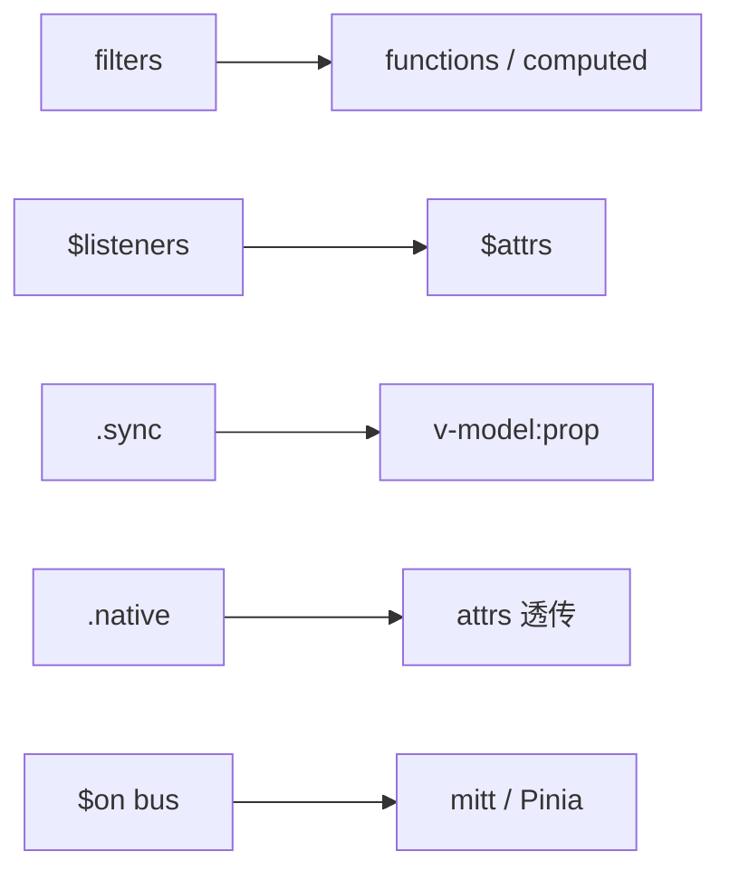

# 过滤器与 Vue2 语法遗留

filters、$listeners、.sync、.native、$on/$off 等是 Vue 2 写法，Vue 3 已移除或替换；维护旧代码与迁移时按本清单逐项对照。

---

## filters（已移除）

**Vue 2 写法**：

```vue
<template>
  <p>{{ price | currency('¥') }}</p>
  <p>{{ createdAt | dateFormat('YYYY-MM-DD') }}</p>
</template>

<script>
export default {
  filters: {
    currency(val, symbol = '') {
      return symbol + Number(val).toFixed(2)
    },
    dateFormat(val, fmt) {
      return dayjs(val).format(fmt)
    }
  }
}
</script>
```

全局过滤器：`Vue.filter('currency', fn)`

**Vue 3 替代**：

```vue
<template>
  <p>{{ currency(price, '¥') }}</p>
  <p>{{ dateFormat(createdAt, 'YYYY-MM-DD') }}</p>
</template>

<script setup>
import { currency, dateFormat } from '@/utils/format'
</script>
```

或 **computed** 包装。读旧代码时 `| fn` 按等价函数理解。

| 原 filters | 替代 |
|------------|------|
| 模板管道 `\| fn` | 函数调用 / computed |
| 全局 Vue.filter | utils 导出 + auto-import |

---

## $listeners（已合并入 $attrs）

**Vue 2**：

```vue
<button v-on="$listeners">OK</button>
```

父对子 `@click`、`@custom` 落在 `$listeners`。

**Vue 3**，未在 **emits** 声明的事件以 **`onClick` 等形式进入 `$attrs`**，与 class、style 一起透传：

```vue
<template>
  <button v-bind="$attrs">OK</button>
</template>

<script setup>
defineOptions({ inheritAttrs: false })
</script>
```

`useAttrs()` 在 setup 中访问；**不再有 `$listeners`**。

---

## .sync 修饰符

```vue
<!-- Vue 2 -->
<Dialog :visible.sync="show" />

<!-- Vue 3 -->
<Dialog v-model:visible="show" />
```

多个 `.sync` 对应多个 **`v-model:propName`**。

---

## .native 修饰符

```vue
<!-- Vue 2：监听组件根元素原生 click -->
<MyButton @click.native="onClick" />

<!-- Vue 3：未声明为 emit 的 onclick 落入 attrs，默认挂根元素 -->
<MyButton @click="onClick" />
```

若子组件 **defineEmits(['click'])** 并手动 `$emit('click')`，则父 `@click` 是组件事件而非原生。

---

## vm.$on / $off / $once

```javascript
// Vue 2 事件总线
const bus = new Vue()
bus.$on('evt', handler)
bus.$emit('evt', payload)
```

**Vue 3 移除实例事件 API**。替代：

| 方案 | 适用 |
|------|------|
| **mitt** | 轻量 pub/sub |
| **Pinia** | 共享状态驱动 |
| **provide/inject** | 子树内通信 |

```javascript
import mitt from 'mitt'
export const emitter = mitt()
emitter.on('refresh', load)
emitter.emit('refresh')
```

---

## 其他 Vue 2 遗留

| API / 语法 | Vue 3 状态 |
|------------|------------|
| `$children` | 移除 → `ref` + `expose` |
| `$set` / `$delete` | 移除（Proxy） |
| `keyCode` 修饰符 | 移除 |
| inline-template | 移除 |
| `$destroy` | 移除 |
| functional 组件 | 移除 `functional: true` |
| `Vue.prototype` | `app.config.globalProperties` |
| 全局 API `Vue.xxx` | `app.xxx` |

---

## v-model 协议变更

| | Vue 2 组件 | Vue 3 组件 |
|，|------------|------------|
| prop | `value` | `modelValue` |
| event | `input` | `update:modelValue` |
| 自定义 | `model: { prop, event }` | `v-model:xxx` |

读 Vue 2 组件库文档时注意表格列「绑定值」字段名。

---

## 迁移对照速查



| 遇到… | 改为… |
|-------|-------|
| `\| filter` | 函数 |
| `$listeners` | `$attrs` / useAttrs |
| `:x.sync` | `v-model:x` |
| `@click.native` | 子组件设计 / emit |
| `new Vue()` 事件总线 | mitt |
| `this.$set` | 直接赋值或新对象 |

官方 **@vue/compat** 可临时打开兼容行为，长期仍要改源码。

---

## 读旧文档技巧

1. Element UI → Element Plus 迁移指南对照 prop/event 更名。
2. Vue 2 中文教程里的「实例事件」章节整章过时。
3. 搜索项目 `\| `、`$listeners`、`.sync`、`.native` 批量替换。

---

## 小结

要点：Vue 3 移除了 filters、$listeners、.native、$on/$off 等 Vue 2 特有 API，统一为函数调用、$attrs 透传、v-model:xxx 和 mitt 等现代替代方案。


- filters → 普通函数或 computed；模板里直接调 `formatDate(x)`。
- $listeners → 合并进 **$attrs**；`.sync` → **v-model:propName**。
- .native 移除；$on/$off 事件总线 → **mitt** 或 Pinia。
- v-model：Vue 2 的 value/input → Vue 3 的 modelValue/update:modelValue。

**易混点**：
- 子组件 defineEmits(['click']) 后，父 @click 是组件事件不是原生。
- @vue/compat 只是过渡，长期仍要改源码。
- Element UI 与 Element Plus 的 prop/event 名不同。

核对：项目里还有没有 `| filter`、`.sync`、`.native`？事件总线是否已换 mitt？v-model 协议是否已升级？
