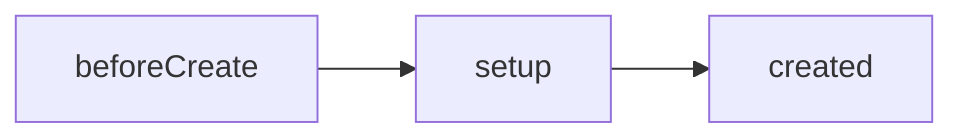

# setup 与响应式入口

**setup** 在组件创建早期执行，声明响应式 state 并返回模板绑定，**`<script setup>`** 是其编译期语法糖，无 `this`，通过 context 拿 emit/attrs/slots。

---

## setup 何时执行



| 时机 | 说明 |
|------|------|
| **before props 解析后** | 可访问 props |
| **beforeCreate / created 之间** | 无 `this`，Options 的 data/methods 尚未挂到实例 |
| **SSR** | 每请求执行一次 setup |

```javascript
export default {
  props: ['id'],
  setup(props, context) {
    console.log(props.id)
    // 无 this
    return { /* 暴露给 template */ }
  }
}
```

---

## setup 参数 context

```javascript
setup(props, { attrs, slots, emit, expose }) {
  // props 为响应式，勿解构丢响应（除非 toRefs）
  // emit 等同 $emit
  // attrs 非 prop 的 fallthrough
  // slots 插槽函数
  // expose 指定 ref 访问的公共方法
}
```

| 属性 | 用途 |
|------|------|
| **props** | 只读响应式对象 |
| **emit** | `(event, ...args) => void` |
| **attrs** | 与 Options `$attrs` 一致 |
| **slots** | 默认与具名插槽 |
| **expose** | `expose({ focus })` 供父 ref 调用 |

---

## return 与模板

```javascript
import { ref } from 'vue'

export default {
  setup() {
    const count = ref(0)
    function inc() {
      count.value++
    }
    return { count, inc }
  }
}
```

```vue
<template>
  <button @click="inc">{{ count }}</button>
</template>
```

**return 的对象** 或 **render 函数** 二选一暴露给渲染层；未 return 的绑定模板不可见。

---

## script setup 语法糖

```vue
<script setup>
import { ref } from 'vue'

const count = ref(0)
function inc() {
  count.value++
}
</script>

<template>
  <button @click="inc">{{ count }}</button>
</template>
```

编译器将顶层绑定自动暴露给 template，等价于 setup + return。

| script setup 优势 | 说明 |
|-------------------|------|
| 更少样板 | 无需 return |
| 更好 TS 推断 | 与 defineProps 等宏配合 |
| 性能 | 编译期优化组件注册 |

**与额外 script 块**：

```vue
<script lang="ts">
export default { name: 'Counter', inheritAttrs: false }
</script>

<script setup lang="ts">
// 逻辑
</script>
```

或使用 Vue 3.3+ **`defineOptions({ name: 'Counter' })`**。

---

## setup 与 Options 共存

```javascript
export default {
  data() {
    return { legacy: 1 }
  },
  setup() {
    const modern = ref(0)
    return { modern }
  },
  mounted() {
    // this.legacy 可用；setup return 也在 this 上（Vue 3）
  }
}
```

| 规则 | 说明 |
|------|------|
| 避免同名 | setup return 与 data 冲突时 setup 优先 |
| 新逻辑放 setup | Options 仅保留迁移遗留 |
| 生命周期 | setup 内 onMounted 与 mounted 都会执行 |

---

## 响应式入口一览

setup 里创建响应式数据的常用 API：

```javascript
import { ref, reactive, computed, watch } from 'vue'

setup() {
  const n = ref(0)              // 基本类型 / 单值
  const state = reactive({ a: 1 }) // 对象集合
  const double = computed(() => n.value * 2)
  watch(n, (v) => console.log(v))
  return { n, state, double }
}
```

Vue 2.7 可在 Options 里写 `setup()` 使用上述 API，但底层仍是 Vue 2 响应式。

---

## async setup 与 Suspense

```javascript
export default {
  async setup() {
    const data = await fetchConfig()
    return { data }
  }
}
```

父级需 **Suspense** 包裹，否则异步 setup 完成前无内容。路由级数据更常用 **导航守卫 / composable** 而非 async setup。

---

## 与 Vue 2 对比

| Vue 2 | Vue 3 Composition |
|-------|-------------------|
| 无 setup（2.6-） | setup / script setup |
| 2.7 实验性 setup | 稳定默认 |
| this 中心 | 函数 + ref/reactive |
| mixins | composables |

---

## 实践建议

| 建议 | 原因 |
|------|------|
| 新 SFC 用 script setup | 社区默认 |
| setup 按功能分段注释 | 单文件变长时可读 |
| 副作用配对 onUnmounted | 防泄漏 |
| 复杂组件拆 composables | 可测、可复用 |

---

## 小结

要点：setup 是 Composition API 的入口，在 beforeCreate/created 之间执行、无 this；script setup 是其编译期语法糖，顶层绑定自动暴露给 template。


- setup 通过 return 或 script setup 暴露绑定；context 提供 emit/attrs/slots/expose。
- script setup 为推荐入口；与 Options 混用仅作迁移过渡。
- async setup 需配合 Suspense；响应式从 ref/reactive 开始。
- 副作用须配对 onUnmounted 清理。

**易混点**：
- setup 无 this，不能访问 Options 的 data/methods。
- setup return 与 data 同名时 setup 优先。
- async setup 里 await 之后再注册 onMounted 会报警告。

核对：新组件是否用 script setup？混用 Options 是否仅为迁移？副作用有没有配对清理？
