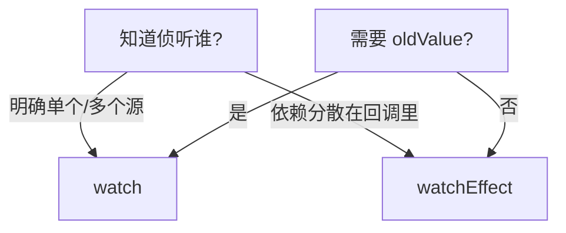

# computed、watch 与 watchEffect

**computed** 缓存衍生值，**watch** 侦听明确来源，**watchEffect** 自动收集依赖，展示用 computed，副作用用 watch/watchEffect，记得 onCleanup 清理。

---

## computed

```javascript
import { ref, computed } from 'vue'

const firstName = ref('三')
const lastName = ref('张')

const fullName = computed(() => `${lastName.value}${firstName.value}`)

const fullNameWritable = computed({
  get() {
    return `${lastName.value}${firstName.value}`
  },
  set(val) {
    const [last, first] = val.split('-')
    lastName.value = last
    firstName.value = first
  }
})
```

| 特性 | 说明 |
|------|------|
| 懒执行 | 依赖不变不重新计算 |
| 缓存 | 多次读 computed 只算一次 |
| 只读默认 | 需 setter 才可写 |

---

## watch

**侦听 ref**：

```javascript
import { ref, watch } from 'vue'

const id = ref('1')

watch(id, (newId, oldId) => {
  fetchDetail(newId)
})
```

**侦听 reactive 属性**：

```javascript
const state = reactive({ count: 0 })

watch(
  () => state.count,
  (n) => console.log(n)
)

watch(state, (s) => { /* deep 默认 */ })
```

**多个源**：

```javascript
watch([id, type], ([newId, newType]) => {
  load(newId, newType)
})
```

**选项**：

```javascript
watch(source, callback, {
  immediate: true,
  deep: true,
  flush: 'post', // 'pre' | 'post' | 'sync'
  once: true     // Vue 3.4+
})
```

| flush | 触发时机 |
|-------|----------|
| pre | 组件更新前（默认） |
| post | DOM 更新后 |
| sync | 同步触发 |

---

## watchEffect

```javascript
import { ref, watchEffect } from 'vue'

const ok = ref(true)
const count = ref(0)

watchEffect(() => {
  if (ok.value) {
    document.title = `count: ${count.value}`
  }
})
```

| 对比 | watch | watchEffect |
|------|-------|-------------|
| 依赖 | 显式指定 source | 回调内自动收集 |
| 立即运行 | 需 immediate | 默认立即 |
| 旧值 | 有 | 无 |
| 适用 | 明确「当 A 变」 | 副作用与多依赖耦合 |

**清理副作用**：

```javascript
watchEffect((onCleanup) => {
  const timer = setInterval(() => {}, 1000)
  onCleanup(() => clearInterval(timer))
})

watch(id, async (newId, _, onCleanup) => {
  let cancelled = false
  onCleanup(() => { cancelled = true })
  const data = await fetch(newId)
  if (!cancelled) result.value = data
})
```

组件卸载或 effect 重新运行前调用 **onCleanup**。

---

## 停止侦听

```javascript
const stop = watch(count, () => {})
const stopEffect = watchEffect(() => {})

stop()
stopEffect()
```

在 **setup 顶层** 注册，组件卸载自动停止；在异步回调里手动 watch 需记得 stop。

---

## watch vs watchEffect 选型



| 场景 | API |
|------|-----|
| route params id | watch(() => route.params.id, ...) |
| 搜索 debounce | watch(query, debouncedFetch) |
| 同步 title、localStorage | watchEffect |
| 表单全量 autosave deep | watch(form, save, { deep: true }) |

---

## 与 Options 对照

| Options | Composition |
|---------|-------------|
| `computed: { x() {} }` | `computed(() => ...)` |
| `watch: { a() {} }` | `watch(a, ...)` |
| 无直接等价 | `watchEffect` |

侦听 **props**：`watch(() => props.userId, loadUser, { immediate: true })`

---

## 性能注意

大对象 **deep: true** 成本高；尽量 watch 具体字段。watchEffect 里无关分支会导致多余依赖，宜拆成两个 effect 或改用 watch。

---

## 常见坑

| 坑 | 处理 |
|----|------|
| watch ref 忘 .value 在 getter 外 | 传 ref 本身即可 |
| 异步竞态 | onCleanup 标记 cancelled |
| immediate + 空数据请求 | 加条件或判 id |
| watchEffect 无限循环 | 勿在 effect 里无条件下改同一依赖 |

---

## 小结

要点：computed 基于依赖缓存衍生值；watch 显式侦听指定源跑副作用；watchEffect 自动收集回调内依赖。三者分工：展示→computed，明确副作用→watch，零散副作用→watchEffect。


- computed：依赖不变返回缓存；返回 ref，模板自动解包。
- watch：显式侦听 ref/getter；支持 oldValue、`immediate`、`deep`、`flush`。
- watchEffect：自动收集依赖；用 **onCleanup** 清理定时器/请求。
- 选型：衍生展示 → computed；路由/props 副作用 → watch；零散 DOM 副作用 → watchEffect。

**易混点**：
- watch reactive 字段须用 getter：`() => state.count`。
- watchEffect 无 oldValue，需要旧值用 watch。
- deep watch 大对象性能昂贵。

核对：异步 watch 有没有 onCleanup 防竞态？展示逻辑是否用了 computed？有没有 deep watch 滥用？
