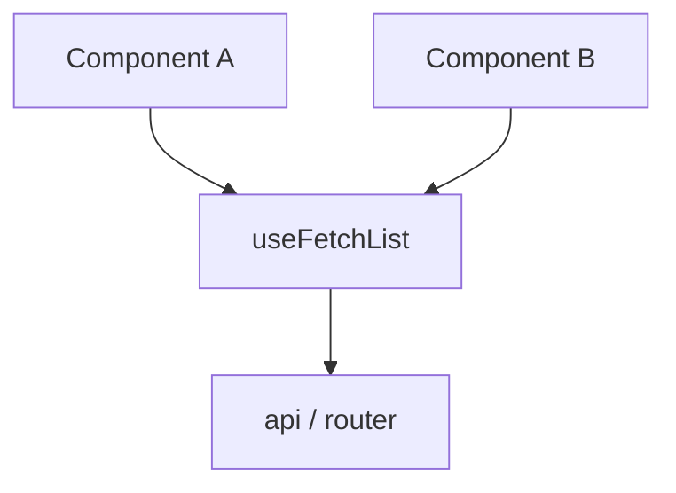

# 组合式函数 Composables

**Composable**（`useXxx`）把可复用响应式逻辑封装成函数，Vue 3 官方替代 mixins 的方式；每调用一次独立状态，副作用记得 onUnmounted 清理。

---

## 最小示例

```javascript
// composables/useCounter.js
import { ref, computed } from 'vue'

export function useCounter(initial = 0) {
  const count = ref(initial)
  const double = computed(() => count.value * 2)

  function increment() {
    count.value++
  }
  function reset() {
    count.value = initial
  }

  return { count, double, increment, reset }
}
```

```vue
<script setup>
import { useCounter } from '@/composables/useCounter'

const { count, increment } = useCounter(10)
</script>

<template>
  <button @click="increment">{{ count }}</button>
</template>
```

每个调用 **useCounter** 的组件拥有 **独立的** count ref。

---

## 设计原则

| 原则 | 说明 |
|------|------|
| 命名 **use** 前缀 | 约定与 ESLint 规则 |
| 返回 ref / reactive | 保持响应式 |
| 可组合 | useA 内部可调 useB |
| 副作用可清理 | onUnmounted / watchEffect cleanup |
| 纯逻辑与 UI 分离 | 不依赖具体 DOM 结构 |



---

## 带副作用的 composable

```javascript
// composables/useEventListener.js
import { onMounted, onUnmounted } from 'vue'

export function useEventListener(target, event, handler) {
  onMounted(() => {
    target.addEventListener(event, handler)
  })
  onUnmounted(() => {
    target.removeEventListener(event, handler)
  })
}
```

生命周期钩子在 composable 内注册，与调用组件 **同生命周期**。

---

## 异步数据模式

```javascript
// composables/useFetch.js
import { ref, watchEffect } from 'vue'

export function useFetch(urlRef) {
  const data = ref(null)
  const error = ref(null)
  const loading = ref(false)

  watchEffect(async (onCleanup) => {
    const url = urlRef.value
    if (!url) return

    loading.value = true
    error.value = null
    let cancelled = false
    onCleanup(() => { cancelled = true })

    try {
      const res = await fetch(url)
      const json = await res.json()
      if (!cancelled) data.value = json
    } catch (e) {
      if (!cancelled) error.value = e
    } finally {
      if (!cancelled) loading.value = false
    }
  })

  return { data, error, loading }
}
```

复杂场景可改用 **Pinia** 或 **@tanstack/vue-query**；composable 适合组件级或中等复杂度请求。

---

## 接受 ref 或 plain 值

```javascript
import { unref, watch } from 'vue'

export function useTitle(title) {
  watch(
    () => unref(title),
    (t) => { document.title = t ?? '' },
    { immediate: true }
  )
}

useTitle('固定标题')
useTitle(computedTitleRef)
```

**unref** / **toValue**（3.3+）让 API 同时接受 ref 与静态值。

---

## 目录与命名

```
src/composables/
  useCounter.ts
  useFetch.ts
src/features/order/
  composables/
    useOrderList.ts
```

| 组织 | 说明 |
|------|------|
| 全局 `composables/` | 跨 feature 通用 |
| feature 内 `composables/` | 业务域专用 |
| 单文件一 export | 大 composable 可拆 private 函数 |

---

## 测试

```javascript
import { describe, it, expect } from 'vitest'
import { useCounter } from './useCounter'

describe('useCounter', () => {
  it('increments', () => {
    const { count, increment } = useCounter(0)
    increment()
    expect(count.value).toBe(1)
  })
})
```

纯计算型 composable 直接测；带 onMounted 的需在 Vue 测试上下文或 test-utils 中测。

---

## 与 mixins / 工具函数对比

| | mixins | 工具函数 | composables |
|，|--------|----------|-------------|
| 响应式 | 合并 this | 通常无 | ref/reactive |
| 来源清晰 | 差 | 清晰 | 清晰 |
| 生命周期 | 支持 | 不支持 | onXxx |
| TS | 弱 | 强 | 强 |

---

## VueUse

[@vueuse/core](https://vueuse.org/) 提供大量经 battle-test 的 composables：`useMouse`、`useLocalStorage`、`useDebounceFn` 等。项目内自写前先查是否已有。

---

## 常见坑

| 坑 | 处理 |
|----|------|
| 在循环里调用 useXxx | 违反钩子规则；抽子组件 |
| 共享 ref 误用 | 模块级 ref 全组件共享 — intentional 才用 |
| 返回 reactive 整体解构 | 用 toRefs |
| composable 过大 | 拆 useXxx + useYyy |

```javascript
// ❌ 模块级 — 所有组件共享同一 count
const count = ref(0)
export function useShared() { return { count } }

// ✅ 每次调用新建
export function useCounter() {
  const count = ref(0)
  return { count }
}
```

---

## 小结

要点：Composable 是把响应式逻辑 + 副作用封装成 `useXxx` 函数，每次调用独立状态，是 mixins 的现代替代，来源清晰、TS 友好、可 tree-shake。


- useXxx：封装响应式 + 副作用；每调用独立状态（除非刻意模块级共享）。
- 清理：onUnmounted / watchEffect onCleanup 配对订阅与定时器。
- 异步：注意竞态取消（AbortController 或 ignore 标志）。
- 组织：通用放 `composables/`，业务放 feature 目录。

**易混点**：
- 模块级 ref 会被所有调用方共享，须刻意设计才用。
- 在循环/条件里调用 composable 违反钩子规则。
- composable 与纯工具函数不同，前者有响应式和生命周期。

核对：副作用有没有配对清理？模块级 ref 是否刻意共享？自写前是否查过 VueUse？
