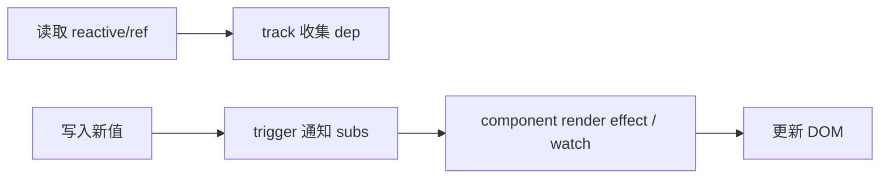
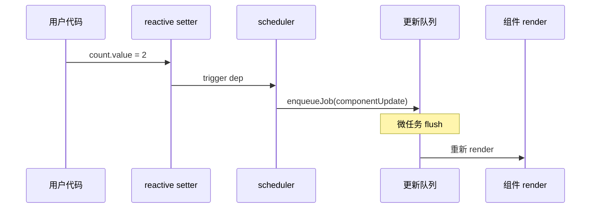

# 依赖收集与触发更新

响应式的核心就两件事：读数据时 **track**（收集依赖），写数据时 **trigger**（通知更新）。组件的 render 本身就是一个 effect，更新经 scheduler 异步队列批量 flush，搞清这条链路，computed、watch 和「改了数据 UI 不动」才好排查。

---

## 从「数据变了 UI 怎么更新」说起

模板或 `computed` 里读到 `state.count`，就是在访问响应式数据；当 `count` 被赋值，Vue 需要知道**哪些副作用**依赖了它，才能精准更新。



| 概念 | 含义 |
|------|------|
| **ReactiveEffect** | 包装副作用函数，执行时开启 track |
| **Dep** | 订阅集合，一个 reactive 属性对应一个 dep |
| **Sub** | 订阅者，通常是 effect 实例 |

---

## effect 与依赖收集流程

Vue 3 源码中，`effect(fn)` 会在执行 `fn` 期间，把当前 activeEffect 压栈；任何 `get` 拦截都会调用 `track(target, key)`。

```js
// 简化伪代码，帮助理解 track/trigger 关系
let activeEffect = null

function effect(fn) {
  const e = () => {
    activeEffect = e
    fn()
    activeEffect = null
  }
  e()
  return e
}

function track(target, key) {
  if (!activeEffect) return
  // 将 activeEffect 登记到 target.key 对应的 dep
}

function trigger(target, key) {
  // 遍历 dep 中的 effect，重新调度执行
}
```

组件挂载时，会为每个组件创建一个 **render effect**：执行 render 函数 → 访问响应式数据 → 建立依赖图。

---

## track 发生在哪些读取路径

| 读取方式 | 是否 track |
|----------|------------|
| 模板 `{{ count }}` | ✅ |
| `computed` getter | ✅ |
| `watch` 源函数返回值 | ✅ |
| 普通 JS 变量 | ❌ |
| `markRaw` 对象属性 | ❌ |

```vue
<script setup>
import { ref, computed } from 'vue'

const count = ref(0)
// 访问 count.value 时 track
const double = computed(() => count.value * 2)
</script>

<template>
  <p>{{ double }}</p>
  <!-- render effect 读取 double，间接依赖 count -->
</template>
```

---

## trigger 与调度队列

赋值 `count.value = 1` 会 `trigger`，但不会**同步**重跑所有 effect，而是进入**调度器（scheduler）**：



| 设计动机 | 说明 |
|----------|------|
| 批处理 | 同一 tick 多次改值只 flush 一次 |
| 去重 | 同一组件多次 trigger 合并为一次更新 |
| 顺序 | 父组件先于子组件更新（pre-flush） |

---

## effect 栈与嵌套 effect

`watchEffect`、嵌套 `computed` 会出现 effect 嵌套执行。Vue 用**栈**维护 `activeEffect`，内层执行完毕 pop 出栈，保证 track 归属正确。

```js
effect(() => {
  // outer effect
  effect(() => {
    // inner effect — 内层读取的数据只订阅 inner
  })
})
```

---

## 与组件更新的关系

每个组件实例有一个 `update` 函数，被包进 render effect。依赖变更 → scheduler 把 `instance.update` 入队 → flush 后重新执行 render → patch DOM。

| 阶段 | 发生的事 |
|------|----------|
| setup | 创建响应式 state，尚未 render |
| mount | 首次 render effect，建立 dep |
| update | trigger → scheduler → 再次 render |
| unmount | 停止 effect，清理 dep 订阅 |

```vue
<script setup>
import { ref, onMounted } from 'vue'

const list = ref([])

onMounted(async () => {
  list.value = await fetch('/api/items').then(r => r.json())
  // trigger list dep → 组件 update 入队
})
</script>
```

---

## 调试依赖关系

Vue DevTools 可查看组件 props/state 与更新原因。开发时可临时用 `effect` 验证 track 是否生效：

```js
import { effect, ref } from 'vue'

const n = ref(0)
effect(() => {
  console.log('effect runs', n.value)
})
n.value++ // 控制台再次输出
```

| 常见问题 | 排查方向 |
|----------|----------|
| 改了数据 UI 不动 | 是否改到非响应式对象 / 丢失 `.value` |
| 多余渲染 | 是否把大对象整包 reactive、子组件未隔离 props |

---

## 小结

**track / trigger** 是响应式底座：读响应式数据时建立「数据 → effect」映射；写时通知订阅者重新调度。

**ReactiveEffect** 包装副作用函数；**Dep** 存订阅集合；**Sub** 通常是 effect 实例。组件 render 本身就是一个 effect，模板里用到的每个响应式字段都是 render 的依赖。

**effect 栈** 保证嵌套 effect（watchEffect、嵌套 computed）的 track 归属正确，内层读取的数据只订阅内层 effect。

**scheduler** 把更新异步入队批量 flush：同一 tick 多次改值合并、同一组件去重、父先于子。好处是避免同步递归与重复渲染。

**组件生命周期**：setup 创建 state → mount 首次 render 建立 dep → update 时 trigger 再 render → unmount 停止 effect 并清理订阅。

**调试**：DevTools 看 state 变化；临时 `effect(() => console.log(x))` 验证 track。UI 不动先查非响应式对象和 `.value`；多余渲染查大对象 deep reactive 与 props 隔离。
