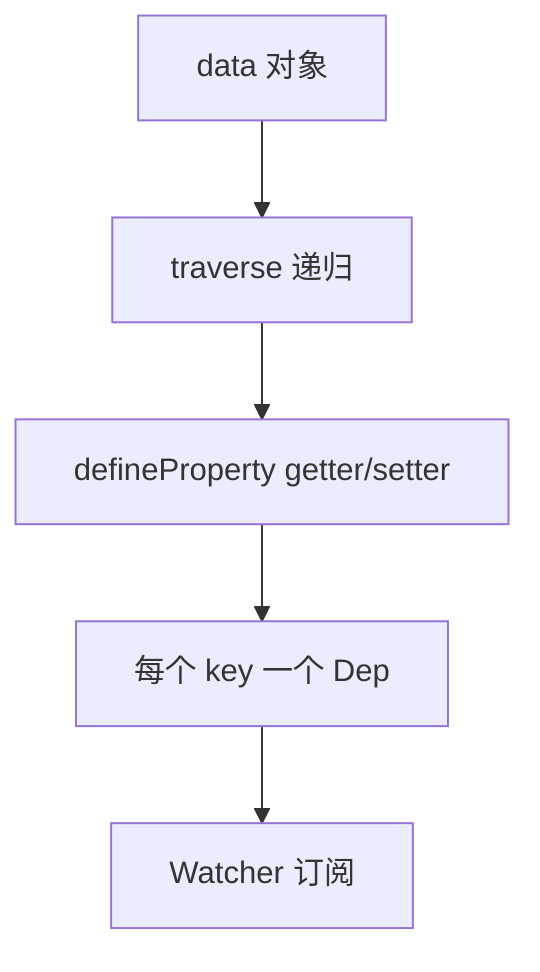

# Vue 2 · DefineProperty 实现

Vue 2 用 **defineProperty** 拦截属性 get/set 实现响应式。维护遗留项目或做迁移对照时，需要理解它的边界，为何有 `$set`、数组为何要变异方法、以及和 Vue 3 Proxy 差在哪。

---

## Observer 入口

`new Vue({ data })` 时，框架递归遍历 `data`，为每个属性定义 getter/setter，并收集依赖、派发更新。



| 模块 | 职责 |
|------|------|
| **Observer** | 递归观测对象/数组 |
| **Dep** | 依赖收集容器 |
| **Watcher** | 渲染 watcher、computed watcher、user watcher |

---

## defineProperty 核心伪代码

```js
function defineReactive(obj, key, val) {
  const dep = new Dep()
  Object.defineProperty(obj, key, {
    enumerable: true,
    configurable: true,
    get() {
      Dep.target && dep.depend() // track
      return val
    },
    set(newVal) {
      if (newVal === val) return
      val = newVal
      dep.notify() // trigger
    }
  })
}
```

组件 render 时创建 **render Watcher**，执行 render 函数访问 data → getter 收集 watcher → 数据变更 setter → `dep.notify()` → 重新 render。

---

## 对象层面的限制

| 场景 | Vue 2 行为 | 原因 |
|------|------------|------|
| 新增属性 `obj.newKey = 1` | 非响应式 | 初始化时未 defineProperty |
| 删除属性 `delete obj.key` | 无法触发更新 | 无 setter |
| 直接替换整个根对象 | 需重新观测 | 旧 dep 失效 |

因此 Vue 2 提供 **`Vue.set(obj, key, val)`** / **`this.$set`**：

```js
// Vue 2 Options API
this.$set(this.user, 'age', 18)
```

`$set` 对新 key 调用 `defineReactive` 并手动 `dep.notify()`。

---

## 数组的特殊处理

`defineProperty` 无法拦截**按索引赋值**与 **`length` 修改**，Vue 2 选择**劫持数组原型方法**：

```js
const methods = ['push', 'pop', 'shift', 'unshift', 'splice', 'sort', 'reverse']
// 包装后仍调用原生方法，再 ob.dep.notify()
```

| 操作 | 是否响应式 |
|------|------------|
| `arr.push(item)` | ✅ 变异方法 |
| `arr[0] = x` | ❌ |
| `arr.length = 0` | ❌ |
| `arr.splice(0, 1, newItem)` | ✅ 推荐替代索引赋值 |

```js
// Vue 2
this.list.splice(0, 1, updatedItem) // 而非 this.list[0] = updatedItem
```

---

## Watcher 与 Dep.target

Vue 2 用全局 **`Dep.target`** 指向当前正在计算的 watcher（类似 Vue 3 的 activeEffect 栈，但仅单层为主）。

```mermaid
sequenceDiagram
  participant W as render Watcher
  participant G as getter
  participant D as Dep

  W->>G: 执行 render，读取 data.x
  G->>D: Dep.target = W; dep.depend()
  Note over W: 后续 data.x 变更
  D->>W: notify → watcher.update()
```

| Watcher 类型 | 触发时机 |
|--------------|----------|
| render | 组件 update |
| computed | 依赖变 → 脏检查 → 重算 |
| user watch | 选项 watch / `$watch` |

---

## computed 与 watch 在 Vue 2 中的实现

**computed**：每个 computed 属性对应一个 **computed watcher**（lazy：依赖变只标 dirty，读取时才 evaluate）。

**watch**：user watcher 可配置 `deep`、`immediate`；深度侦听需递归 traverse 对象属性。

```js
export default {
  data: () => ({ n: 0 }),
  computed: {
    double() { return this.n * 2 }
  },
  watch: {
    n: {
      handler(val) { console.log(val) },
      immediate: true
    }
  }
}
```

---

## 与 Vue 3 对比

| 维度 | Vue 2 defineProperty | Vue 3 Proxy |
|------|----------------------|-------------|
| 新增/删除属性 | 需 $set / $delete | 自动 |
| 数组索引 | 需 splice 等 | 自动 |
| Map/Set | 不支持 | 支持 |
| 性能 | 初始化递归深 | 惰性代理 |
| IE11 | 可支持 | 不支持 |

维护 Vue 2 项目时，团队规范应明确：**禁止随意增删响应式 key**，数组更新走变异 API 或 `$set`。

---

## 迁移时的代码 smell

```js
// Vue 2 典型需改写点
this.$set(this.form, 'extraField', value)
Vue.delete(this.cache, id)
this.$forceUpdate() // 绕过依赖系统的补丁
```

升级到 Vue 3 后，上述多数可改为直接赋值；`$forceUpdate` 应排查是否响应式丢失导致。

---

## 小结

**Vue 2 响应式**是属性级拦截：每个 key 的 getter/setter 配合 Dep/Watcher 完成 track/trigger。Observer 递归观测 data，render Watcher 在 render 时收集依赖。

**经典坑**：初始化后新增/删除属性不触发更新，用 `$set` / `$delete`；数组索引赋值和改 `length` 不响应，用 `push`/`splice` 等变异方法。

**Dep.target** 类似 Vue 3 的 activeEffect，指向当前 watcher。computed watcher 是 lazy 的；user watch 支持 deep/immediate。

**与 Vue 3 差异**：Proxy 支持动态增删、数组索引、Map/Set，且惰性代理初始化更轻。Vue 2 可跑 IE11；新项目用 Vue 3。

**迁移 smell**：`$set`、`Vue.delete`、`$forceUpdate` 在 Vue 3 多数可删，但 `$forceUpdate` 出现时应先查响应式是否丢失。

**维护价值**：读懂 Observer 模型有助于读 Vue 2 源码与 composition-api 垫片。
