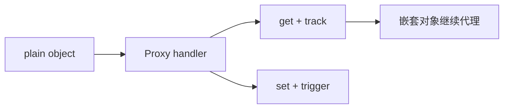

# Vue 3 · Proxy 与 ref 实现

Vue 3 用 **Proxy** 代理对象、**ref** 包装基本类型，支持动态增删属性、数组索引、Map/Set，是 Composition API 的底座。日常写 `reactive`/`ref` 时，知道底层怎么 track/trigger，排查边界问题会快很多。

---

## reactive：基于 Proxy 的深层代理

```js
function reactive(target) {
  return new Proxy(target, {
    get(target, key, receiver) {
      const res = Reflect.get(target, key, receiver)
      track(target, key)
      // 若 res 是对象，递归 reactive（惰性）
      return isObject(res) ? reactive(res) : res
    },
    set(target, key, value, receiver) {
      const old = target[key]
      const result = Reflect.set(target, key, value, receiver)
      if (old !== value) trigger(target, key)
      return result
    },
    deleteProperty(target, key) {
      const had = hasOwn(target, key)
      const result = Reflect.deleteProperty(target, key)
      if (had) trigger(target, key)
      return result
    }
  })
}
```



---

## ref：基本类型与「对象引用」容器

`reactive` 只能作用于对象；**number、string、boolean** 等用 `ref`：

```vue
<script setup>
import { ref, reactive } from 'vue'

const count = ref(0)
const user = reactive({ name: 'Li' })

function inc() {
  count.value++        // 通过 .value 读写
  user.name = 'Wang'   // 直接属性访问
}
</script>
```

| API | 适用 | 访问方式 |
|-----|------|----------|
| `ref(0)` | 基本类型 | `.value` |
| `ref({})` | 对象（内部仍 reactive） | `.value` 或模板自动解包 |
| `reactive({})` | 对象 | 直接属性 |

模板中 **ref 自动解包**，script 中必须 `.value`（除非已解构并用 `toRefs`）。

---

## ref 的实现要点

`ref` 本质是带 `.value` 属性的对象，对 `.value` 做 track/trigger：

```js
class RefImpl {
  constructor(value) {
    this._value = value
    this.dep = new Dep()
  }
  get value() {
    trackRef(this)
    return this._value
  }
  set value(newVal) {
    if (newVal !== this._value) {
      this._value = newVal
      triggerRef(this)
    }
  }
}
```

对象类型 ref：`value` 赋值时会用 `reactive` 包装，保持深层响应式。

---

## readonly 与 shallowReactive

| API | 行为 |
|-----|------|
| `readonly(obj)` | 深层只读，set 开发环境警告 |
| `shallowReactive` | 仅第一层响应式 |
| `shallowReadonly` | 浅只读 |

```js
import { reactive, readonly } from 'vue'

const state = reactive({ nested: { x: 1 } })
const ro = readonly(state)
// ro.nested.x = 2 // 警告，不触发更新
```

只读代理仍 **track**（用于 derived 计算），但 **set** 被拦截。

---

## 响应式 API 全景

```vue
<script setup>
import {
  ref, reactive, computed, watch,
  toRef, toRefs, isRef, unref
} from 'vue'

const props = defineProps({ id: Number })
const idRef = toRef(props, 'id') // 保持与 props 同步

const state = reactive({ a: 1, b: 2 })
const { a, b } = toRefs(state)   // 解构不丢响应式

const sum = computed(() => a.value + b.value)
watch(idRef, (id) => fetchDetail(id))
</script>
```

| 工具 | 用途 |
|------|------|
| `toRef` | 对象为某个 key 创建 ref |
| `toRefs` | 对象每个 key 转 ref，便于解构 |
| `unref` | `isRef(v) ? v.value : v` |
| `isProxy` / `isReactive` / `isReadonly` | 类型判断 |

---

## Proxy 相对 defineProperty 的优势

| 能力 | Vue 3 |
|------|-------|
| `obj.newKey = 1` | ✅ trigger |
| `arr[i] = x` | ✅ |
| `arr.length = n` | ✅ |
| `Map.set / Set.add` | ✅（需 reactive 包装） |
| 结构共享 | 未变子树可复用 |

---

## 集合类型：reactive(Map)

```js
const map = reactive(new Map())
map.set('key', 'value') // trigger
const set = reactive(new Set())
set.add(1)
```

Vue 3 为 Map/Set 等内置类型实现了专门的 collection handler。

---

## 与编译器的协作

模板编译后访问的是 `_ctx.xxx`，运行时对应 setup 返回或 script setup 中的 ref/reactive。编译器对 **ref 解包**、**常量 hoist** 等有专门优化。

```vue
<script setup>
const msg = ref('hello')
</script>
<template>
  <span>{{ msg }}</span>
  <!-- 编译为 _ctx.msg，运行时等价 msg.value -->
</template>
```

---

## 小结

**reactive** 用 Proxy 深层代理对象：get 时 track、set/delete 时 trigger，嵌套对象惰性继续代理。**ref** 用 `.value` 包装任意值，基本类型必选 ref；对象 ref 内部仍会 reactive 包装。

**readonly / shallow\*** 控制深度与可写性：readonly 仍 track 但拦截 set；shallow 只代理第一层，用于性能与单向数据流。

**toRef / toRefs** 解构 reactive 或 props 时保持响应式引用；**unref**、**isRef**、**isProxy** 等做类型判断。

**相对 Vue 2**：动态增删属性、数组索引/length、Map/Set 均自动响应；结构共享让未变子树可复用。

**编译协作**：模板访问 ref 自动解包为 `_ctx.xxx`；script 中仍须 `.value`（除非 toRefs）。

**选型**：对象用 reactive；基本类型用 ref；只读衍生用 readonly/computed；大对象或引用替换考虑 shallow 系列。
