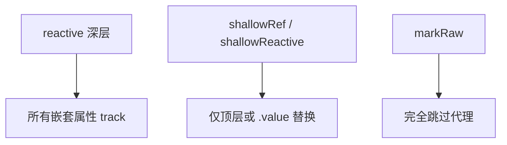

# shallowRef、markRaw 等工具

并非所有数据都需要深层响应式。**shallowRef / markRaw** 等在性能敏感场景划定边界，避免对大对象或第三方实例做无效追踪，先划边界，再谈虚拟列表等上层优化。

---

## 何时需要浅层或非响应式

| 场景 | 问题 | 策略 |
|------|------|------|
| 第三方图表实例 | deep reactive 破坏内部状态 | `markRaw` / `shallowRef` |
| 10 万条列表元数据 | 深层代理开销大 | 仅 UI 状态 reactive |
| 常量配置对象 | 无需 track | `markRaw` 或普通对象 |
| 替换整个大对象 | 只需替换引用 | `shallowRef` |



---

## shallowRef

仅当 **`.value` 整体被替换** 时 trigger；修改 `.value` 内部属性不触发更新。

```vue
<script setup>
import { shallowRef, triggerRef } from 'vue'

const big = shallowRef({ items: [] })

function replaceAll(data) {
  big.value = data // ✅ 触发更新
}

function patchItem(i, row) {
  big.value.items[i] = row // ❌ 不触发（内部变更）
  triggerRef(big) // 可选：强制通知
}
</script>
```

| 对比 | `ref({})` | `shallowRef({})` |
|------|-----------|------------------|
| 改嵌套属性 | trigger | 不 trigger |
| 替换整个对象 | trigger | trigger |

---

## shallowReactive

只代理对象**第一层** key；嵌套对象不会被转为 reactive。

```js
import { shallowReactive } from 'vue'

const state = shallowReactive({
  ui: { open: false },
  meta: { version: 1 }
})

state.ui = { open: true }   // trigger
state.ui.open = false       // 不 trigger
```

适合「顶层字段常整体替换、内层由子组件自管」的状态形状。

---

## markRaw 与 toRaw

**markRaw**：标记对象**永不被**转为 reactive/proxy（`Object.isExtensible` 配合 WeakSet）。

```js
import { reactive, markRaw } from 'vue'

const chart = markRaw(echarts.init(el))
const state = reactive({ chart })

// state.chart = other 会 trigger，但 chart 内部不会被代理
```

**toRaw**：取代理背后的原始对象，用于与只认 plain object 的库互操作。

```js
import { reactive, toRaw } from 'vue'

const form = reactive({ name: '' })
submit(toRaw(form)) // 某些序列化场景
```

---

## customRef：自定义 ref 行为

完全控制 track/trigger 时机，典型用于**防抖输入**：

```js
import { customRef } from 'vue'

function useDebouncedRef(value, delay = 300) {
  let timeout
  return customRef((track, trigger) => ({
    get() {
      track()
      return value
    },
    set(newVal) {
      clearTimeout(timeout)
      timeout = setTimeout(() => {
        value = newVal
        trigger()
      }, delay)
    }
  }))
}
```

```vue
<script setup>
const keyword = useDebouncedRef('')
</script>
<template>
  <input v-model="keyword" />
</template>
```

---

## readonly 与 computed 的只读衍生

| API | 写操作 |
|-----|--------|
| `readonly(reactiveObj)` | 拦截 set |
| `computed(() => ...)` | 无 setter 时只读 |

```js
const source = reactive({ count: 0 })
const snap = readonly(source)
// snap.count++ // 警告
```

---

## 性能实践

```vue
<script setup>
import { shallowRef, markRaw, triggerRef } from 'vue'

// 大型表格：行数据 shallow，选中态单独 ref
const rows = shallowRef([])
const selectedId = ref(null)

async function load() {
  rows.value = await api.fetchRows()
}

function updateCell(rowId, patch) {
  const list = rows.value.map(r =>
    r.id === rowId ? { ...r, ...patch } : r
  )
  rows.value = list // 不可变替换，触发一次
}
</script>
```

| 反模式 | 建议 |
|--------|------|
| 整棵 DOM 树配置 deep reactive | markRaw 第三方实例 |
| 频繁改 shallowRef 内部 | 改 ref 或 triggerRef |
| 把 Pinia state 再 reactive 包一层 | 直接使用 store |

---

## 与 Vue 2 的对应概念

| Vue 2 | Vue 3 |
|-------|-------|
| `Object.freeze` 防观测 | `markRaw` |
| 无官方 shallow API | `shallowRef` / `shallowReactive` |
| `$forceUpdate` | 优先修正响应式边界 |

---

## 小结

**shallowRef** 只追踪 `.value` 整体替换，改内部属性不 trigger；需要时可 `triggerRef` 强制通知。**shallowReactive** 只代理第一层 key。

**markRaw** 排除不应代理的第三方实例（图表、编辑器等）；**toRaw** 取原始对象供序列化或与旧库互操作。

**customRef** 在 ref 语义上自定义 track/trigger，可实现防抖/节流等调度。

**readonly / computed** 提供只读衍生；**readonly** 仍 track 但拦截 set。

**性能策略**：大列表行数据用 shallowRef + 不可变整体替换；UI 状态单独 ref；勿对 Pinia state 再包 reactive。

**优化顺序**：先划响应式边界，再谈虚拟列表等上层手段。Vue 2 的 `Object.freeze` 对应 markRaw；`$forceUpdate` 出现时应先修正边界而非强刷。
