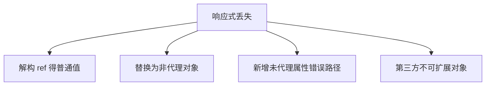

# 响应式丢失场景与修复

数据改了界面不更新，多半是**响应式链接断裂**，解构丢 ref、替换 reactive 根、第三方实例被 deep proxy 等。按场景用 toRefs、`.value`、markRaw 修复，比 `$forceUpdate` 靠谱。

---

## 丢失的本质

响应式依赖 **getter 里 track** 建立的订阅。以下情况会导致**读不到代理**或**写不 trigger**：



---

## 解构 reactive 对象

```js
import { reactive } from 'vue'

const state = reactive({ count: 0 })
let { count } = state // count 是普通 number，非响应式

count++ // 不会更新 UI
```

| 修复 | 写法 |
|------|------|
| 不解构 | `state.count++` |
| toRefs | `const { count } = toRefs(state)` 后 `count.value++` |
| 单独 ref | 把常改字段提成 ref |

```vue
<script setup>
import { reactive, toRefs } from 'vue'

const state = reactive({ count: 0 })
const { count } = toRefs(state)

function inc() {
  count.value++
}
</script>
```

---

## props 解构（Vue 3.4+）

Vue 3.4 起 **script setup 中 props 解构**在编译期保持响应式（基于编译宏），但需对应版本：

```vue
<script setup>
const { title, count = 0 } = defineProps<{ title: string; count?: number }>()
// 3.4+：title/count 在模板中仍响应式
</script>
```

低版本或运行时声明 props 时，仍推荐 **`toRef(props, 'key')`**：

```js
const title = toRef(props, 'title')
```

---

## 替换对象引用 vs 改属性

```js
const user = ref({ name: 'a' })

user.value.name = 'b'     // ✅
user = { name: 'c' }      // ❌ 不能给 ref 变量本身赋新 plain 绑定

// 正确：改 .value
user.value = { name: 'c' }
```

从 API 取回 plain object 直接赋给 reactive 子字段时，若后续只改子字段可能 OK；若整段替换需注意是否仍走代理。

---

## 数组与集合

```js
const list = ref([1, 2, 3])

// ✅
list.value.push(4)
list.value = [...list.value, 4]

// reactive 数组
const arr = reactive([1, 2])
arr[0] = 9 // Vue 3 ✅
```

**Map/Set** 需一开始就是 reactive 包装：

```js
const map = reactive(new Map())
map.set('k', 1) // ✅

const plain = new Map()
plain.set('k', 1) // 未 reactive，不会驱动 UI
```

---

## 异步与闭包快照

```js
const count = ref(0)

async function load() {
  const snap = count.value
  await delay(1000)
  // 若期望用最新 count，应读 count.value 而非 snap
  console.log(count.value)
}
```

`watch` 回调里使用旧闭包变量同理，应用 **ref/reactive 实时读取**。

---

## 第三方对象与 class 实例

axios 响应、DOM 节点、echarts 实例等不应 deep reactive：

```js
import { markRaw, shallowRef } from 'vue'

const editor = shallowRef(null)

onMounted(() => {
  editor.value = markRaw(createEditor())
})
```

| 症状 | 原因 |
|------|------|
| 图表白屏 | 代理破坏内部私有字段 |
| 表单组件报错 | v-model 绑到非预期代理 |

---

## JSON 序列化往返

```js
const state = reactive({ nested: { x: 1 } })
const copy = JSON.parse(JSON.stringify(state)) // plain object
// copy 与 state 无订阅关系
Object.assign(state, copy) // 可能部分丢失深层代理，视结构而定
```

推荐：**只 reactive 一次**，更新时用不可变替换或逐字段 assign 到已代理对象。

---

## Pinia / composable 返回值

```js
// composable
export function useCounter() {
  const count = ref(0)
  return { count }
}

// 使用方
const { count } = useCounter() // ref 对象，需 count.value 或模板自动解包
```

若 composable 返回 reactive 并解构，同样走 **toRefs** 规则。

---

## 逐步排查

| 步骤 | 操作 |
|------|------|
| 1 | 确认是否 `ref` 却忘记 `.value`（script） |
| 2 | 检查是否解构 reactive |
| 3 | DevTools 看组件 state 是否变化 |
| 4 | 临时 `watchEffect(() => console.log(x))` 验证 track |
| 5 | 第三方实例改 shallowRef + markRaw |

```vue
<script setup>
import { ref, watchEffect } from 'vue'

const data = ref(null)
watchEffect(() => {
  console.log('tracked:', data.value)
})
</script>
```

---

## 小结

**解构 reactive** 是 Composition API 下最常见丢失源，用 **toRefs / toRef** 或避免解构；**ref** 在 script 中必须改 `.value`，不能给 ref 变量本身赋 plain 值。

**props 解构**：Vue 3.4+ 编译期保持响应式；更早版本用 **toRef(props, 'key')**。

**数组/集合**：Vue 3 reactive 数组索引可写；Map/Set 须一开始 reactive 包装。

**异步/闭包**：await 后读最新值应访问 ref/reactive 实时属性，勿用旧快照。

**第三方实例**与**超大结构**用 shallowRef + markRaw 划界，避免 deep proxy 破坏内部状态。

**JSON 往返**得到 plain object，与响应式无订阅关系；只 reactive 一次，用不可变替换或逐字段 assign。

**composable 返回**：ref 解构后仍须 `.value`（模板自动解包）；reactive 解构走 toRefs。

**排查顺序**：`.value` → 解构 → DevTools → watchEffect 验证 track → shallow/markRaw。
