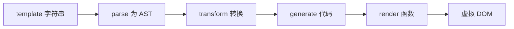
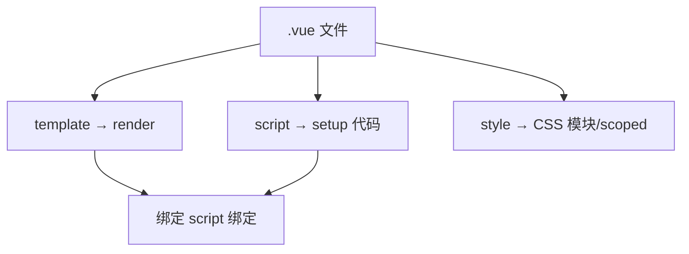

# 模板编译流程

`<template>` 经 **parse → transform → generate** 编译为 render 函数，产出 `h()` 调用链，与响应式、PatchFlags 优化协同。浏览器跑的是编译产物，不是模板字符串本身。

---

## 为什么需要编译

模板是声明式 DSL，浏览器无法直接执行。编译器将其转为 JavaScript：



| 阶段 | 输出 |
|------|------|
| parse | HTML-like AST 节点树 |
| transform | 带指令、表达式信息的 IR |
| generate | `function render(_ctx) { return h(...) }` |

---

## parse：模板 → AST

解析器将模板字符串转为 AST 节点，类型包括 **ELEMENT、TEXT、INTERPOLATION、ATTRIBUTE** 等。

```html
<div id="app">
  <p>{{ msg }}</p>
</div>
```

等价 AST 概念结构（简化）：

```js
{
  type: 'Element',
  tag: 'div',
  props: [{ name: 'id', value: 'app' }],
  children: [
    {
      type: 'Element',
      tag: 'p',
      children: [{ type: 'Interpolation', content: 'msg' }]
    }
  ]
}
```

---

## transform：指令与表达式处理

遍历 AST，处理 **v-if / v-for / v-on / v-bind / v-model** 等，将静态与动态部分分离，并注入 **PatchFlags**（编译优化）。

| 节点标记 | 含义 |
|----------|------|
| 静态节点 | 后续 patch 可跳过 |
| 动态 props | `PROPS`、`CLASS`、`STYLE` 等 flag |
| block root | Block Tree 优化根 |

```html
<p :class="active">{{ title }}</p>
```

transform 后知道：`class` 动态、`title` 依赖 `_ctx.title`。

---

## generate：生成 render 代码

典型输出（逻辑示意）：

```js
import { createElementVNode as _createElementVNode, toDisplayString as _toDisplayString, openBlock as _openBlock, createElementBlock as _createElementBlock } from 'vue'

export function render(_ctx, _cache) {
  return (_openBlock(), _createElementBlock('div', { id: 'app' }, [
    _createElementVNode('p', null, _toDisplayString(_ctx.msg), 1 /* TEXT */)
  ]))
}
```

SFC 中 `<script setup>` 变量自动暴露为 `_ctx` 属性。

---

## 运行时 vs 构建时编译

| 模式 | 说明 |
|------|------|
| **构建时**（推荐） | `@vitejs/plugin-vue` / `vue-loader` 预编译 `.vue` |
| **运行时** | `vue.global.js` + 内联 template 字符串，体积大 |

生产环境应使用 **vue.esm-bundler + 预编译**，不包含完整 compiler。

```js
// vite.config.js
import vue from '@vitejs/plugin-vue'
export default { plugins: [vue()] }
```

---

## SFC 编译管线

单文件组件拆为三块分别处理：



`<script setup>` 编译后，`defineProps` 等宏被展开，模板中的标识符解析为同 scope 变量。

---

## 表达式与约束

模板表达式只能是**单语句表达式**，不能声明变量：

```vue
<!-- ✅ -->
<p>{{ count + 1 }}</p>
<p>{{ ok ? 'Y' : 'N' }}</p>

<!-- ❌ -->
<p>{{ let x = 1 }}</p>
<p>{{ console.log('debug') }}</p> <!-- 不推荐，副作用 -->
```

复杂逻辑应放 **computed** 或 **methods**。

---

## 自定义渲染：render 函数与 JSX

可跳过 template，手写 render（或 JSX 经 Babel 转为 h）：

```js
import { h, ref } from 'vue'

export default {
  setup() {
    const count = ref(0)
    return () => h('button', { onClick: () => count.value++ }, count.value)
  }
}
```

| 选用 template | 选用 render/JSX |
|---------------|-----------------|
| 大多数 UI | 高度动态 vnode 结构 |
| 设计稿直写 | 库作者、复杂分支 |

---

## 与响应式、更新的衔接

render 函数在 **component render effect** 中执行 → 读取响应式数据 → track → 数据变 → scheduler 排队 → 再次 render → patch。

编译质量直接影响：**静态提升**、**block tree**、**cacheHandler** 等是否生效。

---

## 小结

**三阶段**：parse 得 AST → transform 处理指令并注入 PatchFlags → generate 产出 render 函数（`h()` / `_createElementVNode` 调用链）。

**构建时编译**（Vite + plugin-vue）是生产默认：SFC 预编译成 ES 模块，避免 runtime compiler 体积。

**SFC 管线**：template → render、script → setup、style → CSS；script setup 变量自动绑定 `_ctx`。

**表达式约束**：单语句表达式，不能声明变量；复杂逻辑放 computed/methods。

**render/JSX** 适合高度动态 vnode；大多数 UI 仍用 template，利于编译优化。

**与响应式**：render 在 component render effect 中执行，读响应式数据即 track；数据变经 scheduler 再 render + patch。

核对：生产构建是否预编译？模板表达式是否过重？动态结构是否该改 render？
