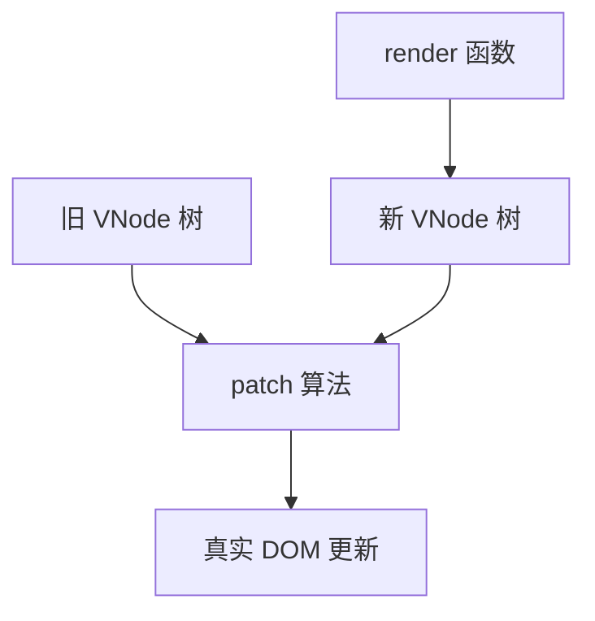
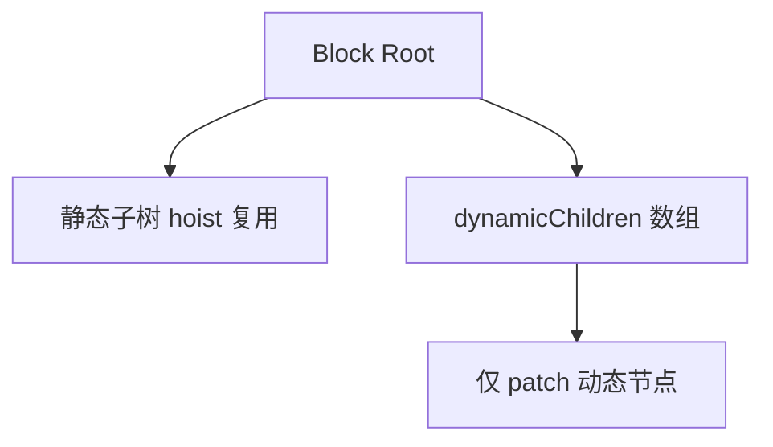

# 虚拟 DOM 与 Patch

Vue 3 用 **VNode** 描述 UI 树，**patch** 对比新旧树做最小 DOM 更新。编译期 PatchFlags、Block Tree 让 diff 更精准，列表还要配稳定 **key**，否则输入框失焦、动画错乱。

---

## VNode 是什么

VNode 是轻量 JS 对象，描述节点类型、props、children、key 等：

```js
const vnode = {
  type: 'div',
  props: { id: 'app' },
  children: [
    { type: 'p', children: 'hello' }
  ],
  key: null,
  patchFlag: 0 // 编译器注入
}
```



| 字段 | 作用 |
|------|------|
| `type` | 标签名 / 组件 / Fragment |
| `props` | 属性、事件、class |
| `children` | 子 VNode 或文本 |
| `key` | 列表 diff 身份标识 |

---

## h() 与 createVNode

```js
import { h } from 'vue'

h('div', { class: 'box' }, [
  h('span', 'text')
])

// 组件
h(MyComp, { title: 'hi' }, { default: () => h('p', 'slot') })
```

SFC 编译产物内部调用 `_createElementVNode` 等别名，语义与 `h` 一致。

---

## patch 基本策略

同层比较，**不跨层级移动**（移动通过 key 在同层列表中复用 DOM）。

| 情况 | 处理 |
|------|------|
| type 不同 | 卸载旧树，挂载新树 |
| type 相同（元素） | patchProps + patchChildren |
| type 相同（组件） | 更新实例 props/slots，sub tree patch |
| 文本节点 | 比较 textContent |

---

## 双端 diff 与 key

`v-for` 列表更新使用**双端指针**算法 + **key** 映射：

```vue
<template>
  <li v-for="item in list" :key="item.id">{{ item.name }}</li>
</template>
```

| key 选择 | 建议 |
|----------|------|
| 稳定唯一 id | ✅ |
| 数组 index（会 reorder） | ⚠️ 可能错误复用 |
| `Math.random()` | ❌ 每次销毁重建 |

错误 key 会导致**输入框失焦、动画错乱、状态残留**。

---

## PatchFlags 编译优化

Vue 3 编译器为动态节点打上 **patchFlag** bitmask，runtime 只比较标记过的部分：

```js
// 示意常量
const PatchFlags = {
  TEXT: 1,
  CLASS: 2,
  STYLE: 4,
  PROPS: 8,
  FULL_PROPS: 16,
  // ...
}
```

```html
<div :id="dynamicId">静态标题</div>
```

静态文本「静态标题」在 patch 时可**跳过**；仅 `id` 参与比较。

---

## Block Tree 与静态提升

**Block**：收集动态子节点列表，patch 时只遍历 dynamic children，不递归全树。

**静态提升（hoist）**：纯静态 VNode 提到 render 外，多次 render 复用同一 VNode 引用。



---

## Fragment 与 Teleport

**Fragment**（多根节点）在 VNode 层是特殊 type，patch 时当作一组 siblings 处理。

**Teleport** 的 VNode 挂载到目标容器，patch 逻辑需维护**容器映射**。

---

## 组件 sub-tree patch

组件更新时：

1. 比较 props（含 attrs、emit 声明）
2. 必要时更新 slots
3. 执行 component update → 新 subTree → patch(oldSubTree, newSubTree)

```vue
<script setup>
const props = defineProps({ count: Number })
</script>
<template>
  <span>{{ count * 2 }}</span>
</template>
```

`count` 变 → 组件 props 变 → render effect → 新 subTree → patch。

---

## 性能相关实践

| 实践 | 说明 |
|------|------|
| 稳定 key | 列表必带业务 id |
| `v-once` | 整段静态子树跳过更新 |
| `v-memo` | 条件跳过子树 patch |
| 避免巨型单组件 template | 拆组件隔离 diff 范围 |

```vue
<template>
  <div v-memo="[item.id, item.done]">
    <!-- 仅 id/done 变时才 patch -->
    <TodoItem :item="item" />
  </div>
</template>
```

---

## 小结

**VNode** 是 render 输出的轻量描述；**patch** 对比新旧树更新真实 DOM，同层比较、不跨层移动。

**列表 diff** 依赖稳定 **key**；index key + 排序/过滤会错误复用 DOM，导致失焦和状态残留。

**PatchFlags** 让 runtime 只比较动态部分；**Block Tree** 只遍历 dynamicChildren；**静态提升**复用纯静态 VNode。

**组件更新**：props/slots 变 → 新 subTree → patch；父 re-render 不一定导致子 update（props 浅比较相等可跳过）。

**应用层**：稳定 key、`v-once`/`v-memo`、拆组件缩小 diff 范围；动画优先 transform/opacity。

**Fragment/Teleport** 有特殊 patch 路径，Teleport 需维护目标容器映射。
