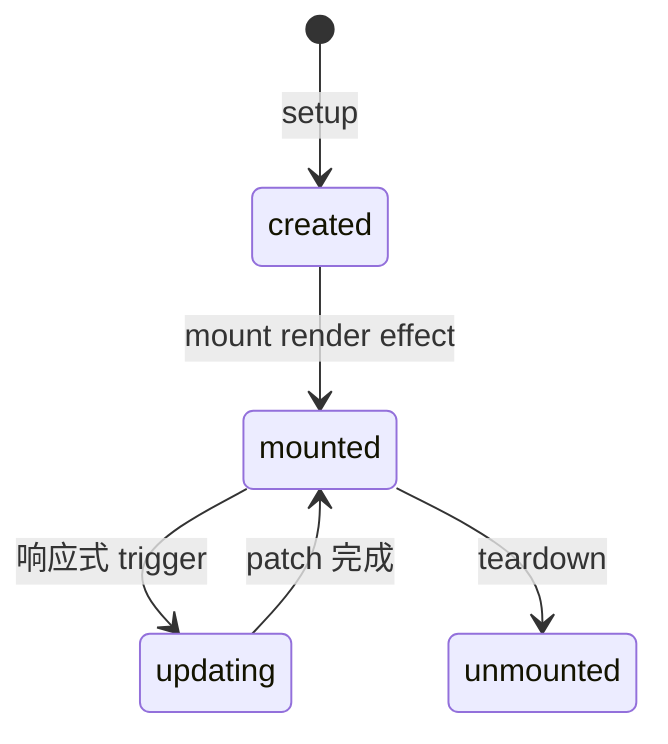
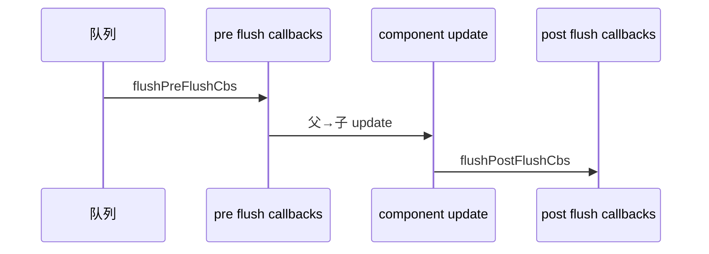

# 组件渲染与更新队列

组件 **render effect** 驱动 mount/update；多个 trigger 合并进**异步更新队列**，flush 顺序 pre → render → post 决定 watch 与 DOM 读取时机，读 DOM 要在 post 或 nextTick 之后。

---

## 生命周期与渲染



| 阶段 | 渲染相关动作 |
|------|--------------|
| setup | 创建响应式 state、computed、watch |
| mount | 首次 render → patch → 插入 DOM |
| update | scheduler 调度 → render → patch |
| unmount | 停止 effect、卸载 DOM |

---

## render effect 与 componentUpdate

每个组件有一个 **update 函数**（内部执行 render + patch），被包在 reactive effect 里：

```js
// 概念简化
instance.update = effect(() => {
  const subTree = instance.render.call(instance.proxy)
  patch(instance.subTree, subTree, container)
  instance.subTree = subTree
}, {
  scheduler: () => queueJob(instance.update)
})
```

数据依赖变更 → effect scheduler → **入队**而非同步执行。

---

## 更新队列（queueJob）

全局 **queue** 存放待执行的 component update job：

| 特性 | 说明 |
|------|------|
| 去重 | 同一 job 只保留一份 |
| 异步 flush | 微任务中批量执行 |
| 排序 | 父先于子、pre 先于 post |

```js
// 同一 tick
count.value++
count.value++
name.value = 'x'
// 组件 update 通常只 flush 一次
```

---

## flush 顺序：pre → render → post



| 回调类型 | 典型用途 |
|----------|----------|
| **pre flush** | `watch`（默认 flush: pre）在 DOM 更新前 |
| **component update** | render + patch |
| **post flush** | `watch({ flush: 'post' })`、`onUpdated`、测量 DOM |

---

## watch 与 flush 选项

```vue
<script setup>
import { ref, watch, nextTick } from 'vue'

const el = ref(null)
const open = ref(false)

watch(open, async () => {
  // flush: 'pre' 默认 — DOM 可能仍是旧状态
})

watch(open, () => {
  console.log(el.value?.offsetHeight)
}, { flush: 'post' }) // DOM 已更新

watch(open, async () => {
  await nextTick()
  // 等价于在 post 后读 DOM
})
</script>
```

| flush | 执行时机 |
|-------|----------|
| `'pre'` | 组件 render 前（默认） |
| `'post'` | 全部组件 patch 后 |
| `'sync'` | trigger 时立即（慎用） |

---

## 子组件更新传播

父组件 re-render **不一定**导致所有子组件 re-render：

| 情况 | 子组件是否 update |
|------|-------------------|
| 父 template 未变子 props | 可能跳过 |
| 子 props 浅比较相等 | 跳过 update |
| 子内部 state 变 | 仅子 update |

```vue
<!-- Parent.vue -->
<Child :id="id" />

<!-- id 未变时 Child 可能不更新 -->
```

使用 **`defineProps` + 稳定 props** 减少无效子树 patch。

---

## onUpdated 与调试

```vue
<script setup>
import { ref, onUpdated } from 'vue'

const n = ref(0)
onUpdated(() => {
  console.log('DOM updated', n.value)
})
</script>
```

`onUpdated` 在**每次** re-render patch 后触发，避免在其中无限改 state。

---

## Suspense 与异步组件

异步 setup 或 `defineAsyncComponent` 会改变 mount 时序，Suspense 管理 **pending / resolve** 边界。更新队列仍统一由 scheduler 驱动。

---

## forceUpdate 与极端情况

Vue 3 无公开 `$forceUpdate` 作为常规 API；应修复响应式链接。调试可用 **`instance.update()`**（内部）或临时改 key 强制 remount：

```vue
<MyPanel :key="refreshKey" />
```

---

## 小结

**render effect** 是响应式与视图的桥梁：render + patch 包在 effect 里，scheduler 把 update **异步入队**而非同步执行。

**更新队列**去重、批处理、排序（父先于子）。同一 tick 多次改值通常只 flush 一次 component update。

**flush 顺序**：pre flush callbacks → 组件 render+patch → post flush callbacks。决定 watch 与 DOM 读取时机。

**watch flush**：默认 pre（DOM 可能未更新）；读 DOM 用 post 或 `await nextTick()`；sync 破坏批处理，慎用。

**子组件**：props 浅比较相等可跳过 update；合理 props 设计与组件拆分减少无效 patch。

**onUpdated** 每次 patch 后触发，勿在其中改 state 导致循环。**forceUpdate** 非日常 API，优先修响应式；极端情况用 key remount。

**异步组件/Suspense** 改变 mount 时序，但 update 仍走同一 scheduler。
