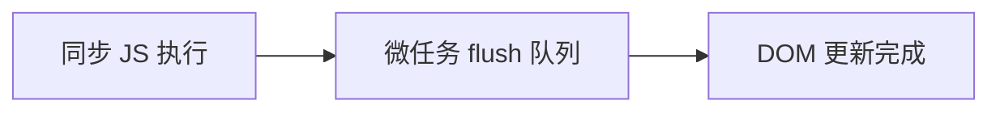

# nextTick 与异步更新

Vue 数据变更后**异步** patch DOM，要在视图同步后读 DOM 或调第三方库，用 **`await nextTick()`** 或 **`watch(..., { flush: 'post' })`**，别用 `setTimeout(0)` 猜时序。

---

## 为什么 DOM 更新是异步的

```vue
<script setup>
import { ref } from 'vue'

const msg = ref('hello')

function change() {
  msg.value = 'world'
  // 此处 DOM 文本可能仍是 hello
}
</script>
<template>
  <p ref="pRef">{{ msg }}</p>
</template>
```

响应式 trigger → scheduler 将 component update 放入**微任务队列** → 当前同步代码执行完 → flush → patch DOM。



| 好处 | 说明 |
|------|------|
| 批处理 | 多次改值一次 patch |
| 避免重复 layout | 合并 DOM 读写 |
| 性能 | 减少中间态 paint |

---

## nextTick API

```vue
<script setup>
import { ref, nextTick } from 'vue'

const list = ref([])
const box = ref(null)

async function addItem() {
  list.value.push({ id: 1 })
  await nextTick()
  // 此时 <li> 已插入，可读 scrollHeight
  console.log(box.value.scrollHeight)
}
</script>
```

| 形式 | 用法 |
|------|------|
| `await nextTick()` | async/await 首选 |
| `nextTick(() => { ... })` | 回调形式 |
| 返回 Promise | 可 chain |

---

## 与 watch flush 的关系

```js
watch(source, () => {
  /* pre：DOM 可能未更新 */
})

watch(source, () => {
  /* post：DOM 已更新 */
}, { flush: 'post' })
```

| 需求 | 推荐 |
|------|------|
| 数据变后立即读 DOM | `flush: 'post'` 或 `nextTick` |
| 阻止 DOM 更新前逻辑 | `flush: 'pre'` |
| 同步执行 watch | `flush: 'sync'`（性能风险） |

---

## 常见使用场景

### 聚焦新输入框

```vue
<script setup>
import { ref, nextTick } from 'vue'

const editing = ref(false)
const inputRef = ref(null)

async function startEdit() {
  editing.value = true
  await nextTick()
  inputRef.value?.focus()
}
</script>
```

### 滚动到底部

```js
messages.value.push(newMsg)
await nextTick()
container.value.scrollTop = container.value.scrollHeight
```

### 集成非 Vue 库（如图表 resize）

```js
chartData.value = nextData
await nextTick()
chartInstance.resize()
```

---

## 多次 nextTick

```js
count.value++
await nextTick()
// 一次 flush 已包含此次更新

count.value++
count.value++
await nextTick()
// 仍可能只需一次 flush（批处理）
```

不必在循环内反复 `nextTick`；一次 state 批量改完后调用即可。

---

## onMounted 与 nextTick

`onMounted` 回调时**首次 DOM 已挂载**，通常不需要 nextTick 读布局。若 mounted 内又改了响应式数据触发二次 patch，则需 nextTick。

```vue
<script setup>
import { onMounted, ref, nextTick } from 'vue'

const visible = ref(false)

onMounted(async () => {
  visible.value = true
  await nextTick()
  // 测量 v-if 新出现的节点
})
</script>
```

---

## Vue 2 对照

Vue 2 同样提供 `this.$nextTick`，语义一致。Composition API 使用 `import { nextTick } from 'vue'`。

---

## 反模式

| 反模式 | 问题 |
|--------|------|
| 滥用 sync watch | 破坏批处理 |
| setTimeout 0 代替 nextTick | 时序不可靠 |
| 在 nextTick 里再改 state 循环 | 无限更新风险 |

```js
// ❌ 应用 nextTick
setTimeout(() => measure(), 0)

// ✅
await nextTick()
measure()
```

---

## 与 Suspense、Teleport 的时序

Teleport 内容可能挂载到 body，nextTick 后 DOM 已在目标容器。Suspense resolve 后子树 mount，若依赖子组件 DOM，可在 `@resolve` 或子组件 `onMounted` + nextTick 处理。

---

## 小结

**异步 patch**：同步代码末尾 state 已变但 DOM 可能仍是旧状态，这是 scheduler 批处理的设计，不是 bug。

**nextTick**：`await nextTick()` 是等待 DOM 同步的标准方式；返回 Promise，也支持回调形式。

**watch flush**：`pre`（默认）在 render 前；`post` 在全部 patch 后，读 DOM 用 post 或 nextTick；`sync` 立即执行，破坏批处理，慎用。

**典型场景**：v-if 后 focus、列表追加后 scroll、图表 resize、测量 layout，都在 state 变更后 await nextTick。

**onMounted** 首次 DOM 已就绪；mounted 内再改 state 触发二次 patch 时才需 nextTick。

**反模式**：setTimeout 猜时序；nextTick 里循环改 state；滥用 sync watch。

**Teleport/Suspense**：nextTick 后 Teleport 内容已在目标容器；Suspense resolve 后子树才 mount，依赖子 DOM 时配合 onMounted/nextTick。
