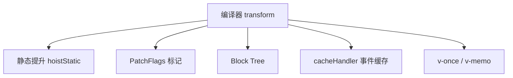
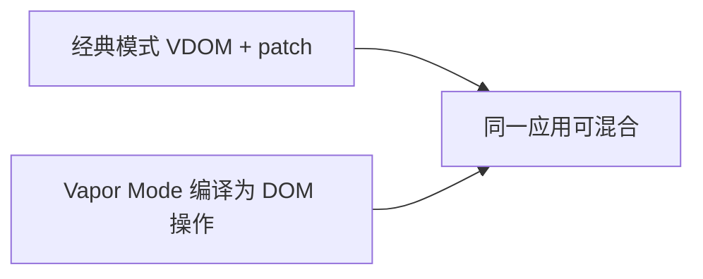

# 编译优化与 Vapor Mode 前瞻

Vue 3 编译器用 **静态提升、PatchFlags、Block Tree** 减运行时开销，**Vapor Mode**（实验）进一步在部分场景跳过虚拟 DOM。生产仍以稳定 compiler 优化为主；先测量再叠加技巧。

---

## 编译优化总览



| 优化 | 效果 |
|------|------|
| 静态提升 | 静态 VNode 只创建一次 |
| PatchFlags | patch 时跳过静态内容 |
| Block Tree | 只 diff dynamicChildren |
| 内联事件缓存 | 避免不必要的 props 变更 |

---

## 静态提升（hoistStatic）

纯静态元素/文本提升到 render 外：

```html
<div>
  <h1>固定标题</h1>
  <p>{{ dynamic }}</p>
</div>
```

编译后「固定标题」对应 VNode **模块级复用**，每次 render 不重建。

---

## PatchFlags 详解

```html
<div
  :class="cls"
  :style="style"
  :id="id"
>{{ text }}</div>
```

编译器分析出需 patch 的字段，生成 bitmask：

| Flag | 含义 |
|------|------|
| `TEXT` | 文本子节点动态 |
| `CLASS` / `STYLE` | class/style 绑定 |
| `PROPS` | 其他动态 prop |
| `HYDRATE_EVENTS` | SSR hydration 事件 |

运行时 `patchElement` 先读 `vnode.patchFlag`，**位运算**判断要比较的分支。

---

## Block Tree

根节点标记为 **block**，收集所有动态子节点到 `dynamicChildren` 数组：

```js
// 概念
block.dynamicChildren = [vnodeP, vnodeSpan] // 仅动态节点
```

patch block 时**不深度递归**静态子树，直接遍历 dynamicChildren。

---

## v-once 与 v-memo

```vue
<template>
  <section v-once>
    <HeavyStaticTree />
  </section>

  <div v-memo="[item.id, item.selected]">
    <Row :item="item" />
  </div>
</template>
```

| 指令 | 行为 |
|------|------|
| `v-once` | 首次 render 后缓存整棵 subTree |
| `v-memo` | 依赖数组不变则跳过该子树 update |

适合大列表行、图表容器等**少变**区域。

---

## SSR 与静态字符串

编译 SSR 时可生成 **字符串拼接** + **hydration vnode** 指令，减少客户端 hydration mismatch。与 `@vue/server-renderer` 配合使用。

---

## 开发期验证编译结果

使用 [Vue SFC Playground](https://play.vuejs.org/) 或 `@vue/compiler-dom` 查看 **render 输出**与 **ast**：

检查是否出现 `_hoisted_`、`openBlock`、`createElementBlock` 等 helper。

---

## Vapor Mode 前瞻

**Vapor Mode**（Vue 核心团队探索中）目标：在**编译期证明可静态绑定**的组件上，生成**直接 DOM 更新代码**，绕过通用 VNode diff。



| 维度 | 经典 Vue 3 | Vapor（方向） |
|------|------------|---------------|
| 运行时 | 通用 patch | 更薄、更专 |
| 适用 | 全场景 | 热点叶子组件 |
| 状态 | 实验 / RFC | 关注官方 RFC |

**实践建议**：关注 [vuejs/rfcs](https://github.com/vuejs/rfcs) 与 Vue 3.5+ 发布说明；生产仍以稳定 compiler 优化为主（PatchFlags、v-memo）。

---

## 手写代码如何配合编译器

| 写法 | 编译器友好度 |
|------|--------------|
| 模板 + 静态结构多 | ✅ 易优化 |
| render 内大量动态 h() | ⚠️ 优化有限 |
| 运行时拼接 template 字符串 | ❌ 难优化 |

组件库作者：对外暴露 SFC 友好 props，减少运行时 vnode 工厂。

---

## 性能排查顺序

1. 是否无效 re-render（props、store）
2. 大列表是否 **key + v-memo**
3. 是否 deep reactive 大对象
4. DevTools Performance 看 update 次数
5. 构建产物是否含 compiler（体积）

---

## 小结

**编译期优化**是 Vue 3 性能主要来源：静态提升、PatchFlags、Block Tree、cacheHandler 在 transform 阶段注入，runtime 只 diff 动态面。

**v-once / v-memo** 是应用层杠杆：显式跳过少变子树，大列表行常用 v-memo + 稳定 key。

**PatchFlags** 用 bitmask 标记 TEXT/CLASS/STYLE/PROPS 等；**Block Tree** 只遍历 dynamicChildren。

**Vapor Mode**（实验）目标是在可静态绑定的热点组件上生成直接 DOM 操作，与经典 VDOM 模式可混合；现阶段以稳定特性为准。

**手写配合**：模板静态结构多最友好；运行时拼 template 或大量动态 h() 难优化。

**排查顺序**：先无效 re-render 和数据流 → key/v-memo → 响应式边界 → DevTools → 构建体积。**测量后**再优化，勿 premature optimization。
