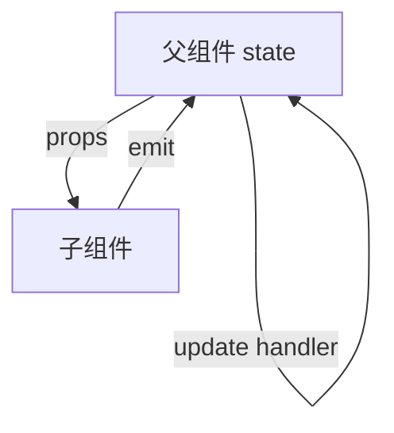

# props、emit 与 v-model 通信

父子通信三件套，**props 向下**、**emit 向上**、**v-model**（`modelValue` + `update:modelValue`）语法糖。跨层过深用 provide/inject 或 Pinia，别 prop drilling 十层。

---

## 单向数据流



子组件**不应**直接改 props；应 emit 请求父组件更新源数据。

---

## props 定义（script setup）

```vue
<!-- Child.vue -->
<script setup lang="ts">
const props = defineProps<{
  title: string
  count?: number
}>()

// 或运行时
// defineProps({ title: String, count: Number })
</script>

<template>
  <h2>{{ title }} — {{ count ?? 0 }}</h2>
</template>
```

| 要点 | 说明 |
|------|------|
| 只读 | 业务上不要 `props.x =` |
| 默认值 | `withDefaults(defineProps<...>(), { count: 0 })` |
| 复杂校验 | 运行时 props 对象 + validator |

---

## emit 事件

```vue
<!-- Child.vue -->
<script setup lang="ts">
const emit = defineEmits<{
  change: [value: number]
  'update:modelValue': [value: string]
}>()

function onInput(e: Event) {
  emit('update:modelValue', (e.target as HTMLInputElement).value)
}
</script>

<template>
  <input :value="modelValue" @input="onInput" />
</template>
```

父组件：

```vue
<Child v-model="keyword" @change="onChange" />
```

---

## v-model 语法糖

| 写法 | 展开 |
|------|------|
| `v-model="x"` | `:modelValue="x"` + `@update:modelValue="x = $event"` |
| `v-model:title="t"` | `:title="t"` + `@update:title="t = $event"` |

```vue
<!-- 多个 v-model -->
<UserForm
  v-model:name="form.name"
  v-model:email="form.email"
/>
```

子组件对应 `defineModel`（Vue 3.4+）：

```vue
<script setup>
const name = defineModel('name', { type: String })
</script>
<template>
  <input v-model="name" />
</template>
```

---

## Vue 2 遗留：.sync

Vue 2 的 **`.sync`** 修饰符等价于 `update:propName`：

```html
<!-- Vue 2 -->
<Child :title.sync="title" />

<!-- Vue 3 -->
<Child v-model:title="title" />
```

迁移时全局搜索 `.sync` 替换为具名 v-model。

---

## props 与响应式

```vue
<script setup>
import { toRef, computed } from 'vue'

const props = defineProps({ userId: Number })

// 单独字段给 watch/composable
const userId = toRef(props, 'userId')

const label = computed(() => `User #${userId.value}`)
</script>
```

Vue 3.4+ 可直接解构 props（编译期响应式）；更早版本用 **toRef**。

---

## 属性透传 attrs

未在 props/emits 声明的属性进入 **attrs**，默认挂到根节点：

```vue
<script setup>
defineOptions({ inheritAttrs: false })
</script>

<template>
  <label class="wrap">
    <input v-bind="$attrs" />
  </label>
</template>
```

| 场景 | 做法 |
|------|------|
| 包装原生 input | inheritAttrs: false + 手动绑定 |
| 高阶组件 | 透传 attrs 到内层 |

---

## 通信选型

| 关系 | 方式 |
|------|------|
| 父 → 子 | props |
| 子 → 父 | emit |
| 双向表单字段 | v-model / defineModel |
| 跨多层 | provide/inject |
| 兄弟 | 共同父组件或 Pinia |

---

## TypeScript 与文档

```vue
<script setup lang="ts">
interface Props {
  items: readonly Item[]
}
const props = defineProps<Props>()
</script>
```

组件库应导出 **Props 类型**供调用方复用。

---

## 小结

**props down、emit up** 是组件树内数据流基石；子组件禁止直接改 props，应 emit 请求父更新源数据。

**defineProps / defineEmits** 在 script setup 中声明；props 只读，默认值用 withDefaults；复杂校验用运行时 validator。

**v-model** 是 `:modelValue` + `@update:modelValue` 语法糖；具名 v-model（`v-model:title`）替代 Vue 2 `.sync`；Vue 3.4+ **defineModel** 进一步减样板。

**props 响应式**：3.4+ 可解构；更早版本用 toRef(props, 'key') 给 watch/composable。

**attrs 透传**：包装原生控件时常设 inheritAttrs: false 并手动 v-bind="$attrs"。

**选型**：父子用 props/emit/v-model；跨 2～3 层以上考虑 provide/inject 或 Pinia；兄弟提升到共同父级。

**TypeScript**：defineProps 泛型 + 导出 Props 类型供消费方复用。
