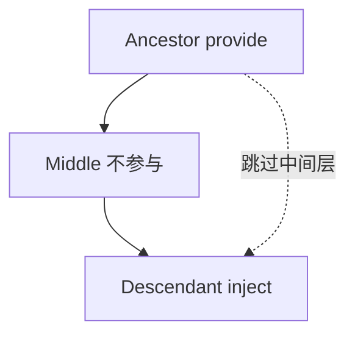

# provide 与 inject

**provide/inject** 跨层级传依赖，主题、表单上下文等「祖先提供、后代消费」。注入 **ref/reactive** 才响应式；TS 用 **InjectionKey** 保类型安全。

---

## 何时使用



| 适合 | 不适合 |
|------|--------|
| 主题、locale | 兄弟组件互传 |
| FormItem 读 Form 规则 | 频繁变动的业务明细（用 Pinia） |
| 插件注册表 | 可扁平化的 1 层 props |

---

## 基本用法

```vue
<!-- AppProvider.vue -->
<script setup>
import { provide, ref, readonly } from 'vue'

const theme = ref('light')
provide('theme', readonly(theme))

function setTheme(t) {
  theme.value = t
}
provide('setTheme', setTheme)
</script>
```

```vue
<!-- DeepChild.vue -->
<script setup>
import { inject } from 'vue'

const theme = inject('theme', 'light') // 第二个参数为默认值
const setTheme = inject('setTheme')
</script>
```

---

## 响应式注入

provide 的若是 **ref/reactive**，inject 方拿到同一引用，保持响应式：

```js
const count = ref(0)
provide('count', count)

// 子组件
const count = inject('count')
// template 中 {{ count }} 自动解包 ref
```

若 provide **plain 值**，后续变更不会向下传播。

---

## InjectionKey（TypeScript）

```ts
// keys.ts
import type { InjectionKey, Ref } from 'vue'

export interface UserContext {
  id: Ref<number>
  reload: () => Promise<void>
}

export const UserKey: InjectionKey<UserContext> = Symbol('user')
```

```vue
<script setup lang="ts">
import { provide, ref } from 'vue'
import { UserKey } from './keys'

provide(UserKey, {
  id: ref(1),
  reload: async () => { /* ... */ }
})
</script>
```

```vue
<script setup lang="ts">
import { inject } from 'vue'
import { UserKey } from './keys'

const user = inject(UserKey)
if (!user) throw new Error('UserKey missing')
</script>
```

---

## readonly 与封装

向子树暴露**只读 state + 方法**，避免 inject 方乱改：

```js
const state = reactive({ config: {} })
provide('config', readonly(state))

provide('updateConfig', (patch) => {
  Object.assign(state, patch)
})
```

---

## 与 props 对比

| 维度 | props | provide/inject |
|------|-------|----------------|
| 显式程度 | 高，每层声明 | 隐式，依赖约定 |
| 中间组件 | 需转发 | 可跳过 |
| 测试 | 易 mount 传 props | 需 stub provide |
| 类型 | defineProps | InjectionKey |

**原则**：能 props 一层解决的不滥用 provide；超过 2～3 层 prop drilling 再考虑 inject。

---

## 应用级 provide

```js
// main.js
import { createApp } from 'vue'
import App from './App.vue'

const app = createApp(App)
app.provide('globalApi', apiClient)
app.mount('#app')
```

等价于根组件 provide，全树可 inject。

---

## 组合式函数封装

```js
// useTheme.js
import { inject, provide, ref } from 'vue'

const ThemeKey = Symbol('theme')

export function provideTheme() {
  const theme = ref('light')
  provide(ThemeKey, theme)
  return theme
}

export function useTheme() {
  const theme = inject(ThemeKey)
  if (!theme) throw new Error('useTheme() without provider')
  return theme
}
```

模式与 **React Context + hook** 类似，但 Vue 用 Symbol key 与 inject API。

---

## SSR 注意

服务端 render 时 provide/inject 按请求实例隔离；避免把**请求级 state** 误放到模块单例。Nuxt 中优先用 **`useState` / composable** 封装请求作用域。

---

## 小结

**provide/inject** 适合跨层稳定上下文（主题、Form 规则、locale）；兄弟通信用父级 state 或 Pinia。

**响应式**：注入 ref/reactive 才跟随变化；plain 值不会传播更新。**readonly** + 方法封装单向数据流。

**InjectionKey**（Symbol + TS）保证 inject 类型安全；缺失 provider 应 throw 或给默认值。

**与 props**：props 显式、易测；inject 隐式、可跳过中间层。超过 2～3 层 drilling 再考虑 inject。

**封装模式**：`provideXxx` + `useXxx` composable，与 React Context 类似。

**app.provide** 等价根组件 provide，全树可用。

**SSR**：请求级 state 勿放模块单例；Nuxt 用 useState 等框架 API 封装作用域。

**测试**：stub provide 或 useXxx 默认值。
