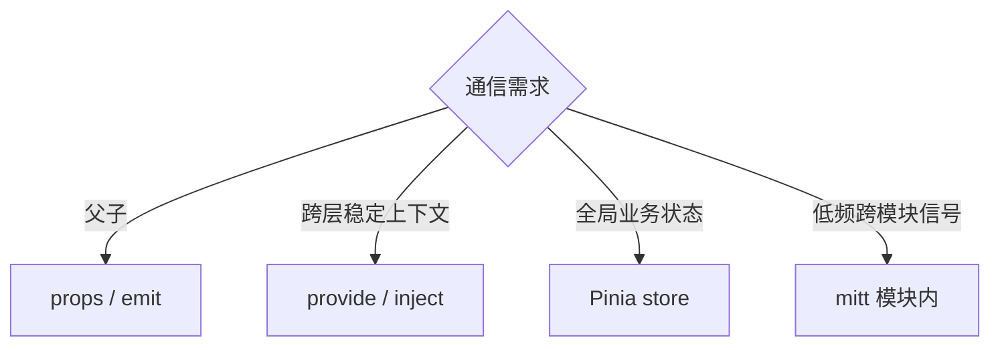

# 事件总线与 mitt

Vue 3 移除 **$on/$off**，模块内解耦用 **mitt**；有共享状态用 **Pinia**，mitt 只传「发生了某事」的信号，不传持久 state。

---

## Vue 2 事件总线为何被弃用

```js
// Vue 2 反模式
Vue.prototype.$bus = new Vue()
this.$bus.$emit('refresh')
this.$bus.$on('refresh', handler)
```

| 问题 | 说明 |
|------|------|
| 隐式依赖 | 难以追踪谁监听谁 |
| 内存泄漏 | 忘记 $off |
| 与组件树无关 | 破坏单向数据流 |
| Vue 3 | 实例不再是 EventEmitter |

---

## mitt 基本用法

```bash
npm install mitt
```

```js
// eventBus.js
import mitt from 'mitt'

export const bus = mitt()

// 类型化（TS）
export type Events = {
  'cart:updated': { count: number }
  'user:logout': void
}

export const bus = mitt<Events>()
```

```vue
<script setup>
import { onMounted, onUnmounted } from 'vue'
import { bus } from './eventBus'

function onCartUpdated(payload) {
  console.log(payload.count)
}

onMounted(() => {
  bus.on('cart:updated', onCartUpdated)
})

onUnmounted(() => {
  bus.off('cart:updated', onCartUpdated)
})
</script>
```

```js
bus.emit('cart:updated', { count: 3 })
```

---

## mitt API 一览

| 方法 | 作用 |
|------|------|
| `on(type, handler)` | 订阅 |
| `off(type, handler?)` | 取消订阅 |
| `emit(type, payload?)` | 派发 |
| `all.clear()` | 清空全部 |

---

## 适用场景边界



| 场景 | 推荐 |
|------|------|
| 购物车数量角标刷新 | Pinia 或 mitt |
| 插件通知宿主 | mitt / 回调 props |
| 兄弟组件 | 提升 state 到父级 |
| 路由级参数 | Vue Router |

---

## Composable 封装 mitt

```js
// useCartBus.js
import { onUnmounted } from 'vue'
import { bus } from './eventBus'

export function useCartBus(onUpdated) {
  bus.on('cart:updated', onUpdated)
  onUnmounted(() => bus.off('cart:updated', onUpdated))

  return {
    notifyCart(count) {
      bus.emit('cart:updated', { count })
    }
  }
}
```

统一 **onUnmounted 清理**，避免泄漏。

---

## 与 Pinia 的对比

| mitt | Pinia |
|------|-------|
| 无 state，仅事件 | 有 state/getters/actions |
| fire-and-forget | 可 DevTools 时间旅行 |
| 轻量 | 适合业务源数据 |

若事件携带的数据需要**持久 UI 展示**，应写入 store 而非仅 emit。

---

## 替代方案：模板 ref + 方法

小范围父调子，可用 **expose**：

```vue
<!-- Child.vue -->
<script setup>
import { ref } from 'vue'

const inner = ref(null)
function focus() { inner.value?.focus() }
defineExpose({ focus })
</script>
```

```vue
<!-- Parent.vue -->
<script setup>
import { ref } from 'vue'
const childRef = ref(null)
function go() { childRef.value?.focus() }
</script>
<template>
  <Child ref="childRef" />
</template>
```

---

## 微前端与模块边界

跨应用不应共享 mitt 单例；用 **自定义事件 window.dispatchEvent** 或微前端全局状态等明确边界机制。

---

## 小结

**Vue 3 无内置总线**；Vue 2 的 `$bus` 因隐式依赖、泄漏风险、破坏数据流而被弃用。

**mitt** 轻量 EventEmitter，适合模块内低频跨组件信号；TS 可用 `mitt<Events>()` 类型化。

**清理**：`onUnmounted` 中 `off`，或 composable 自动清理，忘记 off 是常见泄漏源。

**选型**：有共享 state → Pinia；mitt 只传信号不传 state；父子用 props/emit/expose，勿用总线绕开组件树。

**与 Pinia**：需要持久 UI 展示的数据应进 store，而非仅 emit 事件。

**expose + ref** 适合小范围父调子（focus 等命令式操作）。

**微前端**：跨应用不共享 mitt 单例，用明确边界机制。
