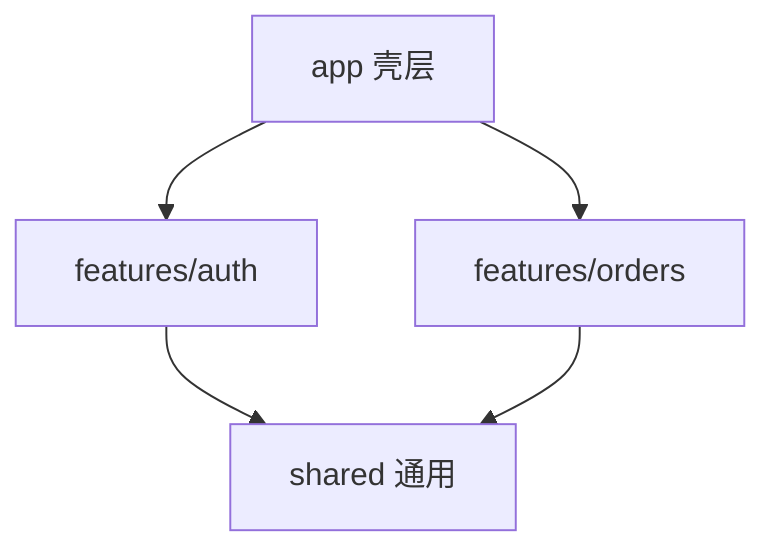

# 模块划分与特性目录

中大型项目按**业务域（feature）**组织，SFC、composable、路由、局部 store 共置，而非按 components/views 类型堆在根目录。shared 只放真正跨域复用的东西。

---

## 按类型 vs 按特性

```
# 按类型（小项目尚可）
src/
  components/
  views/
  composables/
  stores/

# 按特性（推荐中大型）
src/
  features/
    auth/
    dashboard/
    billing/
  shared/
  app/
```



---

## 特性目录典型结构

```
features/orders/
  components/       # 仅 orders 域内复用
    OrderTable.vue
    OrderFilters.vue
  composables/
    useOrderList.ts
  api/
    orders.ts
  types.ts
  routes.ts         # 或 pages/ 下文件路由
  index.ts          # 对外 barrel（可选）
```

| 目录 | 内容 |
|------|------|
| `components/` | 域内 UI，不对外 export 大杂烩 |
| `composables/` | useOrderList 等 |
| `api/` | 该域 HTTP 封装 |
| `types.ts` | 域内 TS 类型 |

---

## shared 层边界

```
shared/
  components/   # BaseButton、AppModal
  composables/  # useMediaQuery、useToast
  utils/
  ui/           # 设计系统封装
```

**原则**：只有 **≥2 个 feature** 复用才提升到 shared；否则留在 feature 内，避免 premature abstraction。

---

## app 壳层

```
app/
  App.vue
  main.ts
  router/index.ts      # 聚合各 feature routes
  plugins/
  layouts/
```

路由**注册**在 app 层，**定义**可分散在 feature：

```ts
// features/orders/routes.ts
export const orderRoutes = [
  { path: '/orders', component: () => import('./pages/OrderList.vue') }
]

// app/router/index.ts
import { orderRoutes } from '@/features/orders/routes'
```

---

## Pinia store 放置

| 策略 | 说明 |
|------|------|
| 域内 store | `features/user/stores/user.ts` |
| 全局 store | `stores/app.ts` 仅真正全局 UI |

```ts
// features/user/stores/user.ts
import { defineStore } from 'pinia'

export const useUserStore = defineStore('user', () => {
  const profile = ref(null)
  return { profile }
})
```

---

## 命名与 import 别名

```ts
// vite.config.ts / tsconfig paths
'@/' → 'src/'
'@/features/orders' → 域内绝对 import
```

组件命名：**多词 PascalCase**，feature 前缀可选：`OrderTable.vue` 而非 `Table.vue`（防全局冲突）。

---

## 懒加载与代码分割

路由级 **dynamic import** 自然按 feature 分 chunk：

```ts
{
  path: '/billing',
  component: () => import('@/features/billing/pages/BillingHome.vue')
}
```

---

## Monorepo 扩展

多 app 共用 UI 与 composable 时：

```
packages/
  ui/
  api-client/
apps/
  admin/
  portal/
```

feature 结构在 app 内仍适用。

---

## 反模式

| 反模式 | 后果 |
|--------|------|
| 巨型 `components/` | 难 ownership |
| feature 互引循环 | 构建循环依赖 |
| 一切皆 shared | 抽象泄漏 |
| 无 index barrel 滥用 | 树摇失效、循环 import |

**依赖规则**：`features/*` 可依赖 `shared`，**feature 之间**通过 app 路由或明确 public API 通信，避免直接 deep import 对方内部组件。

---

## 与 Nuxt 目录

Nuxt 3 用 `pages/`、`composables/` 约定；逻辑 composable 仍可按域分子文件夹：

```
composables/
  orders/
    useOrderList.ts
```

---

## 小结

**按 feature 共置**：SFC、composable、api、types、局部 store、routes 同域内聚，提升 ownership 和代码分割边界。

**shared**：只有 ≥2 个 feature 复用才提升；避免 premature abstraction 和抽象泄漏。

**app 壳层**：聚合路由、插件、layouts；各 feature 导出 routes 由 app/router 注册。

**Pinia**：域内 store 放 feature 内；仅真正全局 UI 放 stores/app。

**路径别名**：`@/` 指向 src；组件多词 PascalCase 防冲突。

**代码分割**：路由 lazy import 与 feature 边界对齐，利于团队分工和 chunk 体积。

**依赖规则**：feature → shared ✅；feature ↔ feature 通过路由/Pinia/public API，勿 deep import 内部组件。

**Monorepo**：packages 共享 ui/api-client；app 内仍用 feature 结构。**Nuxt** 用 pages 约定，composable 可按域分子目录。
