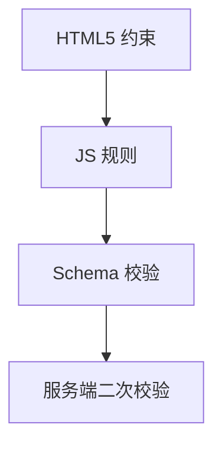

# 表单校验

生产表单需**校验、错误展示、提交门禁**，推荐 **vee-validate + Zod/Yup**；小表单可手写 composable。**前端校验不能替代服务端**。

---

## 校验层次



| 层 | 示例 |
|----|------|
| HTML | `required`、`type="email"` |
| 组件 | 自定义 error prop |
| Schema | Zod `z.string().email()` |
| 服务端 | 唯一性、权限 |

---

## vee-validate 基础

```bash
npm install vee-validate yup
```

```vue
<script setup>
import { useForm, useField } from 'vee-validate'
import * as yup from 'yup'

const schema = yup.object({
  email: yup.string().required('必填').email('格式错误'),
  age: yup.number().min(18, '须年满 18')
})

const { handleSubmit, errors, isSubmitting } = useForm({
  validationSchema: schema
})

const { value: email } = useField('email')
const { value: age } = useField('age')

const onSubmit = handleSubmit(async (values) => {
  await api.register(values)
})
</script>

<template>
  <form @submit="onSubmit">
    <input v-model="email" name="email" />
    <span>{{ errors.email }}</span>

    <input v-model="age" name="age" type="number" />
    <span>{{ errors.age }}</span>

    <button :disabled="isSubmitting">提交</button>
  </form>
</template>
```

---

## 与 Zod 集成

```ts
import { toTypedSchema } from '@vee-validate/zod'
import { z } from 'zod'

const schema = toTypedSchema(
  z.object({
    email: z.string().email(),
    password: z.string().min(8)
  })
)

const { handleSubmit } = useForm({ validationSchema: schema })
```

Zod 推断 TS 类型，与表单 values 类型一致。

---

## Field 组件写法

```vue
<script setup>
import { Form, Field, ErrorMessage } from 'vee-validate'
</script>

<template>
  <Form @submit="onSubmit" :validation-schema="schema">
    <Field name="email" type="email" />
    <ErrorMessage name="email" />

    <button type="submit">提交</button>
  </Form>
</template>
```

声明式 `<Field>` 自动关联 name 与错误信息。

---

## 校验触发时机

| 模式 | 说明 |
|------|------|
| `validateOnBlur` | 失焦校验 |
| `validateOnChange` | 每次变更 |
| `validateOnSubmit` | 仅提交 |

```js
useForm({
  validationSchema: schema,
  validateOnMount: false
})
```

移动端常 **submit 时全量** + 字段 blur 单验。

---

## 异步校验

```js
const schema = yup.object({
  username: yup.string().test(
    'unique',
    '用户名已占用',
    async (value) => {
      if (!value) return true
      return !(await api.checkUsername(value))
    }
  )
})
```

注意 **debounce** 与请求取消，避免旧响应覆盖。

---

## 手写轻量 composable

```js
export function useFormValidator(initial, rules) {
  const values = reactive({ ...initial })
  const errors = reactive({})

  function validate() {
    let ok = true
    for (const [key, rule] of Object.entries(rules)) {
      const msg = rule(values[key], values)
      errors[key] = msg || ''
      if (msg) ok = false
    }
    return ok
  }

  return { values, errors, validate }
}
```

字段 ≤3、无复杂联动时可够用。

---

## 与 UI 库 Form

Element Plus **ElForm**、Ant Design Vue **Form** 自带 rules；可与 vee-validate 二选一，**同一项目统一一套**。

```vue
<ElForm :model="form" :rules="rules" ref="formRef">
  <ElFormItem prop="email">
    <ElInput v-model="form.email" />
  </ElFormItem>
</ElForm>
```

---

## a11y

```vue
<input
  v-model="email"
  :aria-invalid="!!errors.email"
  :aria-describedby="errors.email ? 'email-err' : undefined"
/>
<span id="email-err" role="alert">{{ errors.email }}</span>
```

错误信息与字段 programmatic 关联。

---

## 小结

**校验层次**：HTML5 约束 → JS/组件规则 → Schema（Zod/Yup）→ 服务端二次校验；永不只信前端。

**推荐栈**：vee-validate + Zod/Yup；`useForm`/`useField` 或声明式 `Form`/`Field`/`ErrorMessage`。

**Zod 集成**：`toTypedSchema` 推断 TS 类型，与表单 values 一致。

**触发时机**：blur/change/submit 按需配置；移动端常 submit 全量 + blur 单验。

**异步规则**（唯一性等）：debounce + 取消旧请求，防旧响应覆盖。

**小表单**：≤3 字段可手写 useFormValidator composable。

**UI 库 Form**（ElForm 等）与 vee-validate **择一统一**，勿混用两套规则。

**a11y**：aria-invalid、aria-describedby、role="alert" 关联错误信息。

**安全**：服务端必须再校验；前端只做 UX 门禁。
