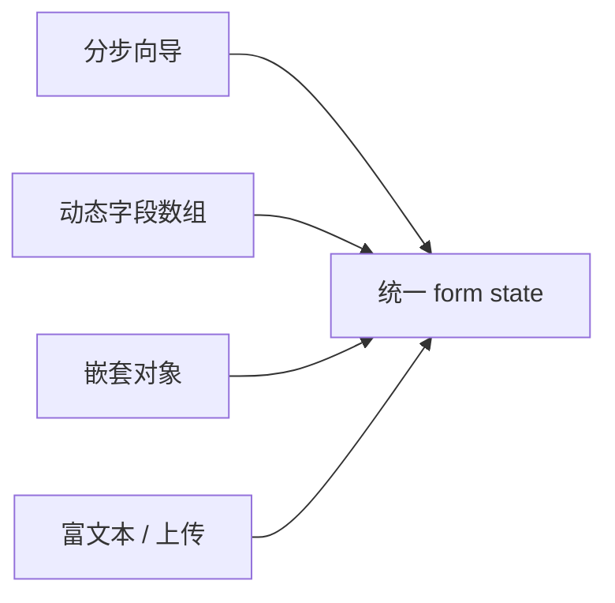

# 复杂表单与第三方编辑器

复杂表单维护**单一 form state**，富文本/上传用 **shallowRef + 生命周期**，避免 reactive 包裹第三方实例；分步/动态字段向同一对象合并，切换 schema 时清理废弃 key。

---

## 复杂表单形态



| 类型 | 挑战 |
|------|------|
| 分步 | 跨步校验、草稿 |
| 动态列表 | 增删行、key |
| 富文本 | 非 Vue 控制 DOM |
| 上传 | 进度、预览、失败重试 |

---

## 统一 state 形状

```vue
<script setup>
import { reactive } from 'vue'

const form = reactive({
  step: 1,
  profile: { name: '', avatar: null },
  items: [{ sku: '', qty: 1 }]
})

function addItem() {
  form.items.push({ sku: '', qty: 1 })
}

function removeItem(i) {
  form.items.splice(i, 1)
}
</script>
```

大表单用 **reactive 单对象** 或 **Pinia 草稿 store**；提交前 `structuredClone` / `toRaw` 序列化。

---

## 分步向导

```vue
<script setup>
import { ref, computed } from 'vue'

const step = ref(1)
const data = ref({ /* ... */ })

const stepSchema = [
  z.object({ name: z.string().min(1) }),
  z.object({ address: z.string().min(1) })
]

async function next() {
  await stepSchema[step.value - 1].parseAsync(data.value)
  step.value++
}
</script>

<template>
  <Step1 v-if="step === 1" v-model="data" />
  <Step2 v-else-if="step === 2" v-model="data" />
</template>
```

每步组件 **v-model 整包或分字段**；父持最终提交权。

---

## 富文本编辑器集成

TipTap、Quill 等多为 **命令式实例**，勿 deep reactive：

```vue
<script setup>
import { shallowRef, onMounted, onBeforeUnmount, watch } from 'vue'
import { Editor } from '@tiptap/core'
import StarterKit from '@tiptap/starter-kit'

const model = defineModel({ type: String, default: '' })
const editor = shallowRef(null)

onMounted(() => {
  editor.value = new Editor({
    extensions: [StarterKit],
    content: model.value,
    onUpdate: ({ editor: e }) => {
      model.value = e.getHTML()
    }
  })
})

watch(model, (html) => {
  if (editor.value && editor.value.getHTML() !== html) {
    editor.value.commands.setContent(html, false)
  }
})

onBeforeUnmount(() => editor.value?.destroy())
</script>

<template>
  <div ref="root" />
</template>
```

| 要点 | 说明 |
|------|------|
| shallowRef 存实例 | 避免 Proxy 破坏编辑器 |
| 双向同步防循环 | 比较后再 setContent |
| destroy | 卸载时释放 |

---

## 文件上传

```vue
<script setup>
import { ref } from 'vue'

const files = ref([])
const progress = ref({})

async function onFileChange(e) {
  const list = [...e.target.files]
  for (const file of list) {
    const id = crypto.randomUUID()
    files.value.push({ id, name: file.name, url: null })
    progress.value[id] = 0
    const url = await uploadWithProgress(file, (p) => {
      progress.value[id] = p
    })
    const row = files.value.find(f => f.id === id)
    if (row) row.url = url
  }
}
</script>
```

大文件用 **分片**；失败行保留 **重试** 状态。

---

## 动态 schema（JSON Schema / Zod）

```ts
const base = z.object({ type: z.enum(['A', 'B']) })

function schemaFor(type: string) {
  return base.extend({
    extra: type === 'A' ? z.string() : z.number()
  })
}
```

字段随 `type` 变化时，**watch 清理无效 key**，避免提交脏字段。

---

## 性能

| 策略 | 说明 |
|------|------|
| 分步 lazy mount | 未显示步骤不挂载重编辑器 |
| v-memo 行 | 动态表格行 |
| 校验 debounce | 异步唯一性 |
| 提交 loading | 防重复 POST |

---

## 第三方 Form 构建器

form-create、formily 等通过 **schema 驱动**渲染；适合中后台配置化。与手写 SFC 选型看**变更频率**与**定制深度**。

---

## 安全

富文本入库前 **DOMPurify** 消毒；上传校验 **MIME/扩展名/大小**。

---

## 小结

**单一 form state**：分步/动态/嵌套都向同一 reactive 对象或 Pinia 草稿合并；提交前 structuredClone/toRaw 序列化。

**分步向导**：每步 schema 校验后 next；子组件 v-model 整包或分字段；父持提交权。

**富文本/编辑器**：shallowRef 存实例 + onMounted 创建 + onBeforeUnmount destroy；双向同步防循环（比较后再 setContent）；勿 deep reactive。

**上传**：进度 ref、失败重试、大文件分片。

**动态 schema**：type 切换时 watch 清理废弃 key，防脏字段提交。

**性能**：分步 lazy mount 重编辑器；v-memo 动态行；提交 loading 防重复 POST。

**Form 构建器**（formily 等）适合配置化中后台；手写 SFC 适合高定制。

**安全**：富文本 DOMPurify；上传校验 MIME/大小；服务端再校验。
