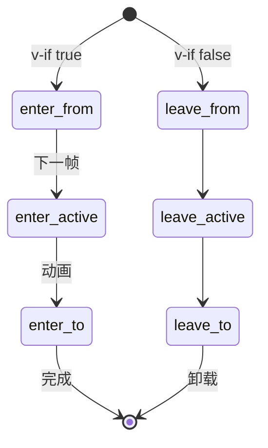

# Transition 与 TransitionGroup

**Transition** 管单元素进出场，**TransitionGroup** 管 v-for 列表，Vue 3 类名用 **-enter-from / -leave-to**；列表需稳定 key + move 样式，否则重排时 DOM 乱跳。

---

## Transition 基本用法

```vue
<script setup>
import { ref } from 'vue'

const show = ref(true)
</script>

<template>
  <button @click="show = !show">切换</button>
  <Transition name="fade">
    <p v-if="show">Hello</p>
  </Transition>
</template>

<style scoped>
.fade-enter-active,
.fade-leave-active {
  transition: opacity 0.3s ease;
}
.fade-enter-from,
.fade-leave-to {
  opacity: 0;
}
</style>
```

---

## 过渡类名阶段



| 类名（name=fade） | 时机 |
|-------------------|------|
| `fade-enter-from` | 进入起始 |
| `fade-enter-active` | 进入过程 |
| `fade-enter-to` | 进入结束 |
| `fade-leave-from` | 离开起始 |
| `fade-leave-active` | 离开过程 |
| `fade-leave-to` | 离开结束 |

Vue 3 使用 **-enter-from / -leave-to**（Vue 2 为 -enter / -leave）。

---

## 内置 mode

```vue
<Transition name="slide" mode="out-in">
  <component :is="current" :key="current" />
</Transition>
```

| mode | 行为 |
|------|------|
| 默认 | 进出场并行 |
| `out-in` | 先 leave 再 enter |
| `in-out` | 先 enter 再 leave（少用） |

路由切换、Tab 内容常用 **out-in** 避免重叠。

---

## TransitionGroup 列表

```vue
<template>
  <TransitionGroup name="list" tag="ul">
    <li v-for="item in items" :key="item.id">
      {{ item.text }}
    </li>
  </TransitionGroup>
</template>

<style scoped>
.list-move,
.list-enter-active,
.list-leave-active {
  transition: all 0.3s ease;
}
.list-enter-from,
.list-leave-to {
  opacity: 0;
  transform: translateX(30px);
}
.list-leave-active {
  position: absolute;
}
</style>
```

**必须稳定 key**；`move` 类实现列表重排动画。

---

## JS 钩子

```vue
<Transition
  @before-enter="onBeforeEnter"
  @enter="onEnter"
  @after-enter="onAfterEnter"
  @leave="onLeave"
>
  ...
</Transition>
```

```js
function onEnter(el, done) {
  el.offsetHeight // 触发 reflow
  el.style.transition = 'height 0.3s'
  el.style.height = el.scrollHeight + 'px'
  el.addEventListener('transitionend', done, { once: true })
}
```

第三方动画库（GSAP）常在 **enter/leave** 中调用 `done()` 通知结束。

---

## appear 首次渲染

```vue
<Transition appear name="fade">
  <h1 v-if="ready">标题</h1>
</Transition>
```

增加 **-appear-\*** 类，首屏 mount 也播放动画。

---

## 与 v-show

`<Transition>` 配合 **v-if**（挂载/卸载）。**v-show** 仅 toggle display，需自写 class 或仍用 CSS transition on opacity。

---

## 性能注意

| 建议 | 原因 |
|------|------|
| 动画 `transform`/`opacity` | 避免 layout thrashing |
| 长列表慎用复杂 leave | 同时多条 leave-active |
| `will-change` 适度 | 内存 |

---

## 路由过渡

```vue
<router-view v-slot="{ Component }">
  <Transition name="fade" mode="out-in">
    <component :is="Component" />
  </Transition>
</router-view>
```

---

## 小结

**Transition** 包裹单节点 v-if/v-show 切换（v-if 更常见）；**TransitionGroup** 包裹 v-for 列表，需 `tag` 指定容器元素。

**Vue 3 类名**：`-enter-from` / `-enter-to` / `-leave-from` / `-leave-to` + `-enter-active` / `-leave-active`；Vue 2 为 -enter/-leave，迁移要改 CSS。

**mode**：`out-in` 先 leave 再 enter，路由/Tab 常用；默认进出场并行。

**TransitionGroup**：稳定 key 必须；`-move` 类做 FLIP 重排动画；leave-active 常设 absolute 防布局跳动。

**JS 钩子**：enter/leave 接收 `(el, done)`，动画结束须调 done()；GSAP 等第三方库同理。

**appear**：首屏 mount 也播动画，加 `-appear-*` 类。

**性能**：优先 transform/opacity；长列表慎用复杂 leave。

**路由**：router-view slot + Transition + mode out-in。
