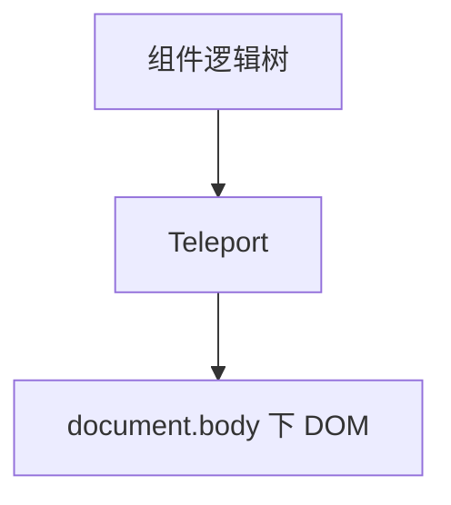

# Teleport

**Teleport** 把模板渲染到 DOM 其他位置（如 `body`），逻辑仍属原组件，Modal/Toast 标准方案；配合 Transition + 焦点管理（focus trap、Esc 关闭、aria-modal）。

---

## 为什么需要 Teleport

```vue
<template>
  <div class="card" style="overflow: hidden">
    <!-- 若不 teleport，modal 可能被 overflow 裁剪 -->
    <Teleport to="body">
      <div v-if="open" class="modal">...</div>
    </Teleport>
  </div>
</template>
```



---

## 基本语法

```vue
<script setup>
import { ref } from 'vue'

const open = ref(false)
</script>

<template>
  <button @click="open = true">打开</button>
  <Teleport to="body">
    <div v-if="open" class="overlay" @click.self="open = false">
      <div class="dialog" role="dialog" aria-modal="true">
        内容
      </div>
    </div>
  </Teleport>
</template>
```

`to` 可为 CSS 选择器字符串或 DOM 元素。

---

## disabled

```vue
<Teleport to="body" :disabled="!useTeleport">
  <Panel />
</Teleport>
```

**disabled** 时内容渲染在原位，便于 SSR 或测试。

---

## 与组件 state 的关系

Teleport 内仍访问同一 **setup** 作用域：

```vue
<Teleport to="body">
  <p>{{ message }}</p>
  <button @click="count++">{{ count }}</button>
</Teleport>
```

事件、响应式与未 teleport 部分一致。

---

## 多个 Teleport 同一目标

```vue
<Teleport to="#modals">...</Teleport>
<Teleport to="#modals">...</Teleport>
```

按**声明顺序**依次挂载到 `#modals` 内。

---

## SSR 与 hydration

服务端需目标容器存在；Nuxt 常用 **`ClientOnly`** 包裹纯客户端 Teleport，或 **disabled** 到客户端再启用。

```vue
<ClientOnly>
  <Teleport to="body">
    <ToastHost />
  </Teleport>
</ClientOnly>
```

---

## 焦点与 a11y

Modal 应 **focus trap**、**Esc 关闭**、**aria-modal**：

```vue
<script setup>
import { watch, nextTick } from 'vue'

const open = defineModel({ type: Boolean })
const dialogRef = ref(null)

watch(open, async (v) => {
  if (v) {
    await nextTick()
    dialogRef.value?.focus()
  }
})
</script>
```

---

## 与 Transition 组合

```vue
<Teleport to="body">
  <Transition name="modal">
    <div v-if="open" class="overlay">...</div>
  </Transition>
</Teleport>
```

leave 动画完成前勿销毁，Transition 会延迟 unmount。

---

## UI 库

Element Plus `ElDialog`、Ant Design Vue `Modal` 内部已 Teleport；二次封装时 **不要重复 teleport** unless 必要。

---

## 小结

**Teleport** 把 DOM 挂到指定容器（通常 `body`），解决 overflow 裁剪和 z-index 层叠；**逻辑和响应式仍属原组件**。

**to** 为 CSS 选择器或 DOM 元素；**disabled** 时渲染在原位，SSR/测试常用。

**多个 Teleport 同目标**按声明顺序堆叠。

**SSR**：目标容器须存在；Nuxt 用 ClientOnly 或 disabled 到客户端启用。

**Modal a11y**：aria-modal、focus trap、Esc 关闭；打开后 nextTick focus 对话框。

**Transition**：Teleport 外包 Transition 做进出场；leave 完成前 Transition 延迟 unmount。

**UI 库** Dialog/Modal 通常已内置 Teleport，二次封装勿重复。

**KeepAlive 配合**：页面 deactivated 时关闭 Modal，防 ghost 遮罩。
