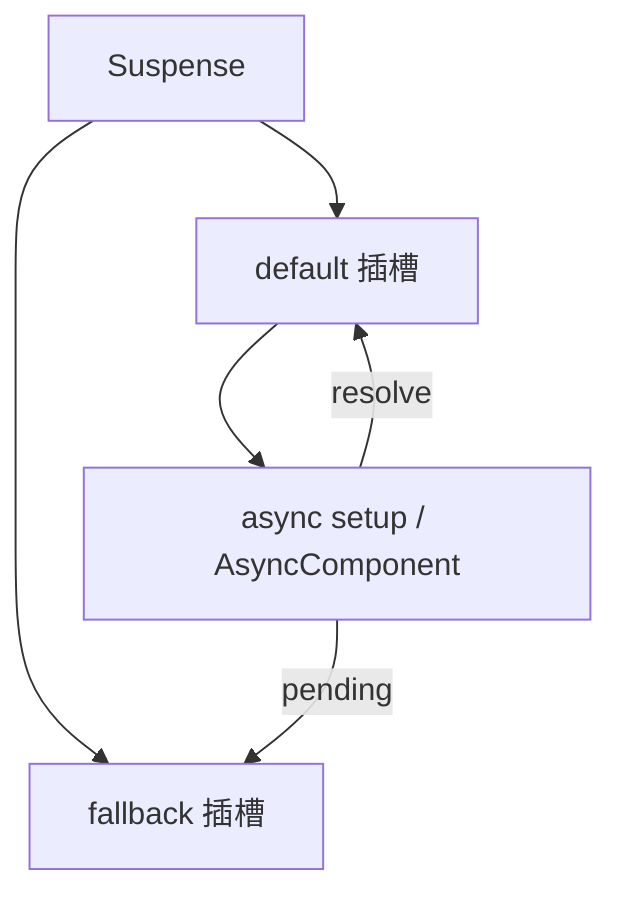

# Suspense

**Suspense** 在 async setup / 异步组件 pending 时显示 **fallback**，支持嵌套与 @pending/@resolve；简单 loading 可手写 ref，不必强行 Suspense。

---

## 使用场景



| 触发 pending | 示例 |
|--------------|------|
| async setup | `await fetch()` |
| defineAsyncComponent | 懒加载 chunk |
| 嵌套 Suspense | 子树 async |

---

## async setup

```vue
<!-- AsyncUser.vue -->
<script setup>
const props = defineProps({ id: Number })

const user = await fetch(`/api/users/${props.id}`).then(r => r.json())
</script>

<template>
  <div>{{ user.name }}</div>
</template>
```

父级：

```vue
<Suspense>
  <AsyncUser :id="1" />
  <template #fallback>
    <p>加载中...</p>
  </template>
</Suspense>
```

**await 在 setup 顶层**会挂起组件，Suspense 显示 fallback。

---

## 异步组件

```js
import { defineAsyncComponent } from 'vue'

const HeavyChart = defineAsyncComponent(() =>
  import('./HeavyChart.vue')
)
```

```vue
<Suspense>
  <HeavyChart />
  <template #fallback>图表加载中</template>
</Suspense>
```

可与 **loadingComponent**、**delay**、**timeout** 配置并用（组件级 fallback vs Suspense fallback）。

---

## 嵌套 Suspense

```vue
<Suspense>
  <Layout>
    <Suspense>
      <AsyncPanel />
      <template #fallback>Panel...</template>
    </Suspense>
  </Layout>
  <template #fallback>Layout...</template>
</Suspense>
```

外层 resolve 不保证内层已 ready；各层独立 fallback。

---

## 事件 @pending / @resolve / @fallback

```vue
<Suspense
  @pending="onPending"
  @resolve="onResolve"
  @fallback="onFallback"
>
  ...
</Suspense>
```

用于埋点、进度条或协调多个 Suspense。

---

## 与 router、KeepAlive

路由懒加载组件外包 Suspense 可统一 loading；**KeepAlive + async setup** 时注意 activated 时是否重新 await（默认缓存实例可能不再 pending）。

---

## 错误处理

Suspense **不**替代 ErrorBoundary；async setup 抛错需 **onErrorCaptured** 或外层错误组件。

```vue
<script setup>
import { onErrorCaptured } from 'vue'

onErrorCaptured((err) => {
  console.error(err)
  return false // 阻止继续向上
})
</script>
```

---

## 实验性说明

Suspense **仍部分实验性**（尤其 SSR 组合）；生产使用需查当前 Vue 版本文档与 Nuxt 内置数据 fetching（`useAsyncData`）是否更稳。

---

## 替代：手动 loading

```vue
<script setup>
const loading = ref(true)
const data = ref(null)

onMounted(async () => {
  data.value = await fetchData()
  loading.value = false
})
</script>

<template>
  <div v-if="loading">加载中</div>
  <div v-else>{{ data }}</div>
</template>
```

简单页不必强行 Suspense；async setup 适合**逻辑集中**与**嵌套一致 fallback**。

---

## 小结

**Suspense** 在 async setup 或 defineAsyncComponent pending 时显示 **fallback** 插槽，resolve 后显示 default。

**async setup**：顶层 await 挂起组件；父级 Suspense 提供统一 loading UI。

**defineAsyncComponent** 懒加载 chunk 同样触发 pending；可与组件级 loadingComponent 并用。

**嵌套 Suspense** 各层独立 fallback；外层 resolve 不保证内层 ready。

**事件**：@pending/@resolve/@fallback 用于埋点和进度协调。

**错误**：Suspense 不捕获 async 错误；用 onErrorCaptured 或错误边界组件。

**KeepAlive**：缓存实例可能不再 pending；activated 时注意数据是否需刷新。

**实验性**：SSR 组合仍 evolving；Nuxt 项目优先 useAsyncData 等框架 API。

**简单场景**：v-if loading + onMounted fetch 足够；复杂树用 Suspense 统一体验。
