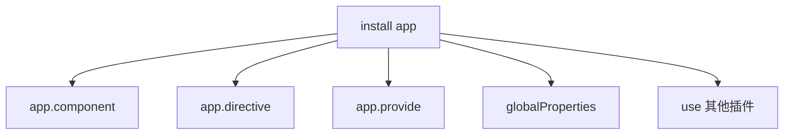

# 插件与 app.use

插件通过 **`install(app, options)`** 扩展应用，**`app.use`** 是入口；Router/Pinia/i18n 都是插件，业务逻辑优先 composable 而非 globalProperties。

---

## 插件是什么

```js
export default {
  install(app, options) {
    // 扩展 app
  }
}
```

或函数式：

```js
export function myPlugin(app, options) {
  app.config.globalProperties.$toast = (msg) => { /* ... */ }
}
```

```js
import { createApp } from 'vue'
import App from './App.vue'
import myPlugin from './plugins/myPlugin'

createApp(App)
  .use(myPlugin, { theme: 'dark' })
  .mount('#app')
```

---

## install 内常见能力



| API | 用途 |
|-----|------|
| `app.component` | 全局组件 |
| `app.directive` | 全局指令 |
| `app.provide` | 应用级 inject |
| `app.config.globalProperties` | 兼容 Options API 的 this.$xxx |
| `app.use` | 组合插件 |

---

## 示例：i18n 风格插件

```js
// plugins/i18n.js
export function createI18n(messages) {
  return {
    install(app) {
      const locale = ref('zh')
      const t = (key) => messages[locale.value]?.[key] ?? key

      app.provide('locale', locale)
      app.provide('t', t)
      app.config.globalProperties.$t = t
    }
  }
}
```

```js
app.use(createI18n({ zh: { hello: '你好' }, en: { hello: 'Hello' } }))
```

Composition 侧 **inject('t')**，Options 侧 **this.$t**。

---

## 防止重复 install

```js
const installed = new WeakSet()

export default {
  install(app) {
    if (installed.has(app)) return
    installed.add(app)
    // ...
  }
}
```

SSR 多请求或多 app 实例时各 app 独立 install 一次。

---

## 插件 options 与类型

```ts
export interface ToastOptions {
  duration?: number
}

export function ToastPlugin(app: App, options: ToastOptions = {}) {
  app.provide(ToastKey, createToast(options))
}
```

调用：`app.use(ToastPlugin, { duration: 3000 })`

---

## 与 composable 分工

| 插件 | composable |
|------|------------|
| 一次 install 全局注册 | 按需 import |
| UI 库、i18n、router | 业务逻辑复用 |
| `app.use(router)` | `useRouter()` |

Vue Router、Pinia 本身即 **插件**：

```js
import { createPinia } from 'pinia'
import router from './router'

createApp(App)
  .use(createPinia())
  .use(router)
  .mount('#app')
```

---

## 局部 vs 全局

优先 **按需 import 组件**；全局 `app.component('BaseButton')` 仅真正高频基础件。

```js
// 避免
app.component('ElButton', ElButton) // 不如 unplugin-vue-components 按需
```

---

## 插件顺序

```js
app
  .use(pinia)   // store 先于依赖 store 的插件
  .use(router)
  .use(i18n)
```

依赖 **provide/inject** 的插件应在使用方 install 之前。

---

## 测试

```js
import { createApp } from 'vue'
import { mount } from '@vue/test-utils'

function withPlugin(plugin) {
  const app = createApp({})
  app.use(plugin)
  return app
}
```

或测试组件时 **global.plugins** 传入。

---

## 生态示例

| 插件 | install 作用 |
|------|--------------|
| vue-router | 注册 router、RouterView |
| pinia | 注册 pinia 实例 |
| vue-i18n | 注册 i18n 与 $t |
| Element Plus | 组件、样式、locale |

阅读库源码时从 **`app.use` 导出的 install** 入手。

---

## 小结

**插件**：实现 `install(app, options)` 扩展应用；入口 **`app.use(plugin, options)`**，可链式调用。

**install 能力**：注册全局 component/directive、app.provide、globalProperties（Options API 的 this.$xxx）、嵌套 app.use。

**幂等**：WeakSet 防同一 app 重复 install；SSR 多 app 实例各装一次。

**i18n 模式**：provide + globalProperties 双轨，Composition 用 inject，Options 用 this.$t。

**vs composable**：插件适合一次 install 的全局能力（router、pinia、i18n、UI 库）；业务逻辑优先 composable 按需 import。

**全局组件**：仅高频基础件；UI 库用 unplugin-vue-components 按需优于全量 app.component。

**install 顺序**：pinia → router → i18n 等，满足 provide 依赖。

**测试**：createApp + app.use 或 test-utils global.plugins。

**生态**：Router/Pinia/vue-i18n/Element Plus 均为插件，读源码从 install 入手。
