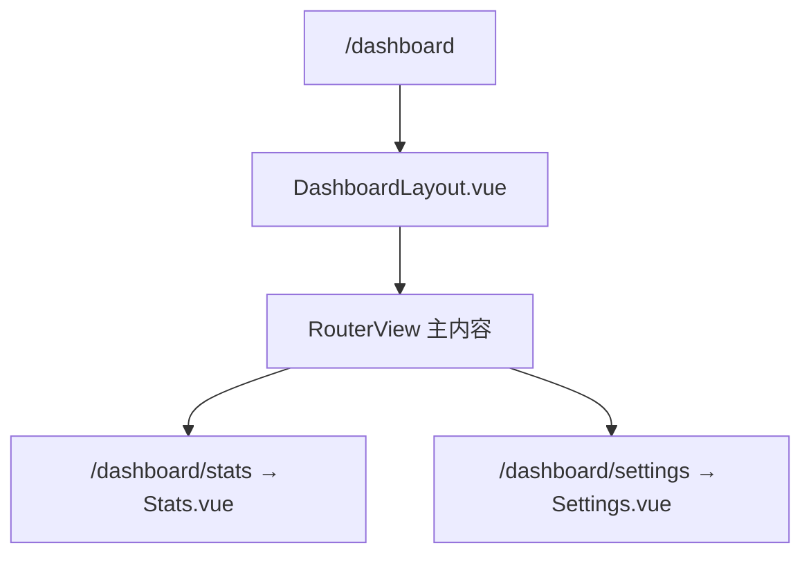
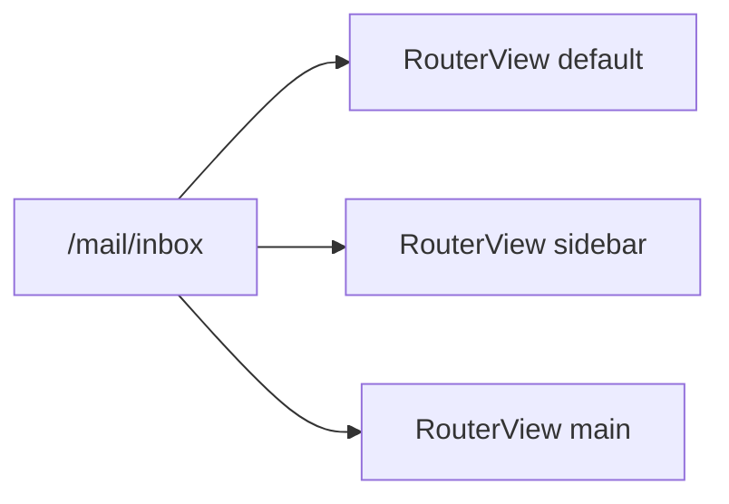

# 嵌套路由与命名视图

后台系统常见「Layout + 内容区」：侧栏固定，主区域随 URL 切换。嵌套路由用 `children` 描述 URL 树，父组件内放 `<RouterView>` 承载子页；同一 URL 下还要并排多栏时，用 `components` + 命名 `<RouterView>`。子 path 别加 `/`，否则会跳出父前缀。

---

## 嵌套路由的结构



父路由组件**必须**包含 `<RouterView>`，子路由组件才会渲染在该出口内。

```ts
const routes = [
  {
    path: '/dashboard',
    component: () => import('@/layouts/DashboardLayout.vue'),
    children: [
      { path: '', name: 'DashboardHome', component: () => import('@/views/dashboard/Home.vue') },
      { path: 'stats', name: 'DashboardStats', component: () => import('@/views/dashboard/Stats.vue') },
      { path: 'settings', name: 'DashboardSettings', component: () => import('@/views/dashboard/Settings.vue') },
    ],
  },
];
```

| 路径 | 渲染层级 |
|------|----------|
| `/dashboard` | Layout + Home（默认子路由） |
| `/dashboard/stats` | Layout + Stats |
| `/dashboard/settings` | Layout + Settings |

---

## DashboardLayout 示例

```vue
<!-- layouts/DashboardLayout.vue -->
<template>
  <div class="dashboard">
    <aside>
      <RouterLink to="/dashboard">概览</RouterLink>
      <RouterLink to="/dashboard/stats">统计</RouterLink>
      <RouterLink to="/dashboard/settings">设置</RouterLink>
    </aside>
    <main>
      <RouterView />
    </main>
  </div>
</template>
```

子路由 path **不要**以 `/` 开头（除非想从根路径匹配）。`stats` 会拼接为 `/dashboard/stats`。

---

## 绝对路径与相对 path

| 写法 | 实际 path | 场景 |
|------|-----------|------|
| `path: 'profile'` | `/dashboard/profile` | 常规嵌套 |
| `path: '/profile'` | `/profile` | 跳出父前缀，独立顶级 |
| `path: ''` | 继承父 path | 默认子页 |

```ts
{
  path: '/users/:id',
  component: UserLayout,
  children: [
    { path: '', component: UserOverview },
    { path: 'posts', component: UserPosts },
  ],
}
```

访问 `/users/42/posts` 时：`UserLayout` 始终挂载，`<RouterView>` 内切换 `UserPosts`。

---

## 嵌套过渡动画

Router 4 推荐用 `v-slot` 包裹 `<Transition>`：

```vue
<RouterView v-slot="{ Component, route }">
  <Transition name="fade" mode="out-in">
    <component :is="Component" :key="route.path" />
  </Transition>
</RouterView>
```

| 属性 | 作用 |
|------|------|
| `Component` | 当前匹配组件构造器 |
| `route` | 当前路由对象 |
| `:key="route.path"` | 强制 remount，触发动画 |

---

## 命名视图（Named Views）

同一 URL 下渲染**多个**同级视图，例如：固定 Header + Sidebar + Main。

```ts
{
  path: '/mail',
  components: {
    default: MailLayout,
    sidebar: MailSidebar,
    main: MailList,
  },
  children: [
    {
      path: ':folder',
      components: {
        default: MailLayout,
        sidebar: MailSidebar,
        main: MailFolder,
      },
    },
  ],
}
```

```vue
<!-- App.vue 或上层布局 -->
<template>
  <header>固定顶栏</header>
  <div class="body">
    <RouterView name="sidebar" />
    <RouterView name="main" />
  </div>
  <RouterView /> <!-- default -->
</template>
```



| 字段 | 说明 |
|------|------|
| `component` | 单个默认视图 |
| `components` | 多视图映射，键名对应 `name` |
| 未命名 `<RouterView>` | 渲染 `default` |

---

## 命名视图与嵌套组合

典型邮件客户端：Layout 不变，sidebar 与 main 随 folder 变化。

```ts
{
  path: '/mail',
  component: MailShell,
  children: [
    {
      path: ':folder',
      components: {
        sidebar: FolderNav,
        main: MessageList,
      },
    },
    {
      path: ':folder/:id',
      components: {
        sidebar: FolderNav,
        main: MessageDetail,
      },
    },
  ],
}
```

`MailShell.vue` 内需同时放置两个命名出口：

```vue
<template>
  <div class="mail-shell">
    <RouterView name="sidebar" />
    <RouterView name="main" />
  </div>
</template>
```

---

## 与 React Router Outlet 对照

| 概念 | Vue Router | React Router v6 |
|------|------------|-----------------|
| 子路由出口 | `<RouterView>` | `<Outlet>` |
| 多出口 | 命名 `RouterView` | 需自行布局拆分 |
| 布局路由 | 父 route + children | 嵌套 Route + layout |
| 默认索引 | `path: ''` | `index: true` |

---

## 实践建议

| 场景 | 建议 |
|------|------|
| 后台 CRUD | 一级 Layout + children 列表/详情 |
| 多 Tab 详情 | 同级 children，不用命名视图 |
| 三栏仪表盘 | `components` 命名视图 |
| 路由过深（>4 层） | 考虑 flatten 或按业务拆模块 |

避免在每一层都写重复 `<RouterView>`：只有**需要承载子路由**的组件才放置出口。

---

## 调试技巧

```vue
<script setup lang="ts">
import { useRoute } from 'vue-router';
const route = useRoute();
</script>

<template>
  <!-- 开发环境查看匹配链 -->
  <pre v-if="import.meta.env.DEV">{{ route.matched.map(r => r.path) }}</pre>
</template>
```

`route.matched` 是当前路由记录数组，从根到叶，便于确认嵌套是否生效。

---

## 小结

**嵌套路由**：`children` 描述 URL 树；父 Layout 内必须有 `<RouterView>` 承载子页。`path: ''` 作默认子页；子 path 不以 `/` 开头，否则会跳出父前缀。

**path 拼接**：`'stats'` 拼成 `/dashboard/stats`；`'/profile'` 则从根匹配，脱离父级。

**命名视图**：`components: { sidebar, main }` 对应 `<RouterView name="sidebar">`；未命名出口渲染 `default`。适合三栏邮件客户端等并排布局。

**过渡动画**：`RouterView v-slot` 取 `Component` + `:key="route.path"` 配合 `<Transition>` 触发切换动画。

**设计顺序**：先画 URL 树，再定 Layout 层与是否多视图；路由过深宜 flatten。只有承载子路由的组件才放 `<RouterView>`。

**调试**：`route.matched` 查看从根到叶的匹配链，嵌套不生效时先看父组件有没有出口。
