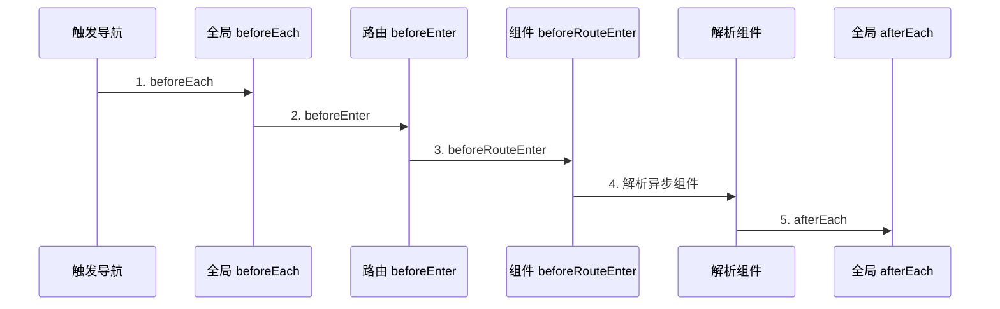
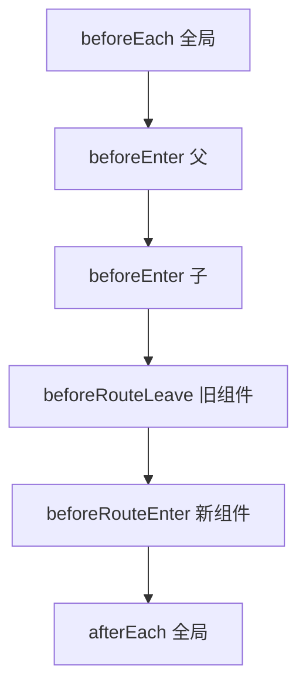

# 导航守卫

路由守卫在导航完成前拦截、重定向或取消跳转。分三层：**全局** `beforeEach`、**路由独享** `beforeEnter`、**组件内** `onBeforeRouteLeave` / `onBeforeRouteUpdate`。Router 4 推荐用**返回值**代替 `next()`，牢记执行顺序，避免重复鉴权与无限重定向。

---

## 守卫在导航流程中的位置



| 阶段 | 可访问 `this` | 典型用途 |
|------|---------------|----------|
| `beforeEach` | 否 | 登录 Token、全局 Loading |
| `beforeEnter` | 否 | 模块级权限 |
| `beforeRouteEnter` | 否（next 回调内可） | 依赖 DOM 的初始化 |
| `beforeRouteUpdate` | 是 | 同组件参数变化 |
| `beforeRouteLeave` | 是 | 表单未保存拦截 |
| `afterEach` | 否 | 埋点、改标题 |

---

## 全局前置守卫

```ts
// router/index.ts
import { router } from './router';

router.beforeEach(async (to, from, next) => {
  const token = localStorage.getItem('token');

  if (to.meta.requiresAuth && !token) {
    next({ name: 'Login', query: { redirect: to.fullPath } });
    return;
  }

  next(); // 必须调用，否则导航挂起
});
```

Router 4 中 `next` 仍可用，但**推荐**改为返回值风格（见下文）。

```ts
// 类型扩展 meta
declare module 'vue-router' {
  interface RouteMeta {
    requiresAuth?: boolean;
    roles?: string[];
    title?: string;
  }
}
```

---

## 路由独享守卫

```ts
{
  path: '/admin',
  component: AdminLayout,
  meta: { requiresAuth: true, roles: ['admin'] },
  beforeEnter: (to, from) => {
    const userStore = useUserStore();
    if (!userStore.hasRole('admin')) {
      return { name: 'Forbidden' };
    }
  },
  children: [/* ... */],
}
```

`beforeEnter` 仅在该路由及其子路由进入时触发，适合「整个模块」的准入控制。

---

## 返回值 API（Router 4 推荐）

不再依赖 `next()`，用返回值表达意图：

| 返回值 | 行为 |
|--------|------|
| `true` / `undefined` / 无 return | 放行 |
| `false` | 取消导航 |
| 路由位置对象 | 重定向 |
| Error | 交给 `router.onError` |

```ts
router.beforeEach((to) => {
  if (to.meta.requiresAuth && !isLoggedIn()) {
    return { name: 'Login', query: { redirect: to.fullPath } };
  }
});
```

---

## 组件内守卫

### Options API

```vue
<script lang="ts">
export default {
  beforeRouteEnter(to, from, next) {
    // 不能访问 this
    fetchData(to.params.id).then(data => {
      next(vm => vm.setData(data));
    });
  },
  beforeRouteUpdate(to, from) {
    // 同组件，/users/1 → /users/2
    this.loadUser(to.params.id);
  },
  beforeRouteLeave(to, from) {
    if (this.formDirty) {
      return window.confirm('有未保存修改，确定离开？');
    }
  },
};
</script>
```

### Composition API + script setup

```vue
<script setup lang="ts">
import { onBeforeRouteLeave, onBeforeRouteUpdate } from 'vue-router';

const dirty = ref(false);

onBeforeRouteLeave((to, from) => {
  if (dirty.value) {
    return window.confirm('确定离开？');
  }
});

onBeforeRouteUpdate(async (to) => {
  await loadDetail(to.params.id as string);
});
</script>
```

| 组合式 API | 对应 Options |
|------------|--------------|
| `onBeforeRouteLeave` | `beforeRouteLeave` |
| `onBeforeRouteUpdate` | `beforeRouteUpdate` |
| 无直接等价 | `beforeRouteEnter`（用路由 meta + 父守卫） |

---

## 全局后置钩子

```ts
router.afterEach((to) => {
  document.title = (to.meta.title as string) ?? 'My App';
  trackPageView(to.fullPath);
});
```

`afterEach` 不能阻止导航，适合做无副作用的收尾。

---

## 完整执行顺序

从 `/a` 导航到 `/b`（b 有父路由 p）：

1. `router.beforeEach`（全局）
2. `beforeEnter`（p）
3. `beforeEnter`（b）
4. 离开 `/a` 组件的 `beforeRouteLeave`
5. 进入 b 组件的 `beforeRouteEnter`
6. 全局 `beforeResolve`（Router 4 保留，少用）
7. 导航确认
8. `router.afterEach`



---

## 鉴权模式对比

| 模式 | 实现 | 优点 | 缺点 |
|------|------|------|------|
| 全局 meta | `to.meta.requiresAuth` | 集中管理 | meta 膨胀 |
| 路由独享 | `beforeEnter` | 模块清晰 | 重复逻辑 |
| 后端驱动 | 动态路由表 | 权限与菜单一致 | 首屏异步 |
| Nuxt middleware | `definePageMeta` | SSR 友好 | 框架绑定 |

```ts
// 动态路由 + 守卫组合
async function setupDynamicRoutes() {
  const menus = await fetchMenus();
  menus.forEach(menu => router.addRoute(transformMenu(menu)));
  router.addRoute({ path: '/:pathMatch(.*)*', redirect: '/404' });
}
```

---

## 常见坑

| 问题 | 原因 | 解决 |
|------|------|------|
| 白屏挂起 | 未 `next()` 且无 return | 始终 return 或 next |
| 无限重定向 | Login 页也 requiresAuth | 白名单路由 |
| 重复鉴权请求 | 每个守卫都 fetch user | Pinia 缓存 + 单次 Promise |
| Pinia 未就绪 | 守卫在 app 外执行 | 守卫内 `useStore()` 在 setup 外也可 |

```ts
// 白名单
const PUBLIC = ['Login', 'Register'];
router.beforeEach((to) => {
  if (PUBLIC.includes(to.name as string)) return true;
  // ...
});
```

---

## 小结

**三层守卫**：全局 `beforeEach` 做 Token/Loading；路由 `beforeEnter` 做模块级权限；组件 `onBeforeRouteLeave` / `onBeforeRouteUpdate` 做表单拦截与同组件参数变化。

**Router 4 返回值**：`return false` 取消；`return { name: 'Login' }` 重定向；`return true` 或 undefined 放行。避免只写 async 却不 return/next 导致导航挂起。

**执行顺序**：全局 → 父 beforeEnter → 子 beforeEnter → leave → enter → afterEach。`afterEach` 不能阻止导航，适合改标题和埋点。

**鉴权实践**：`meta.requiresAuth` + Pinia 缓存用户态；Login/Register 进白名单防无限重定向；动态路由场景登录后 `addRoute` 再 `replace` 重匹配。

**组件守卫**：script setup 用 `onBeforeRouteLeave` / `onBeforeRouteUpdate`；`beforeRouteEnter` 无组合式等价，可用父守卫或 meta 预取数据。

核对：Login 页是否在白名单？守卫里用户信息是否重复请求？async 守卫有没有 return？
