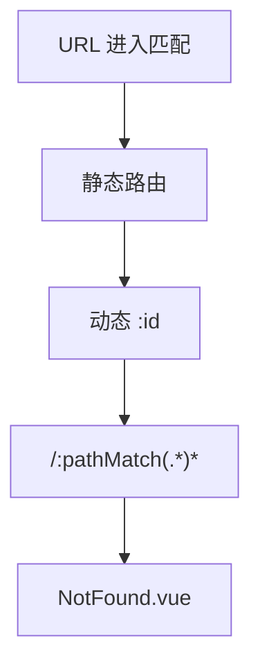

# 动态路由与路由表生成

「动态路由」有两层含义：URL 里的 **`:id` params**，以及运行时 **`addRoute`** 注入路由表。B 端后台标配：菜单 transform → `addRoute` → catch-all 404 → `replace` 重匹配；登出时 **`removeRoute`** 清掉用户专属路由，防越权菜单残留。

---

## 动态路径参数

```ts
{ path: '/users/:id', name: 'UserDetail', component: UserDetail, props: true }
```

| 写法 | 匹配 | 说明 |
|------|------|------|
| `:id` | 单段 | 必填 |
| `:id?` | 可选 | Router 4 支持 |
| `:id(\\d+)` | 正则 | 仅数字 |
| `*` / 旧写法 | — | Router 4 用 `pathMatch` |

```vue
<script setup lang="ts">
import { useRoute } from 'vue-router';
const route = useRoute();
// /users/42 → route.params.id === '42'（字符串）
</script>
```

`props: true` 将 params 映射为组件 props，减少模板对 `useRoute` 的耦合：

```vue
<script setup lang="ts">
defineProps<{ id: string }>();
</script>
```

---

## 查询参数与 props 函数

```ts
{
  path: '/search',
  component: Search,
  props: (route) => ({ q: route.query.q ?? '', page: Number(route.query.page ?? 1) }),
}
```

```vue
<RouterLink :to="{ name: 'Search', query: { q: 'vue', page: '2' } }">
  搜索
</RouterLink>
```

| 类型 | 存储位置 | 刷新保留 | 适用 |
|------|----------|----------|------|
| params | 路径段 | 是 | 资源 ID |
| query | `?key=val` | 是 | 筛选、分页 |
| state | `history.state` | 否 | 临时上下文 |

---

## 404 与 catch-all

Router 4 通配符写法：

```ts
{ path: '/:pathMatch(.*)*', name: 'NotFound', component: NotFound }
```

**必须放在 routes 数组末尾**，否则会吞掉后续路由。



---

## meta 与权限元数据

```ts
{
  path: '/orders',
  name: 'Orders',
  component: () => import('@/views/Orders.vue'),
  meta: {
    title: '订单管理',
    requiresAuth: true,
    permissions: ['order:read'],
    keepAlive: true,
  },
}
```

```ts
router.beforeEach((to) => {
  const perms = to.meta.permissions as string[] | undefined;
  if (perms && !hasAnyPermission(perms)) {
    return { name: 'Forbidden' };
  }
});
```

扩展 `RouteMeta` 类型后，全项目 meta 字段有智能提示。

---

## 服务端菜单 → 前端路由

典型 B 端流程：


```ts
// types/menu.ts
interface MenuItem {
  path: string;
  name: string;
  component?: string; // 后端返回组件路径字符串
  children?: MenuItem[];
  meta?: RouteMeta;
}

// utils/routeTransform.ts
const viewModules = import.meta.glob('@/views/**/*.vue');

function resolveComponent(path: string) {
  const key = `/src/views/${path}.vue`;
  return viewModules[key];
}

export function menuToRoutes(menus: MenuItem[]): RouteRecordRaw[] {
  return menus.map(menu => ({
    path: menu.path,
    name: menu.name,
    component: menu.component ? resolveComponent(menu.component) : undefined,
    meta: menu.meta,
    children: menu.children ? menuToRoutes(menu.children) : undefined,
  }));
}
```

```ts
// 登录后
const menus = await fetchMenus();
const dynamicRoutes = menuToRoutes(menus);
dynamicRoutes.forEach(r => router.addRoute(r));
// 动态路由注册后必须补 404
router.addRoute({ path: '/:pathMatch(.*)*', name: 'NotFound', redirect: '/404' });
await router.replace(router.currentRoute.value.fullPath); // 重新触发匹配
```

---

## 静态 + 动态路由拆分

| 类型 | 示例 | 注册时机 |
|------|------|----------|
| 常量路由 | Login、404、Layout | `createRouter` 时 |
| 异步路由 | 业务模块 | 登录后 `addRoute` |
| 常驻路由 | 个人中心 | 可按角色分支 |

```ts
export const constantRoutes: RouteRecordRaw[] = [
  { path: '/login', name: 'Login', component: Login },
  { path: '/404', name: '404', component: NotFound },
];

export const asyncRoutes: RouteRecordRaw[] = [
  {
    path: '/',
    component: Layout,
    children: [/* 业务 children，按权限 filter */],
  },
];
```

---

## removeRoute 与路由重置

登出时需清除用户专属路由，避免下一用户看到越权菜单：

```ts
const addedNames: string[] = [];

function addDynamicRoutes(routes: RouteRecordRaw[]) {
  routes.forEach(r => {
    if (r.name) {
      router.addRoute(r);
      addedNames.push(r.name as string);
    }
  });
}

function resetRouter() {
  addedNames.forEach(name => router.removeRoute(name));
  addedNames.length = 0;
}
```

Router 4 无「一键 reset」，需自行记录 `name` 列表。

---

## 与侧栏联动

```vue
<script setup lang="ts">
import { computed } from 'vue';
import { useRoute, useRouter } from 'vue-router';

const route = useRoute();
const router = useRouter();

const menuRoutes = computed(() =>
  router.getRoutes().filter(r => r.meta?.showInMenu)
);
</script>

<template>
  <nav>
    <RouterLink
      v-for="r in menuRoutes"
      :key="r.name"
      :to="{ name: r.name }"
    >
      {{ r.meta?.title }}
    </RouterLink>
  </nav>
</template>
```

`router.getRoutes()` 返回当前**扁平化**后的全部路由记录。

---

## 实践要点

| 项 | 说明 |
|----|------|
| 组件懒加载 | 动态路由更应用 `import()` |
| name 唯一 | `addRoute` / `removeRoute` 依赖 name |
| 首屏 redirect | 动态注册后 `replace` 当前 URL |
| 权限变更 | 角色切换时 reset + 重新 add |
| Vite glob | 路径字符串需与 `import.meta.glob` 键一致 |

---

## 小结

**动态 params**：`:id` 匹配路径段，值为字符串；`props: true` 或 props 函数把 params/query 映射为组件 props，减少 `useRoute` 耦合。

**404**：Router 4 用 `/:pathMatch(.*)*`，必须放 routes 末尾；动态 `addRoute` 后也要补 catch-all。

**B 端流程**：常量路由（Login/404/Layout）→ 登录拉菜单 → `menuToRoutes` + `import.meta.glob` → 循环 `addRoute` → `replace` 重匹配当前 URL。

**登出清理**：记录已 add 的 route `name`，循环 `removeRoute`，防下一用户看到越权菜单。

**侧栏**：`router.getRoutes()` 过滤 `meta.showInMenu`；meta 扩展 `RouteMeta` 获 TS 提示。

核对：glob 键与后端返回路径一致吗？动态路由后 replace 了吗？catch-all 在最后吗？
