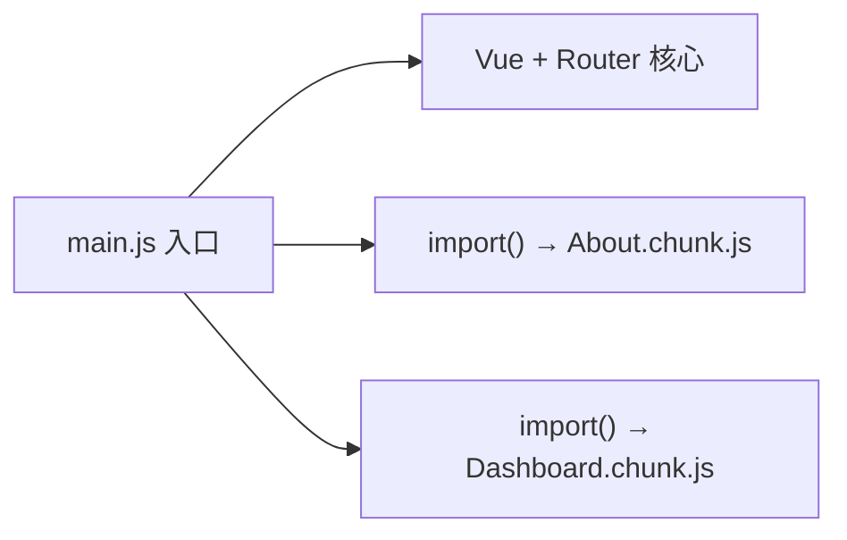

# 懒加载与滚动行为

后台页面多、图表重，路由 **`() => import()`** 按页拆 chunk 几乎是标配。`scrollBehavior` 管回顶、后退还原与锚点定位；嵌套滚动容器和 KeepAlive 列表还需额外处理 scrollTop。

---

## 为什么路由要懒加载



| 策略 | 首屏 JS | 切换页面 |
|------|---------|----------|
| 静态 import 全部页面 | 大 | 无额外请求 |
| 路由懒加载 | 小 | 按需加载 chunk |

---

## 基础写法

```ts
const routes: RouteRecordRaw[] = [
  {
    path: '/about',
    name: 'About',
    component: () => import('@/views/About.vue'),
  },
  {
    path: '/dashboard',
    name: 'Dashboard',
    component: () => import('@/views/Dashboard.vue'),
  },
];
```

Vite / Webpack 会将 `import()` 自动拆包。chunk 名默认带 hash，利于长期缓存。

---

## 魔法注释与 chunk 命名

```ts
component: () => import(/* webpackChunkName: "about" */ '@/views/About.vue')
```

Vite 使用：

```ts
component: () => import('@/views/About.vue') // 默认按路径命名
```

按业务域合并 chunk（减少 HTTP 请求数）：

```ts
const AdminUsers = () => import(/* @vite-ignore */ '@/views/admin/users/index.vue');
// 或使用 vite-plugin-chunk-split 等插件按目录分组
```

| 目标 | 手段 |
|------|------|
| 单页一 chunk | 默认 `import()` |
| 多页合并 | 手动合并入口或 split 插件 |
| 预加载 | 见下文 |

---

## 加载态与错误处理

动态组件加载期间用户可能看到空白，可配合 Suspense 或 loading 组件：

```ts
import { defineAsyncComponent } from 'vue';

const AsyncAbout = defineAsyncComponent({
  loader: () => import('@/views/About.vue'),
  loadingComponent: LoadingSpinner,
  delay: 200,
  timeout: 10000,
  errorComponent: LoadError,
});
```

路由场景常见做法是 `<RouterView>` 外包一层：

```vue
<RouterView v-slot="{ Component }">
  <Suspense>
    <template #default>
      <component :is="Component" />
    </template>
    <template #fallback>
      <PageSkeleton />
    </template>
  </Suspense>
</RouterView>
```

---

## 预加载策略

| 策略 | 实现 | 场景 |
|------|------|------|
| 悬停预取 | `@mouseenter` 触发 import | 导航菜单 |
| 可见预取 | Intersection Observer | 长列表链接 |
| 空闲预取 | `requestIdleCallback` | 低优先级页 |

```vue
<script setup lang="ts">
const prefetchAbout = () => import('@/views/About.vue');
</script>

<template>
  <RouterLink to="/about" @mouseenter="prefetchAbout">关于</RouterLink>
</template>
```

Vite 生产构建还可配合 `modulepreload` 由插件注入。

---

## scrollBehavior 基础

```ts
export const router = createRouter({
  history: createWebHistory(),
  routes,
  scrollBehavior(to, from, savedPosition) {
    if (savedPosition) {
      return savedPosition; // 浏览器后退/前进
    }
    if (to.hash) {
      return { el: to.hash, behavior: 'smooth' };
    }
    return { top: 0 }; // 默认滚到顶部
  },
});
```

| 返回值 | 效果 |
|--------|------|
| `{ top: 0 }` | 滚动到文档顶 |
| `savedPosition` | 还原历史位置 |
| `{ el: '#id' }` | 锚点定位 |
| `false` | 不改变滚动 |

---

## 嵌套滚动容器

页面内 `main` 可滚动而非 `window` 时，需在 `scrollBehavior` 中指定元素：

```ts
scrollBehavior(to, from, savedPosition) {
  return new Promise((resolve) => {
    setTimeout(() => {
      const el = document.querySelector('#main-scroll');
      if (savedPosition && el) {
        el.scrollTop = savedPosition.top ?? 0;
        resolve(false);
      } else {
        resolve({ el: '#main-scroll', top: 0 });
      }
    }, 0);
  });
}
```

异步组件加载完成前 DOM 高度可能为 0，必要时 `nextTick` 或短 delay。

---

## KeepAlive 与滚动

列表 → 详情 → 返回列表时，常希望保留列表滚动位置：

```vue
<RouterView v-slot="{ Component, route }">
  <KeepAlive :include="['OrderList']">
    <component :is="Component" :key="route.name" />
  </KeepAlive>
</RouterView>
```

| 组合 | 行为 |
|------|------|
| KeepAlive + savedPosition | 后退还原 scroll |
| KeepAlive 无 savedPosition | 组件缓存内 scroll 可能保留 |
| 每次回顶 | `scrollBehavior` 强制 top: 0 |

在列表页 `onActivated` 中也可手动恢复内部 scrollTop。

---

## 性能观测

```ts
router.afterEach((to) => {
  if (import.meta.env.PROD) {
    performance.mark(`route-${to.name}-end`);
  }
});
```

配合 Lighthouse / Web Vitals：路由 chunk 过大影响 **LCP** 与 **INP**（交互后导航延迟）。

| 指标 | 优化方向 |
|------|----------|
| 首屏 JS | 路由懒加载 + 组件库按需 |
| 导航延迟 | prefetch、骨架屏 |
| 重复下载 | HTTP 缓存、CDN |

---

## Nuxt 对照

| Vue Router SPA | Nuxt 3 |
|----------------|--------|
| 手动 `import()` | `pages/` 自动路由 + 自动 split |
| `scrollBehavior` | `router.options.ts` 或 `definePageMeta` |
| 无文件约定 | 文件即路由 |

同构项目 scroll 还需考虑 hydration 后位置一致。

---

## 小结

**路由懒加载**：`component: () => import('...')` 按页拆 chunk，减小首屏 JS；后台多页场景几乎是标配。

**加载体验**：Suspense 或 `defineAsyncComponent` 填加载空白；菜单 `@mouseenter` 预 import 降低导航感知延迟。

**scrollBehavior**：`savedPosition` 还原后退位置；`to.hash` 锚点定位；默认 `{ top: 0 }` 新页回顶。

**特殊场景**：滚动容器不是 window 时在 `scrollBehavior` 指定 `#main-scroll`；KeepAlive 列表页可 `onActivated` 手动恢复 scrollTop。

**性能**：chunk 过大影响 LCP/INP；生产用 performance mark 或 Web Vitals 观测；Vite 默认按路径命名 chunk。

核对：大页都 lazy 了吗？嵌套滚动容器 scroll 行为测过吗？KeepAlive 列表返回位置符合预期吗？
