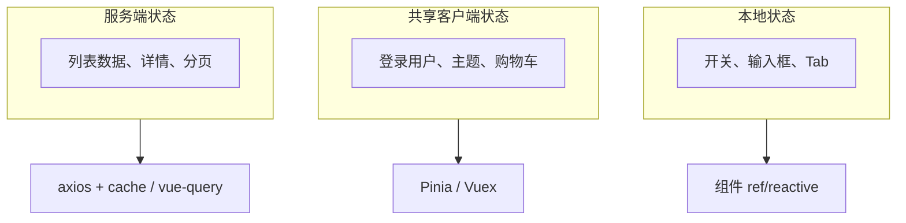
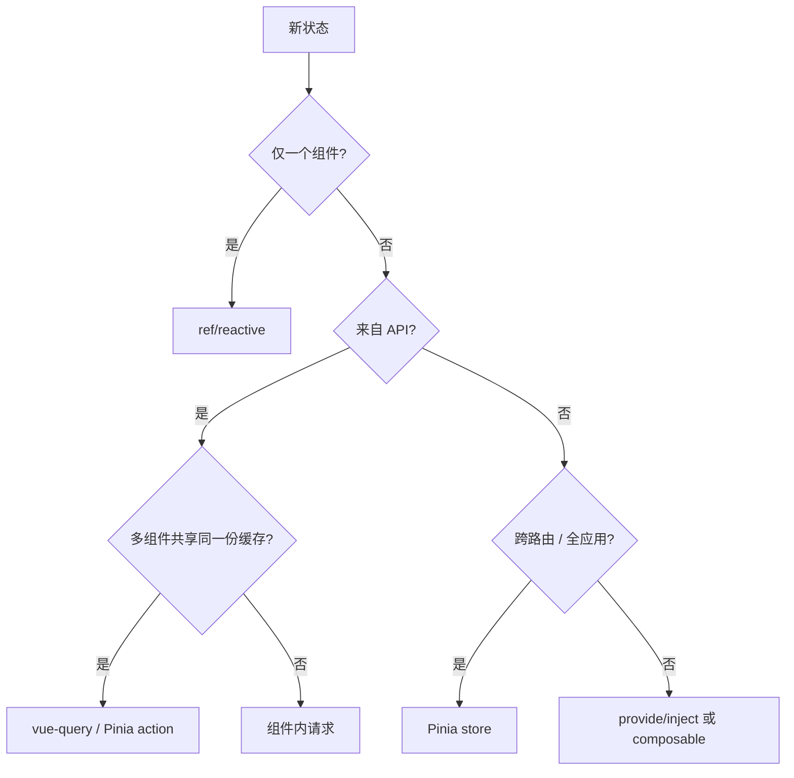

# 何时需要全局状态

状态放哪里，直接影响维护成本和性能。大致三分：**本地 UI 用 ref**；**跨路由客户端共享用 Pinia**；**API 数据用请求缓存**（如 vue-query）。别把 store 当全局垃圾桶，能局部就不全局，能 computed 就不 duplicate 进 state。

---

## 状态三分法



| 类型 | 特征 | 存放位置 |
|------|------|----------|
| 本地 UI | 仅当前组件/subtree 使用 | `ref` / `reactive` |
| 共享客户端 | 多路由、多模块读写 | Pinia |
| 服务端 | 来自 API、可过期、可重拉 | 请求层 + 缓存 |

---

## 适合全局 store 的场景

| 场景 | 原因 | 示例 |
|------|------|------|
| 登录会话 | 全应用读取 Token / 用户 | `useUserStore` |
| 主题 / 语言 | Layout、设置页、持久化 | `useAppStore` |
| 跨页购物车 | 多个页面累加同一数据 | 电商 |
| 复杂向导 | 多步表单跨路由 | onboarding |
| WebSocket 推送 | 多处订阅同一连接 | 通知中心 |

```ts
// 典型用户 store 字段
interface UserState {
  token: string | null;
  profile: UserProfile | null;
}
```

---

## 不应放进 store 的情况

| 反例 | 更好做法 |
|------|----------|
| 表格当前页码（仅列表页用） | 组件 ref 或 URL query |
| 弹窗 open/close | 父组件或 composable |
| 接口返回的列表（无跨页共享） | 组件内 fetch 或 vue-query |
| 表单每个 input | 本地 ref，提交再 action |
| 派生数据 | `computed`，不必持久进 state |

**原则**：能局部就不全局；能 computed 就不 duplicate 进 state。

---

## provide/inject 作为中间层

跨 2～3 层、范围明确的共享，不必上 Pinia：

```ts
// 父级
const formCtx = reactive({ model, validate });
provide(FormContextKey, formCtx);

// 深层子组件
const ctx = inject(FormContextKey)!;
```

| 方式 | 作用域 | 持久化 | DevTools |
|------|--------|--------|----------|
| props/emit | 父子 | 否 | — |
| provide/inject | 子树 | 否 | 弱 |
| Pinia | 全应用 | 可插件 | 强 |

---

## 服务端状态 vs 客户端状态

```vue
<script setup lang="ts">
import { useQuery } from '@tanstack/vue-query';

// 服务端状态：缓存、失效、重试交给 query
const { data: orders, isLoading } = useQuery({
  queryKey: ['orders'],
  queryFn: fetchOrders,
});

// 客户端状态：筛选条件可放 URL 或本地
const statusFilter = ref<'all' | 'paid'>('all');
</script>
```

| 维度 | 服务端状态 | 客户端状态 |
|------|------------|------------|
| 真相来源 | 后端 | 浏览器 |
| 过期 | 是 | 否（除非业务规则） |
| 多 tab 同步 | 需 invalidate | 各 tab 独立 store |
| 离线 | 需缓存策略 | 可 localStorage |

---

## 决策流程



---

## Pinia vs Vuex 选型

| 维度 | Pinia | Vuex 4 |
|------|-------|--------|
| Vue 版本 | 3 官方推荐 | 3 兼容 / 2 常用 |
| 写法 | 选项式 + 组合式 store | mutations 必选 |
| TS | 友好 | 需额外封装 |
| 体积 | 更小 | 略大 |
| 新项目 | 默认 | 维护遗留 |

Vue 2 遗留项目可能仍用 Vuex 3；Vue 3 新项目直接 Pinia。

---

## store 粒度设计

| 反模式 | 问题 | 改进 |
|--------|------|------|
| 单一大 store | 难维护、热更新慢 | 按域拆分 |
| 镜像 API 字段 | 与组件耦合 | DTO → ViewModel 在 composable |
| 存 DOM ref | 非序列化 | 只存数据 |
| 重复存 computed 值 | 源不一致 | getters / computed |

推荐按**业务域**命名：`useUserStore`、`useCartStore`、`useSettingsStore`。

---

## 与 URL 状态协作

可分享、可刷新的 UI 状态优先放 URL：

```ts
const route = useRoute();
const page = computed(() => Number(route.query.page ?? 1));
```

| 放 URL | 放 store |
|--------|----------|
| 分页、排序、搜索词 | Token、用户信息 |
| 当前 Tab（需分享） | 侧边栏折叠 |
| 详情 ID | 客户端草稿 |

---

## 小结

**三分法**：本地 `ref`/`reactive` 管 UI；Pinia 管跨路由客户端共享（会话、主题、购物车）；API 列表/详情优先 vue-query 或 axios + 缓存，而非无脑进 store。

**决策路径**：单组件 → ref；来自 API → 多组件共享用 query，否则组件内 fetch；非 API 且跨路由 → Pinia；2～3 层子树 → provide/inject 或 composable。

**不该进 store**：仅单页用的分页、弹窗开关、无共享的接口列表、表单字段、可 computed 的派生值。

**粒度**：按业务域拆 `useUserStore` / `useCartStore`，避免单一大 store 或镜像 API 字段。

**URL 协作**：分页、排序、可分享 Tab 放 query；Token、用户信息、侧边栏折叠放 store。

**选型**：Vue 3 新项目默认 Pinia；Vuex 留给 Vue 2 遗留维护。

核对：这份状态真的跨路由吗？是 API 数据吗？能不能 computed 而不是 duplicate 进 state？
