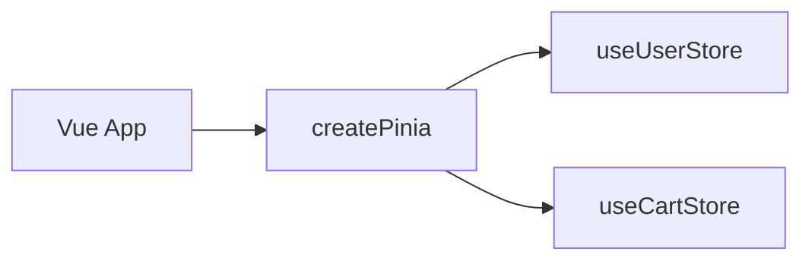

# Pinia store 与组合式写法

Pinia 是 Vue 3 官方推荐的全局状态库。`defineStore` 定义 store，**Options / Setup** 两种写法等价；组件解构 state 必用 **storeToRefs**，actions 可直接解构或 `store.xxx()` 调用。

---

## 安装与注册

```bash
pnpm add pinia
```

```ts
// main.ts
import { createApp } from 'vue';
import { createPinia } from 'pinia';
import App from './App.vue';

const app = createApp(App);
app.use(createPinia());
app.mount('#app');
```



---

## Options Store（经典写法）

```ts
// stores/counter.ts
import { defineStore } from 'pinia';

export const useCounterStore = defineStore('counter', {
  state: () => ({
    count: 0,
    name: 'Counter',
  }),
  getters: {
    double: (state) => state.count * 2,
    doublePlusOne(): number {
      return this.double + 1; // 可访问其他 getter
    },
  },
  actions: {
    increment(amount = 1) {
      this.count += amount;
    },
    async fetchAndSet(n: number) {
      const res = await api.getCount(n);
      this.count = res;
    },
  },
});
```

| 选项 | 作用 |
|------|------|
| `state` | 可变数据，工厂函数 |
| `getters` | 派生状态，类似 computed |
| `actions` | 同步/异步方法，直接改 state |

---

## Setup Store（组合式写法）

```ts
// stores/user.ts
import { ref, computed } from 'vue';
import { defineStore } from 'pinia';

export const useUserStore = defineStore('user', () => {
  const token = ref<string | null>(null);
  const profile = ref<UserProfile | null>(null);

  const isLoggedIn = computed(() => !!token.value);

  async function login(credentials: Credentials) {
    const { accessToken, user } = await authApi.login(credentials);
    token.value = accessToken;
    profile.value = user;
  }

  function logout() {
    token.value = null;
    profile.value = null;
  }

  return { token, profile, isLoggedIn, login, logout };
});
```

| Setup Store | Options Store |
|-------------|---------------|
| `ref`/`reactive` 作 state | `state()` |
| `computed` 作 getters | `getters` |
| 普通函数作 actions | `actions` |
| 更灵活（watch、 composable） | 结构固定 |

---

## 组件中使用

```vue
<script setup lang="ts">
import { storeToRefs } from 'pinia';
import { useCounterStore } from '@/stores/counter';

const counter = useCounterStore();

// 解构响应式 state/getters 必须用 storeToRefs
const { count, double } = storeToRefs(counter);
// actions 可直接解构
const { increment } = counter;

function handleClick() {
  increment(2);
  // 或 counter.$patch({ count: counter.count + 2 });
}
</script>

<template>
  <p>{{ count }} × 2 = {{ double }}</p>
  <button @click="handleClick">+2</button>
</template>
```

直接解构 store 会**丢失响应式**：

```ts
const { count } = counter; // ❌ 非响应式
const { count } = storeToRefs(counter); // ✅
```

---

## $patch 与 $reset

```ts
counter.$patch({ count: counter.count + 1, name: 'Updated' });

// 函数式 patch
counter.$patch((state) => {
  state.count++;
});

// Options store 可 $reset（Setup store 需自行实现 reset）
counter.$reset();
```

Setup Store 重置需手动：

```ts
function $reset() {
  token.value = null;
  profile.value = null;
}
return { /* ... */, $reset };
```

---

## Store 之间互相调用

```ts
export const useCartStore = defineStore('cart', () => {
  const userStore = useUserStore(); // 在 action/getter 内调用

  async function checkout() {
    if (!userStore.isLoggedIn) throw new Error('请先登录');
    await orderApi.create(/* ... */);
  }

  return { checkout };
});
```

**不要在 store 外部顶层**调用 `useXxxStore()`，应在 action 或 setup 内调用，确保 Pinia 已激活。

---

## 订阅与 DevTools

```ts
counter.$subscribe((mutation, state) => {
  console.log(mutation.type, mutation.storeId, state);
});

counter.$onAction(({ name, args, after, onError }) => {
  after(() => console.log(`action ${name} 完成`));
});
```

Vue DevTools 的 Pinia 面板可时间旅行调试（开发环境）。

---

## TypeScript

Options Store 自动推断；Setup Store 建议显式返回类型：

```ts
export const useUserStore = defineStore('user', (): {
  token: Ref<string | null>;
  login: (c: Credentials) => Promise<void>;
} => {
  // ...
});
```

`storeToRefs` 保留 getter 的 `ComputedRef` 类型。

---

## 单元测试

```ts
import { setActivePinia, createPinia } from 'pinia';
import { useCounterStore } from '@/stores/counter';

beforeEach(() => {
  setActivePinia(createPinia());
});

it('increments', () => {
  const store = useCounterStore();
  store.increment();
  expect(store.count).toBe(1);
});
```

每个测试前 `createPinia()` 保证隔离。

---

## 与 composable 边界

| Pinia store | composable |
|-------------|------------|
| 全局单例 | 每调用方可独立 |
| DevTools、持久化插件 | 轻量逻辑复用 |
| 跨路由 | 组件树内 |

纯 UI 逻辑用 `useToggle()` 等 composable；需全局共享再升格为 store。

---

## 小结

**defineStore** 两种写法：Options（state/getters/actions）与 Setup（ref/computed/函数），功能等价；Setup 更灵活，可内联 watch 和 composable。

**组件用法**：`useXxxStore()` 取实例；state/getters 用 `storeToRefs` 解构保响应式；actions 直接解构或 `store.action()`。

**批量更新**：`$patch` 合并字段；Options store 有 `$reset`；Setup store 需手写 reset 并 return。

**跨 store**：在 action 内 `useOtherStore()`，勿在模块顶层调用。

**测试**：`setActivePinia(createPinia())` 保证每个用例隔离。

**边界**：全局单例、跨路由、需 DevTools/持久化 → store；纯 UI 复用 → composable。

核对：解构 state 用了 storeToRefs 吗？Setup store 有 reset 吗？store 顶层有没有误调 useStore？
