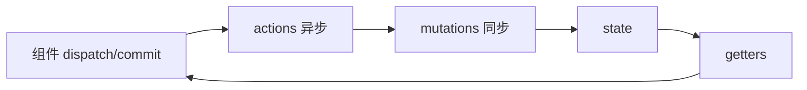

# Vuex 核心与 Modules

Vuex 遵循单向数据流：**mutation 同步改 state**，**action 处理异步**。大项目用 **namespaced modules** 按域拆分；Vue 3 新项目优先 Pinia，但维护 Vue 2 遗留或读开源 admin 模板时仍需读懂 Vuex。

---

## Vuex 数据流



| 概念 | 职责 |
|------|------|
| state | 单一数据源 |
| getters | 派生状态 |
| mutations | 同步提交，唯一改 state 入口 |
| actions | 异步、可 dispatch 多个 mutation |

---

## 基础 Store（Vuex 4 + Vue 3）

```ts
// store/index.ts
import { createStore } from 'vuex';

export interface RootState {
  count: number;
}

export default createStore<RootState>({
  state: () => ({ count: 0 }),
  getters: {
    double: (state) => state.count * 2,
  },
  mutations: {
    INCREMENT(state, payload: number) {
      state.count += payload;
    },
  },
  actions: {
    incrementAsync({ commit }, amount: number) {
      setTimeout(() => commit('INCREMENT', amount), 500);
    },
  },
});
```

```ts
// main.ts
import store from './store';
createApp(App).use(store).mount('#app');
```

---

## 组件内访问

### 直接访问

```vue
<script setup lang="ts">
import { computed } from 'vue';
import { useStore } from 'vuex';

const store = useStore();
const count = computed(() => store.state.count);
const double = computed(() => store.getters.double);

function inc() {
  store.commit('INCREMENT', 1);
  store.dispatch('incrementAsync', 2);
}
</script>
```

### map 辅助函数（Options API 遗留）

```js
import { mapState, mapGetters, mapMutations, mapActions } from 'vuex';

export default {
  computed: {
    ...mapState(['count']),
    ...mapGetters(['double']),
  },
  methods: {
    ...mapMutations(['INCREMENT']),
    ...mapActions(['incrementAsync']),
  },
};
```

Composition API 项目更推荐 `useStore` + `computed`，或迁移 Pinia。

---

## Modules 模块化

```ts
// store/modules/user.ts
export default {
  namespaced: true,
  state: () => ({ token: null as string | null }),
  getters: {
    isLoggedIn: (s) => !!s.token,
  },
  mutations: {
    SET_TOKEN(state, token: string) {
      state.token = token;
    },
  },
  actions: {
    async login({ commit }, credentials) {
      const { token } = await authApi.login(credentials);
      commit('SET_TOKEN', token);
    },
  },
};
```

```ts
// store/index.ts
import user from './modules/user';
import cart from './modules/cart';

export default createStore({
  modules: { user, cart },
});
```

| namespaced | commit/dispatch |
|------------|-----------------|
| `true` | `'user/SET_TOKEN'` |
| `false` | 全局 mutation 名冲突风险 |

```ts
store.commit('user/SET_TOKEN', 'xxx');
store.dispatch('user/login', { username, password });
```

---

## Module 嵌套与 rootState

```ts
getters: {
  fullName(state, getters, rootState, rootGetters) {
    return `${rootState.app.title}-${state.name}`;
  },
},
actions: {
  async fetch({ commit, rootState, dispatch }) {
    if (!rootState.user.token) return;
    dispatch('user/refresh', null, { root: true });
  },
},
```

---

## 严格模式

```ts
createStore({ strict: import.meta.env.DEV, /* ... */ });
```

开发环境下非 mutation 修改 state 会抛错，便于发现直接赋值 bug。

---

## Vuex 3（Vue 2）差异速查

| 项 | Vuex 3 | Vuex 4 |
|----|--------|--------|
| 创建 | `new Vuex.Store` | `createStore` |
| 挂载 | `new Vue({ store })` | `app.use(store)` |
| TS | 弱 | 略好 |
| 与 Pinia | — | 可共存，不推荐长期 |

---

## 常见反模式

| 反模式 | 问题 | 修正 |
|--------|------|------|
| mutation 里 async | 时间旅行失效 | 异步放 action |
| 巨大单 module | 难维护 | 按域拆分 namespaced |
| 存组件实例 | 不可序列化 | 只存 plain data |
| 重复 API 数据 | 与组件缓存重复 | 请求层或 Pinia + query |

---

## 何时仍读 Vuex

- 维护 Vue 2 + Vuex 3 老项目
- 阅读开源模板（vue-element-admin 等）
- 理解 Pinia 设计来源（去 mutations 简化）

---

## 小结

**数据流**：组件 `dispatch` action → action `commit` mutation → 同步改 state → getters 派生 → 视图更新。mutation 必须是同步的。

**模块化**：`namespaced: true` 后用 `'user/SET_TOKEN'` 提交；按业务域拆 user/cart 等 module，避免单 module 堆一切。

**Vue 3**：`createStore` + `app.use(store)` + `useStore()`；Composition 项目更宜迁 Pinia。

**跨 module**：getter/action 可用 `rootState`、`rootGetters`；`dispatch('user/refresh', null, { root: true })` 调其他 module。

**严格模式**：开发环境 `strict: true` 抓直接改 state 的 bug。

**反模式**：mutation 里写 async、存组件实例、把 API 列表镜像进 store 又与 query 重复。

核对：异步在 action 吗？mutation 名 namespaced 了吗？还在 Vue 3 新项目加 Vuex 吗？
